[toc]

## 前言

在安装前,为了减少相关因素影响,建议先卸载干净后再安装;

整个安装过程需要root权限;

安装环境 centos 7; 

安装版本 MySQL 5.7

## MySQL卸载

### 查看是否已安装MySQL
查看正在运行的进程,如果存在可以先kill掉
```
ps axj|grep mysql
```


查看是否存在有正在运行的SQL服务
```
systemctl list-units|grep mysql
```

暂停mysql服务

```
systemctl stop mysqld
```


### 卸载mysql服务

yum安装的mysql通常是.rpm版本,因此可以通过rpm管理器查看mysql安装包

```
rpm -qa | grep mysql			#	qa 表示 'query all'
```

全部卸载,可以选择手动一条条删,也可以选择组合命令自动化删除

```
rpm -qa | grep mysql | xargs yum -y remove 		# 将rpm输出结果通过xargs转成命令参数喂给yum
```


### 查看是否卸载干净

卸载mysql后,/etc/my.cnf文件也会被删除

```
ls /etc/my.cnf
```

历史mysql数据默认会保留.需要的话可以做一个备份

```
sudo ls /var/lib/mysql/
```


## MySQL安装


### 查看linux版本

安装前先查看自己linux发行版

```
cat /etc/centos-release
```

或

```
cat /etc/redhat-release
```


或

```
uname -a		# el代表centos
```


### 选择MySQL版本

打开网页[http://repo.mysql.com/](http://repo.mysql.com/)

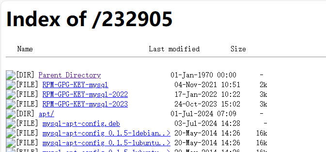

可以发现很多版本,但是版本过长,显示不全,右键选择查看网页源代码就能展开查看了

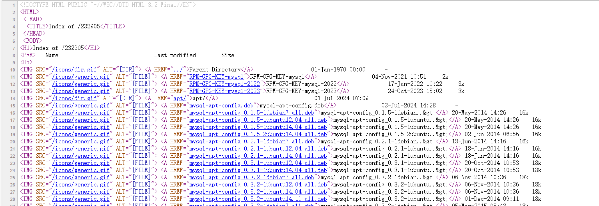

我的服务器是centos7,因此选择el版本;即[mysql57-community-release-el7.rpm](http://repo.mysql.com/mysql57-community-release-el7.rpm)(centos7通用版本,如果有对应的版本也可以选择)

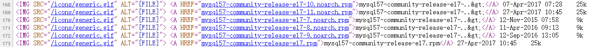

> [noarch_百度百科 (baidu.com)](https://baike.baidu.com/item/noarch/5351882?fr=aladdin


### 获取mysql官方yum源

使用wget直接下载到服务器

```
wget http://repo.mysql.com/mysql57-community-release-el7.rpm
```

或者直接下载到本地,然后再使用其他方法如scp,lrzsz,ftp方式等拷贝过去


### rpm安装mysql官方yum源

进入到存放mysql的目录后,因为我们下载的mysql是.rpm版本,因此需要使用rpm管理器进行安装.

> yum类似一个商店,用于下载需要的包,实际安装也是调用rpm进行安装.如果配好了下载mysql的yum源,就可以直接通过yum进行直接安装.
>
> 可以通过ls /etc/yum.repos.d/ 查看所有yum源
>
> 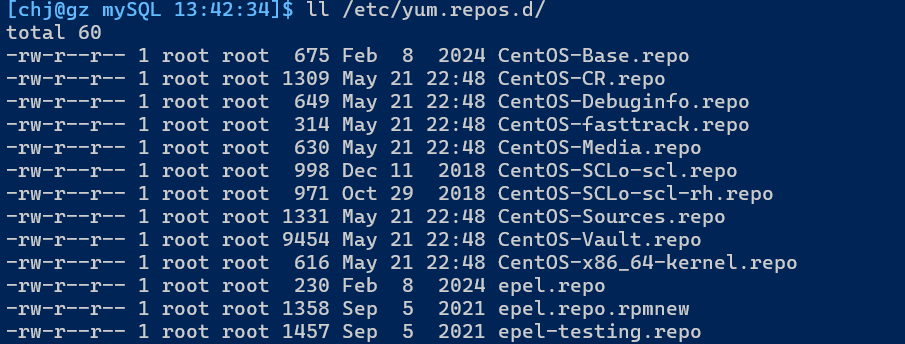
>
> 我的liunx上没有mysql相关的yum源,因此需要安装;

安装命令:

```
sudo rpm -ivh mysql57-community-release-el7.rpm
```

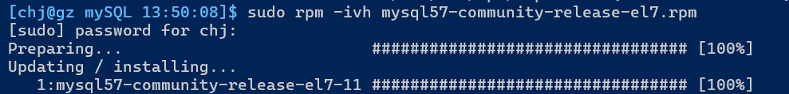

安装后,yum也更新了mysql相关的yum源

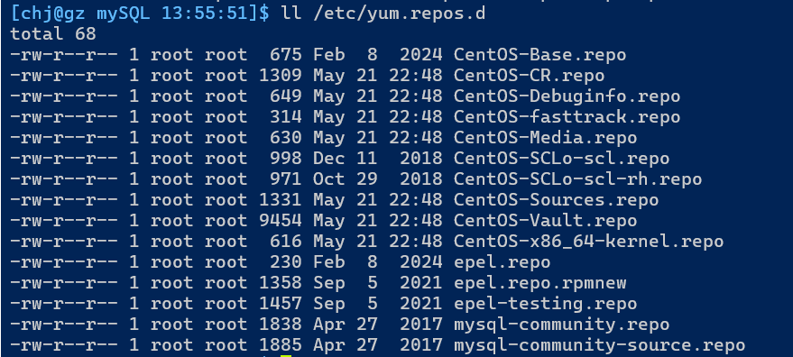

之后就可以通过yum进行安装mysql及mysql相关工具.


测试新增的yum源是否正常工作:

```
yum list |grep mysql
```

如果出现mysql相关的包,就说明安装成功


### 安装mysql服务

```
sudo yum install -y mysql-community-server
```

安装大概需要1G空间,安装时间根据机器配置而定,需要一定时间


### 查看是否安装成功

查看mysql配置文件是否存在

```
ls /etc/my.cnf
```

查看服务端应用程序是否存在

```
which mysqld
```

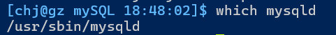

> sbin:super bin # 需要超管权限的服务

查看客户端应用程序

```
which mysql
```


查看监听端口号,mysql启动后会在local Address 3306

```
netstat nltp
```


## 配置MySQL

### 简单登录mysql命令

先看能不能用,简单登录测试,注意刚安装时是不知道密码的,看下文处理

```
mysql -uroot -p ## -u:User, -p表示password
```

退出命令

```
quit
```


### 免密登录配置

在不知道密码时,网上有多种登录方式,目前只介绍免密登录配置.

在/etc/my.cnf文件中追加以下命令即可.

```
skip-grant-tables
```

配置好后重启mysqld

```
systemctl restart mysqld 	##或者分两步走,先stop再start
```

然后再次登录mysql,密码处直接回车即可


### my.cnf 其他配置项

```
## /etc/my.cnf
## ...

datadir=/var/lib/mysql                  #建表等数据存放路径
socket=/var/lib/mysql/mysql.sock        #内部数据,略

# Disabling symbolic-links is recommended to prevent assorted security risks
symbolic-links=0

log-error=/var/log/mysqld.log           #错误日志
pid-file=/var/run/mysqld/mysqld.pid

# User-defind Add
skip-grant-tables                       #免密设置,重启mysqld生效
port=3306                               #mysql服务端口号
character-set-server=utf8               #设置字符集为utf8
default-storage-engine=innodb           #设置默认存储引擎为innodb

```


### 设置开机启动(可选)

```
systemctl enable mysqld		#开机自启
systemctl daemon-reload		#重新加载配置文件
```


## 常用命令与名词认识

### 登录命令

```
mysql -h127.0.0.1 -P3306 -uroot		## -h 指定服务器ip -P指定端口号 ##不指定时使用默认
```


### 清屏命令

```
mysql> system clear;
```


### 认识mysql 和 mysqld

mysqld是网络服务一种,d表示daemon,守护进程;mysqld表示mysql数据库服务的服务器端

mysql就是数据库服务的客户端了


mysql是一套提供数据存取服务的网络程序;

数据库本质是,在磁盘或内存中存储的 特定结构组织的数据


一般谈数据库服务就表示mysqld ;谈数据库时,就是具体的数据组织文件


### 数据库在linux中的存在形式

创建了一个数据库叫`helloworld`

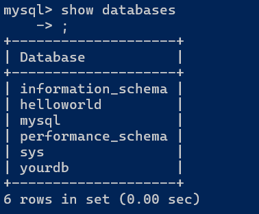

根据`/etc/my.cnf`知道,`datadir`是数据存放目录,默认为`/var/lib/mysql,`进到目录中,可以发现该目录中存在许多与数据库同名的目录,即**数据库在linux中是一个目录**

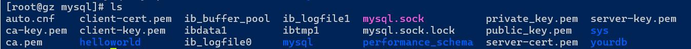

进到helloworld目录中,只有一个配置信息的文件

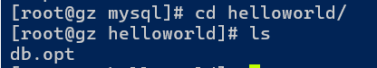

建一个表后,查看变化

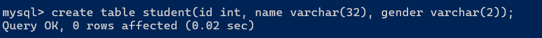

表表现为.frm和.ibd两个文件;即**表就是数据库目录中的文件**


> 在数据库目录下创建一个目录,对应的mysql也会同步增加一个数据库(测试用,实际不可这么做)


### SQL分类

- DDL(data definition language) 数据定义语言,用来维护存储数据的结构

  代表指令: create, drop, alter

- DML(data manipulation language) 数据操作语言,用来对数据进行操作

  代表指令: insert, delete, update

- DCL(data control language) 数据控制语言, 主要负责权限管理和事物

  代表指令: grant, revoke, commit


### 存储引擎

存储引擎是：数据库管理系统如何存储数据、如何为存储的数据建立索引和如何更新、查询数据等技术的实现方法。
MySQL的核心就是插件式存储引擎，支持多种存储引擎。

查看存储引擎

```
show engines;
```

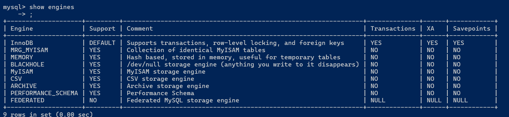

MySQL常用的存储引擎基本上只有两种InnoDB或MyISAM;如果需要其他存储引擎时,大概率也不会选择MySQL,而是考虑其他数据库服务了.

>  InnoDB以强大索引,事物功能,方便业务处理; MyISAM不支持事务,但是高并发较好;

#### 存储引擎对比

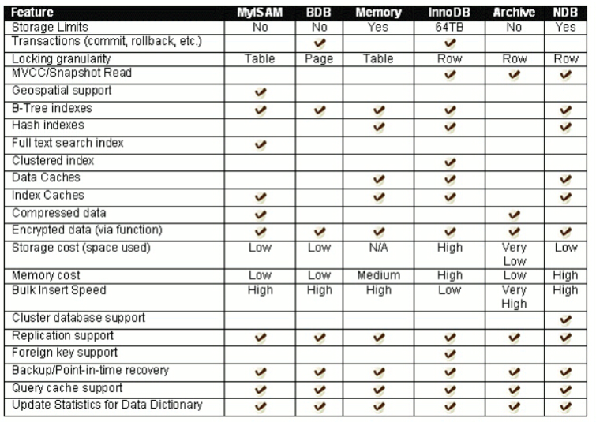


### MySQL架构

MySQL 是一个可移植的数据库，几乎能在当前所有的操作系统上运行，各种系统在底层实现方面各有不同，但是 MySQL 基本上能保证在各个平台上的物理体系结构的一致性。

> 主要还是作为网络服务用在服务器(linux)上.


mysqld可以简单分为4层

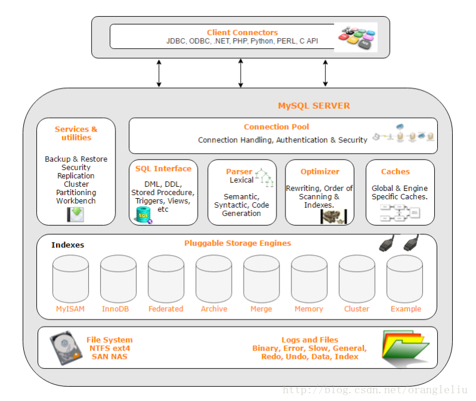


## help中文翻译

```
所有 MySQL 命令列表：
请注意，所有的文本命令都必须在一行的开始位置，并且以 ';' 结束。

? (\?) - `help` 的同义词。
clear (\c) - 清除当前输入的语句。
connect (\r) - 重新连接到服务器。可选参数包括数据库(db)和主机(host)。 
delimiter (\d) - 设置语句分隔符。
edit (\e) - 使用 $EDITOR 编辑命令。
ego (\G) - 将命令发送到 MySQL 服务器，并垂直显示结果。
exit (\q) - 退出 MySQL。与 quit 相同。
go (\g) - 将命令发送到 MySQL 服务器。
help (\h) - 显示此帮助信息。
nopager (\n) - 禁用分页器，打印到标准输出。
notee (\t) - 不写入输出文件。
pager (\P) - 设置分页器 [to_pager]。通过分页器打印查询结果。
print (\p) - 打印当前命令。
prompt (\R) - 更改你的 MySQL 提示符。
quit (\q) - 退出 MySQL。
rehash (\#) - 重建补全哈希表。
source (\.) - 执行一个 SQL 脚本文件。需要一个文件名作为参数。
status (\s) - 从服务器获取状态信息。
system (\!) - 执行一个系统 Shell 命令。
tee (\T) - 设置输出文件 [to_outfile]。将所有内容附加到指定的输出文件。
use (\u) - 使用另一个数据库。需要一个数据库名称作为参数。
charset (\C) - 切换到另一个字符集。可能在处理多字节字符集的 binlog 时需要。
warnings (\W) - 每个语句后显示警告。
nowarning (\w) - 每个语句后不显示警告。
resetconnection (\x) - 清理会话上下文。
```


#### 现学现用

- `? 命令` 显示对应指令的帮助文档

  例如 `? use`

- `命令 \c` 当前输入命令作废

- `命令 \G` 结果垂直显示,而不是以表格形式显示。

- `system shell命令` 或 `\! shell命令 `  : 执行系统命令

  常用: `system clear`

- `status` 或 `\s` :显示服务器信息

- `source` 或 `\.`: 执行sql

- `connect [db_name [host]]` 重新连接到 `my_database` 数据库，连接主机为 `my_host`。

  示例:`connect my_database my_host;`

- `prompt [new_prompt]` 修改提示符的名字

  示例:`prompt hello> ` 把提示符`mysql> `  改成了`hello> `


## 数据库的编码集与校验集

数据库编码集:数据库未来存储数据采用的编码集

> 编码集,即一套表示数据的规则,写入数据时,根据采用的字符集,写入对应规则的数据.
>
> 一般来说怎么存就要怎么取,即统一的编码集

数据库校验集:检测数据库存取比较时,是否使用同样的编码

> 取数相关操作需要加载到内存中,此时才会对数据进行校验

- 查看系统默认字符集以及校验规则

```
show variables like 'character_set_database'; 	##字符集
show variables like 'collation_database';				##校验规则
show variables like 'character_set_%';					##查看所有字符集相关
show variables like 'collation_%';							##查看所有校验规则相关
```


- 查看数据库支持的字符集

```
show charset;
```


当我们创建数据库没有指定字符集和校验规则时，系统使用默认字符集或配置文件中的字符集：

例如配置文件my.cnf中设置了utf8，校验规则 是：utf8_ general_ ci


一般来说,使用了对应的校验码后,mysql会自动同步更新成对应的字符集,无需手动设置.(如果对应不上的话,则可以查表show charset自己修改正确)


## 表的结构

​			列fields

行records


## 库的操作(DDL)

### 创建数据库

语法

```
CREATE DATABASE [IF NOT EXISTS] 数据库名 [create_specification [create_specification] ...]
```

> 中括号[]围起来的表示**可选**选项

说明：

- 大写的表示关键字
- [] 是可选项
- CHARACTER SET: 指定数据库采用的字符集 
- COLLATE: 指定数据库字符集的校验规则


#### 带字符集创建

显式指明字符集时,会覆盖掉默认的字符集(就近原则)

未来在建表时,表的配置也同数据库的配置;

```
create database 数据库名 charset=utf8;
或
create database 数据库名 charset utf8;				##省略=号
或
create database 数据库名 character set=utf8;
或
create database 数据库名 character set utf8;	##省略=号
```


#### 带校验集创建

```
create database 数据库名 charset=utf8 collate utf8_general_ci;
```

> utf8_general_ci:不区分大小写
>
> utf8_bin:区分大小写


注意:一般不支持指定存储引擎创建

验证:

```
mysql> create database test_db charset=utf8 collate=utf8_general_ci;
## 切换至linux
[root@gz mysql]# cd test_db/
[root@gz test_db]# ls
db.opt
[root@gz test_db]# cat db.opt
default-character-set=utf8
default-collation=utf8_general_ci
```

说明数据库默认只配置编码集和校验集

### 查看数据库

```
show databases;
```

#### 查看自己正在使用的是哪一个数据库

```
select database();
```

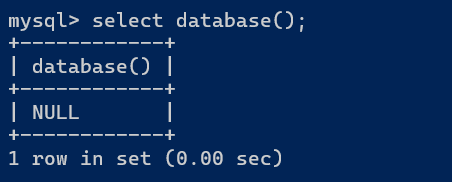

### 显示创建语句

```
show create database 数据库名；
```
结果
```
mysql> show create database helloworld;
+------------+-----------------------------------------------------------------------+
| Database   | Create Database                                                       |
+------------+-----------------------------------------------------------------------+
| helloworld | CREATE DATABASE `helloworld` /*!40100 DEFAULT CHARACTER SET utf8 */ |
+------------+-----------------------------------------------------------------------+
1 row in set (0.00 sec)
```

说明：

- MySQL 建议我们关键字使用大写，但是不是必须的。 
- 数据库名字的反引号``,是为了防止使用的数据库名刚好是关键字
- `/*!40100  default.... */`这个不是注释，表示 如果当前mysql版本大于4.01版本，就执行这句话


### 删除数据库

```
DROP DATABASE [IF EXISTS] 数据库名;
```

> 对应的数据库文件夹被删除，级联删除，里面的数据表全部被删


### 使用数据库

语法

```
use 数据库名;
```


> use就像cd命令一样,需要使用某个目录(数据库)时,先cd进入这个目录 -- 库的行为与linux行为对应上


### 查看当前使用的数据库

```
select database();
```


### 数据库备份与还原

#### 备份

- 备份整个数据库

```
mysqldump  -u root -p 密码 -B 数据库名 > 数据库备份存储的文件路径(一般是.sql文件,相对路径)
```

- 备份数据库其中的表

```
mysqldump -u root -p 数据库名 表名1 表名2  > ../mytest.sql		## 注意,不带-B了
```
> 如果备份一个数据库时，没有带上-B参数， 在恢复数据库时，需要先创建空数据库，然后使用数据 
> 库，再使用source来还原。
>
> -B选项会备份数据库创建语法
>
> 


- 备份多个数据库

```
mysqldump -u root -p -B 数据库名1  数据库名2 ... > 数据库存放路径
```


#### 还原

- 还原

```
mysql> source 绝对路径
```


### 查看数据库连接数

```
show processlist;
```

mysql> show processlist; 
+----+------+-----------+------+---------+------+-------+------------------+
| Id | User | Host      | db   | Command | Time | State | Info             | 
+----+------+-----------+------+---------+------+-------+------------------+
|  2 | root | localhost | test | Sleep   | 1386 |       | NULL             |
|  3 | root | localhost | NULL | Query   |    0 | NULL  | show processlist | 
+----+------+-----------+------+---------+------+-------+------------------+    


## 表的操作(DDL)

### 建表

语法

```
CREATE TABLE  user1 (
  id int(11) COMMENT '用户id',
  name varchar(32) COMMENT '用户名',
  password char(32) COMMENT '定长密码',
  birthday date COMMENT '生日'
) ENGINE=MyISAM CHARSET=utf8;
```

```
CREATE TABLE if not exists `user2` (
  `id` int(11) DEFAULT NULL COMMENT '用户id',
  `name` varchar(32) DEFAULT NULL COMMENT '用户名',
  `password` char(32) DEFAULT NULL COMMENT '定长密码',
  `birthday` date DEFAULT NULL COMMENT '生日'
) ENGINE=InnoDB DEFAULT CHARSET=utf8;
```

- comment:建表语句注释

> 建表可以指定存储引擎,编码集,校验集
>
> 数据库是仓库(目录),表是货物(具体文件)


与linux对应操作

```
[root@gz d1]# ll
total 128
-rw-r----- 1 mysql mysql    61 Sep  4 11:14 db.opt		//数据库默认配置

-rw-r----- 1 mysql mysql  8697 Sep  4 11:19 user1.frm	//frm:表结构
-rw-r----- 1 mysql mysql     0 Sep  4 11:19 user1.MYD	//D:data	MYISAM的数据文件
-rw-r----- 1 mysql mysql  1024 Sep  4 11:19 user1.MYI	//I:index MYISAM的索引文件(数据与索引分开)
-rw-r----- 1 mysql mysql  8697 Sep  4 11:17 user2.frm	//frm:表结构
-rw-r----- 1 mysql mysql 98304 Sep  4 11:17 user2.ibd	//d:data 	InnoDB的数据文件(数据和索引一起)
```


### 查看数据库中的表

```
show tables;
```


### 查看表结构

```
desc 表名;			##description:描述
```

显示结构: 

`| 字段 | 字段数据类型 | 是否允许为空 | 键/索引类型 | 缺省值 | 扩充 |`

示例

```
mysql> desc user1;
+----------+-------------+------+-----+---------+-------+
| Field    | Type        | Null | Key | Default | Extra |
+----------+-------------+------+-----+---------+-------+
| id       | int(11)     | YES  |     | NULL    |       |
| name     | varchar(32) | YES  |     | NULL    |       |
| password | char(32)    | YES  |     | NULL    |       |
| birthday | date        | YES  |     | NULL    |       |
+----------+-------------+------+-----+---------+-------+
```


### 查看表的创建信息

```
show create table 表名;
```

> 不一定和用户当时写的SQL一一对应,用户写的SQL会在MYSQL服务器词法语法分析器中重新解析、优化后执行,更加标准;因此返回的结果是标准SQL语句.


### 修改表结构

>  删除字段(列)只需要字段名,增加和修改操作还需要属性

```
增加列
ALTER TABLE  tablename ADD (column datatype 字段属性...);

修改列属性
ALTER TABLE  tablename MODIfy (column datatype 字段属性...);

删除列
ALTER TABLE  tablename DROP (column);

修改列名(相当于删除后添加,但是不会删除数据)
ALTER TABLE  tablename 列名 change 新列名 (字段属性等完整定义...)
```

举例

- 添加一列用于存放图片路径

  ```
  alter table user1 add image_path varchar(128) comment '图片路径' after birthday;	## 默认插入到最末;  after 列名 : 表示在哪列之后,
  ```

- 删除一列

  ```
  alter table user1 drop image_path;						# 只需要列名,该列所有数据也会被干掉
  ```

- 修改某列的属性

  ```
  alter table user1 modify name varchar(60); 		# 直接在字段后面加上属性,会覆盖掉所有旧属性
  ```

  ```
  mysql> show create table user1 \G;
  *************************** 1. row ***************************
         Table: user1
  Create Table: CREATE TABLE `user1` (
    `id` int(11) DEFAULT NULL COMMENT '用户id',
    `name` varchar(60) DEFAULT NULL,												### 覆盖式修改
    `password` char(32) DEFAULT NULL COMMENT '定长密码',
    `birthday` date DEFAULT NULL COMMENT '生日',
    `image_path` varchar(128) DEFAULT NULL COMMENT '图片路径'
  ) ENGINE=MyISAM DEFAULT CHARSET=utf8
  1 row in set (0.00 sec)
  ```

  

### 修改表名

```
alter table 表名 rename to 新表名;				## to可以省略
```


### 删除表

```
drop table 表名;
```


## 数据类型

### 数据类型分类

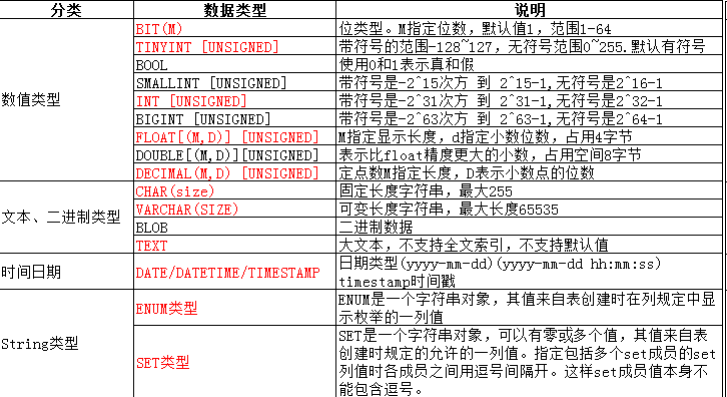

### 数值类型

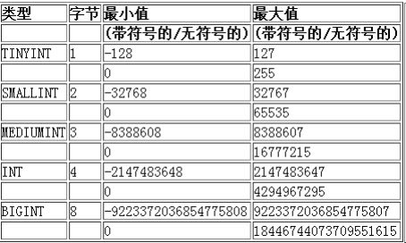

- 数值类型+unsigned 就是无符号类型

- mysql中类型与C/C++定义变量方式反过来

  > C/C++:
  >
  > ​	unsigned int a;
  >
  > MySQL:
  >
  > ​	a int unsigned;

- 为什么有这么多种类型: 在节省空间与满足应用场景之间的平衡

### 以TINYINT认识整型族

先建个简单的只有一个字段表

```
mysql> create database test_db charset=utf8 collate=utf8_general_ci engine=InnoDB;
create table t1(num tinyint);

mysql> desc t1;
+-------+------------+------+-----+---------+-------+
| Field | Type       | Null | Key | Default | Extra |
+-------+------------+------+-----+---------+-------+
| num   | tinyint(4) | YES  |     | NULL    |       |
+-------+------------+------+-----+---------+-------+
1 row in set (0.00 sec)

mysql> show create table t1\G;
*************************** 1. row ***************************
       Table: t1
Create Table: CREATE TABLE `t1` (
  `num` tinyint(4) DEFAULT NULL
) ENGINE=InnoDB DEFAULT CHARSET=utf8
1 row in set (0.00 sec)
```

> tinyint(4) 括号内数字后面说


#### 有符号边界范围测试

- 边界内能够正常插入

```
mysql> insert into t1(num) values(-128);
Query OK, 1 row affected (0.00 sec)

mysql> insert into t1(num) values(127);
Query OK, 1 row affected (0.00 sec)

mysql> insert into t1(num) values(0);
Query OK, 1 row affected (0.00 sec)

mysql> insert into t1(num) values(-1);
Query OK, 1 row affected (0.00 sec)

mysql> insert into t1(num) values(1);
Query OK, 1 row affected (0.01 sec)

mysql> select * from t1;
+------+
| num  |
+------+
| -128 |
|  127 |
|    0 |
|   -1 |
|    1 |
+------+
5 rows in set (0.00 sec)
```

- 边界外无法插入

```
mysql> insert into t1(num) values(-129);
ERROR 1264 (22003): Out of range value for column 'num' at row 1
mysql> insert into t1(num) values(128);
ERROR 1264 (22003): Out of range value for column 'num' at row 1
```


#### 无符号边界测试

建一个只有无符号tiny类型的表

```
mysql> create table t2(num tinyint unsigned);
Query OK, 0 rows affected (0.02 sec)
```


- 范围内正常插入

```
mysql> insert into t2(num) values(0);
Query OK, 1 row affected (0.00 sec)

mysql> insert into t2(num) values(1);
Query OK, 1 row affected (0.00 sec)


mysql> insert into t2(num) values(255);
Query OK, 1 row affected (0.01 sec)
```

- 范围外不允许插入

```
mysql> insert into t2(num) values(256);
ERROR 1264 (22003): Out of range value for column 'num' at row 1

mysql> insert into t2(num) values(-1);
ERROR 1264 (22003): Out of range value for column 'num' at row 1
```


#### 说明

mysql中,所有数值类型数据范围不匹配时,mysql一般会直接拦截,不允许写入;

反过来,已经存在mysql中的数据,一定是合法的;

例如,修改表字段时,如果原有数据不满足新数据类型规则时,不允许进行修改

```
mysql> alter table t1 modify num tinyint unsigned;
ERROR 1264 (22003): Out of range value for column 'num' at row 1
mysql> alter table t2 modify num tinyint;
ERROR 1264 (22003): Out of range value for column 'num' at row 3
```

这也说明,mysql中数据类型也是一种约束

> 约束:约束程序员/使用者 尽可能正确的存取数据

另外,尽量不使用unsigned，对于int类型可能存放不下的数据，int unsigned同样可能存放不下，与其如此，还不如设计时，将int类型提升为bigint类型。


### BIT类型

基本语法：

```
bit[(M)] : 比特位/位图。M表示位数，范围从1到64。如果M被忽略，默认为1。
```

用法举例:

```
mysql> create table t3(id int, online bit(1));
Query OK, 0 rows affected (0.02 sec)

mysql> insert into t3(id,online) values(1,0);
Query OK, 1 row affected (0.00 sec)

mysql> insert into t3(id,online) values(2,1);
Query OK, 1 row affected (0.01 sec)

mysql> insert into t3(id,online) values(3,2);
ERROR 1406 (22001): Data too long for column 'online' at row 1

mysql> select * from t3;		#### 字符回显是以ascii码表示的,此时online的值属于不回显字符;
+------+--------+
| id   | online |
+------+--------+
|    1 |        |
|    2 |       |
+------+--------+
2 rows in set (0.00 sec)

mysql> select id,bin(online) from t3;
+------+-------------+
| id   | bin(online) |
+------+-------------+
|    1 | 0           |
|    2 | 1           |
+------+-------------+
2 rows in set (0.00 sec)
```

> 如何证明是ascii码,把bit调整更大(到10),然后插入'a',之后就能看到回显的'a'了;


### FLOAT类型

> mysql中浮点类型是支持舍入进位的,但是各种浮点类型的舍入规则各不相同

建一个小数精度为2,总有效长度为4的表

```
mysql> create table t4 (id int ,salary float(4,2))charset=utf8, collate=utf8_general_ci,engine=InnoDB;
Query OK, 0 rows affected (0.01 sec)

mysql> desc t4;
+--------+------------+------+-----+---------+-------+
| Field  | Type       | Null | Key | Default | Extra |
+--------+------------+------+-----+---------+-------+
| id     | int(11)    | YES  |     | NULL    |       |
| salary | float(4,2) | YES  |     | NULL    |       |
+--------+------------+------+-----+---------+-------+
2 rows in set (0.00 sec)
```


- 常规插入

```
mysql> insert into t4 (id,salary) values(1,99.99);
Query OK, 1 row affected (0.00 sec)

mysql> insert into t4 (id,salary) values(2,-99.99);
Query OK, 1 row affected (0.01 sec)
```


- 错误插入

```
mysql> insert into t4 (id,salary) values(4,100.00);
ERROR 1264 (22003): Out of range value for column 'salary' at row 1

mysql> insert into t4 (id,salary) values(4,100.0);
ERROR 1264 (22003): Out of range value for column 'salary' at row 1

mysql> insert into t4 (id,salary) values(4,99.999);
ERROR 1264 (22003): Out of range value for column 'salary' at row 1
```


- 占位插入

```

mysql> insert into t4 (id,salary) values(4,1.000);
Query OK, 1 row affected (0.00 sec)

mysql> insert into t4 (id,salary) values(4,1.0000);
Query OK, 1 row affected (0.00 sec)

mysql> insert into t4 (id,salary) values(4,1.00000);
Query OK, 1 row affected (0.00 sec)

mysql> insert into t4 (id,salary) values(4,99.00000);
Query OK, 1 row affected (0.00 sec)

mysql> insert into t4 (id,salary) values(4,099.00);
Query OK, 1 row affected (0.00 sec)

mysql> insert into t4 (id,salary) values(4,000099.9900);
Query OK, 1 row affected (0.00 sec)

mysql> insert into t4 (id,salary) values(4,10.0);
Query OK, 1 row affected (0.00 sec)
```


- 舍入插入

```
mysql> insert into t4 values(3, 99.994);
Query OK, 1 row affected (0.01 sec)

mysql> insert into t4 values(3, 99.995);
ERROR 1264 (22003): Out of range value for column 'salary' at row 1
```

> 舍入后,如果范围超过精度,则不允许插入;在精度范围内,则允许插入


查看插入的数据

```
mysql> select * from t4;
+------+--------+
| id   | salary |
+------+--------+
|    1 |  99.99 |
|    2 | -99.99 |
|    4 |   1.00 |
|    4 |   1.00 |
|    4 |   1.00 |
|    4 |  99.00 |
|    4 |  99.00 |
|    4 |  99.99 |
|    4 |  10.00 |
|    4 |   1.00 |
+------+--------+
10 rows in set (0.00 sec)
```


说明: 约束有效数字范围不能超过指定范围. 无效数字是可以超过的,无效数字不保留,只保留有效数字部分; 不满足的小数部分会自动补齐
