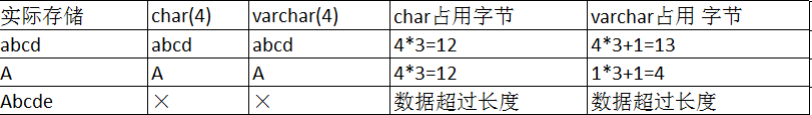
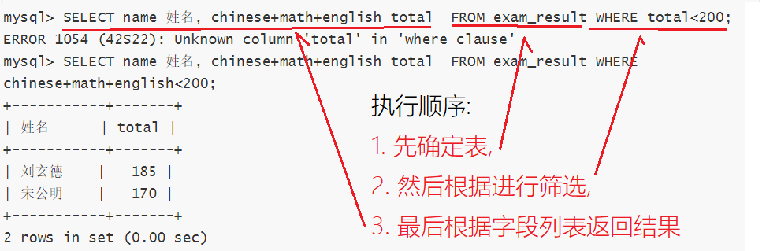
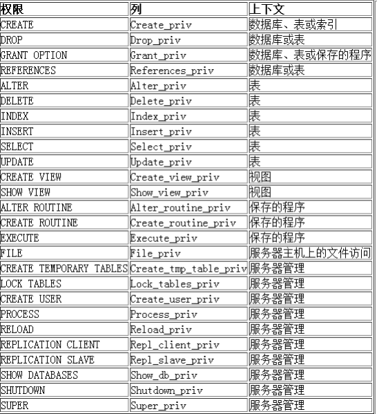

[toc]


## MySQL卸载

### 环境

在安装前,为了减少相关因素影响,建议先卸载干净后再安装;

整个安装过程需要root权限;

安装环境 centos 7; 

安装版本 MySQL 5.7;

架构 x86-64;

### 查看是否已安装MySQL

查看正在运行的进程,如果存在可以先kill掉
```
ps axj|grep mysql
```


查看是否存在有正在运行的SQL服务
```
systemctl list-units|grep mysql
```

暂停mysql服务

```
systemctl stop mysqld
```


### 卸载mysql服务

yum安装的mysql通常是.rpm版本,因此可以通过rpm管理器查看mysql安装包

```
rpm -qa | grep mysql			#	qa 表示 'query all'
```

全部卸载,可以选择手动一条条删,也可以选择组合命令自动化删除

```
rpm -qa | grep mysql | xargs yum -y remove 		# 将rpm输出结果通过xargs转成命令参数喂给yum
```


### 查看是否卸载干净

卸载mysql后,/etc/my.cnf文件也会被删除

```
ls /etc/my.cnf
```

历史mysql数据默认会保留.需要的话可以做一个备份

```
sudo ls /var/lib/mysql/
```


## MySQL安装


### 查看linux版本

安装前先查看自己linux发行版

```
cat /etc/centos-release
```

或

```
cat /etc/redhat-release
```


或

```
uname -a		# el代表centos
```


### 选择MySQL版本

打开网页[http://repo.mysql.com/](http://repo.mysql.com/)


可以发现很多版本,但是版本过长,显示不全,右键选择查看网页源代码就能展开查看了


我的服务器是centos7,因此选择el版本;即[mysql57-community-release-el7.rpm](http://repo.mysql.com/mysql57-community-release-el7.rpm)(centos7通用版本,如果有对应的版本也可以选择)


> [noarch_百度百科 (baidu.com)](https://baike.baidu.com/item/noarch/5351882?fr=aladdin


### 获取mysql官方yum源

使用wget直接下载到服务器

```
wget http://repo.mysql.com/mysql57-community-release-el7.rpm
```

或者直接下载到本地,然后再使用其他方法如scp,lrzsz,ftp方式等拷贝过去


### rpm安装mysql官方yum源

进入到存放mysql的目录后,因为我们下载的mysql是.rpm版本,因此需要使用rpm管理器进行安装.

> yum类似一个商店,用于下载需要的包,实际安装也是调用rpm进行安装.如果配好了下载mysql的yum源,就可以直接通过yum进行直接安装.
>
> 可以通过ls /etc/yum.repos.d/ 查看所有yum源
>
> 
>
> 我的liunx上没有mysql相关的yum源,因此需要安装;

安装命令:

```
sudo rpm -ivh mysql57-community-release-el7.rpm
```


安装后,yum也更新了mysql相关的yum源


之后就可以通过yum进行安装mysql及mysql相关工具.


测试新增的yum源是否正常工作:

```
yum list |grep mysql
```

如果出现mysql相关的包,就说明安装成功


### 安装mysql服务

```
sudo yum install -y mysql-community-server
```

安装大概需要1G空间,安装时间根据机器配置而定,需要一定时间


### 查看是否安装成功

查看mysql配置文件是否存在

```
ls /etc/my.cnf
```

查看服务端应用程序是否存在

```
which mysqld
```


> sbin:super bin # 需要超管权限的服务

查看客户端应用程序

```
which mysql
```


查看监听端口号,mysql启动后会在local Address 3306

```
netstat nltp
```


## 配置MySQL

### 简单登录mysql命令

先看能不能用,简单登录测试,注意刚安装时是不知道密码的,看下文处理

> 更新版本的mysql可能root没有登陆密码,直接回车登录即可.
>
> 其他方式如历史记录查看mysql生成临时密码等(旧版本) :
>
> `sudo grep 'temporary password' /var/log/mysqld.log `\
>
> 搜到就用你的搜到的,搜不到就只能用别的方法
>
> 可能临时密码都是相同的,即`waQ,qR%be2(5` 
>
> 可以输入试试;


```
mysql -uroot -p ## -u:User, -p表示password
```

退出命令

```
quit
```


### 免密登录配置

在不知道密码时,网上有多种登录方式,当前介绍免密登录配置.

在/etc/my.cnf文件中追加以下命令即可.

```
skip-grant-tables
```

配置好后重启mysqld

```
systemctl restart mysqld 	##或者分两步走,先stop再start
```

然后再次登录mysql,密码处直接回车即可

能够登录之后,再进行修改密码,修改密码方式有很多种,不过当前是处于`kip-grant-tables`下,常规方式不允许,可以直接通过修改user表进行修改密码;下面语句暂时用着即可

```
mysql> set global validate_password_policy=0;		## 设置为弱密码强度
#安全强度，默认为中，即1，要求必须包含 数字、符号、⼤⼩写字⺟，⻓度⾄少为8位 

set global validate_password_length=1;	## 设置密码最小长度

update user set authentication_string=password('123456') where user='root';	##直接对数据进行操作
或  ALTER USER 'root'@'localhost' IDENTIFIED BY '123456';

flush privileges;	## 刷新权限
```

改完密码后就可以移除`skip-grant-tables`配置了

### my.cnf 其他配置项

```
## /etc/my.cnf
## ...

datadir=/var/lib/mysql                  #建表等数据存放路径
socket=/var/lib/mysql/mysql.sock        #内部数据,略

# Disabling symbolic-links is recommended to prevent assorted security risks
symbolic-links=0

log-error=/var/log/mysqld.log           #错误日志
pid-file=/var/run/mysqld/mysqld.pid

# User-defind Add
skip-grant-tables                       #免密设置,重启mysqld生效
port=3306                               #mysql服务端口号
character-set-server=utf8               #设置字符集为utf8
default-storage-engine=innodb           #设置默认存储引擎为innodb

```


### 设置开机启动(可选)

```
systemctl enable mysqld		#开机自启
systemctl daemon-reload		#重新加载配置文件
```


## 常用命令与名词认识

### 登录命令

```
mysql -h127.0.0.1 -P3306 -uroot		## -h 指定服务器ip -P指定端口号 ##不指定时使用默认
```


### 清屏命令

```
mysql> system clear;
```


### 认识mysql 和 mysqld

mysqld是网络服务一种,d表示daemon,守护进程;mysqld表示mysql数据库服务的服务器端

mysql就是数据库服务的客户端了


mysql是一套提供数据存取服务的网络程序;

数据库本质是,在磁盘或内存中存储的 特定结构组织的数据


一般谈数据库服务就表示mysqld ;谈数据库时,就是具体的数据组织文件


### 数据库在linux中的存在形式

创建了一个数据库叫`helloworld`


根据`/etc/my.cnf`知道,`datadir`是数据存放目录,默认为`/var/lib/mysql,`进到目录中,可以发现该目录中存在许多与数据库同名的目录,即**数据库在linux中是一个目录**


进到helloworld目录中,只有一个配置信息的文件


建一个表后,查看变化


表表现为.frm和.ibd两个文件;即**表就是数据库目录中的文件**


> 在数据库目录下创建一个目录,对应的mysql也会同步增加一个数据库(测试用,实际不可这么做)


### SQL分类

- DDL(data definition language) 数据定义语言,用来维护存储数据的结构

  代表指令: create, drop, alter

- DML(data manipulation language) 数据操作语言,用来对数据进行操作

  代表指令: insert, delete, update

- DCL(data control language) 数据控制语言, 主要负责权限管理和事物

  代表指令: grant, revoke, commit


### 存储引擎

存储引擎是：数据库管理系统如何存储数据、如何为存储的数据建立索引和如何更新、查询数据等技术的实现方法。
MySQL的核心就是插件式存储引擎，支持多种存储引擎。

查看存储引擎

```
show engines;
```


MySQL常用的存储引擎基本上只有两种InnoDB或MyISAM;如果需要其他存储引擎时,大概率也不会选择MySQL,而是考虑其他数据库服务了.

>  InnoDB以强大索引,事物功能,方便业务处理; MyISAM不支持事务,但是高并发较好;

#### 存储引擎对比


### MySQL架构

MySQL 是一个可移植的数据库，几乎能在当前所有的操作系统上运行，各种系统在底层实现方面各有不同，但是 MySQL 基本上能保证在各个平台上的物理体系结构的一致性。

> 主要还是作为网络服务用在服务器(linux)上.


mysqld可以简单分为4层


## help中文翻译

```
所有 MySQL 命令列表：
请注意，所有的文本命令都必须在一行的开始位置，并且以 ';' 结束。

? (\?) - `help` 的同义词。
clear (\c) - 清除当前输入的语句。
connect (\r) - 重新连接到服务器。可选参数包括数据库(db)和主机(host)。 
delimiter (\d) - 设置语句分隔符。
edit (\e) - 使用 $EDITOR 编辑命令。
ego (\G) - 将命令发送到 MySQL 服务器，并垂直显示结果。
exit (\q) - 退出 MySQL。与 quit 相同。
go (\g) - 将命令发送到 MySQL 服务器。
help (\h) - 显示此帮助信息。
nopager (\n) - 禁用分页器，打印到标准输出。
notee (\t) - 不写入输出文件。
pager (\P) - 设置分页器 [to_pager]。通过分页器打印查询结果。
print (\p) - 打印当前命令。
prompt (\R) - 更改你的 MySQL 提示符。
quit (\q) - 退出 MySQL。
rehash (\#) - 重建补全哈希表。
source (\.) - 执行一个 SQL 脚本文件。需要一个文件名作为参数。
status (\s) - 从服务器获取状态信息。
system (\!) - 执行一个系统 Shell 命令。
tee (\T) - 设置输出文件 [to_outfile]。将所有内容附加到指定的输出文件。
use (\u) - 使用另一个数据库。需要一个数据库名称作为参数。
charset (\C) - 切换到另一个字符集。可能在处理多字节字符集的 binlog 时需要。
warnings (\W) - 每个语句后显示警告。
nowarning (\w) - 每个语句后不显示警告。
resetconnection (\x) - 清理会话上下文。
```


#### 现学现用

- `? 命令` 显示对应指令的帮助文档

  例如 `? use`

- `命令 \c` 当前输入命令作废

- `命令 \G` 结果垂直显示,而不是以表格形式显示。

- `system shell命令` 或 `\! shell命令 `  : 执行系统命令

  常用: `system clear`

- `status` 或 `\s` :显示服务器信息

- `source` 或 `\.`: 执行sql

- `connect [db_name [host]]` 重新连接到 `my_database` 数据库，连接主机为 `my_host`。

  示例:`connect my_database my_host;`

- `prompt [new_prompt]` 修改提示符的名字

  示例:`prompt hello> ` 把提示符`mysql> `  改成了`hello> `


## 数据库的编码集与校验集

数据库编码集:数据库未来存储数据采用的编码集

> 编码集,即一套表示数据的规则,写入数据时,根据采用的字符集,写入对应规则的数据.
>
> 一般来说怎么存就要怎么取,即统一的编码集

数据库校验集:检测数据库存取比较时,是否使用同样的编码

> 取数相关操作需要加载到内存中,此时才会对数据进行校验

- 查看系统默认字符集以及校验规则

```
show variables like 'character_set_database'; 	##字符集
show variables like 'collation_database';				##校验规则
show variables like 'character_set_%';					##查看所有字符集相关
show variables like 'collation_%';							##查看所有校验规则相关
```


- 查看数据库支持的字符集

```
show charset;
```


当我们创建数据库没有指定字符集和校验规则时，系统使用默认字符集或配置文件中的字符集：

例如配置文件my.cnf中设置了utf8，校验规则 是：utf8_ general_ ci


一般来说,使用了对应的校验码后,mysql会自动同步更新成对应的字符集,无需手动设置.(如果对应不上的话,则可以查表show charset自己修改正确)


## 表的结构

​			列fields

行records


## 库的操作(DDL)

### 创建数据库

语法

```
CREATE DATABASE [IF NOT EXISTS] 数据库名 [create_specification [create_specification] ...]
```

> 中括号[]围起来的表示**可选**选项

说明：

- 大写的表示关键字
- [] 是可选项
- CHARACTER SET: 指定数据库采用的字符集 
- COLLATE: 指定数据库字符集的校验规则


#### 带字符集创建

显式指明字符集时,会覆盖掉默认的字符集(就近原则)

未来在建表时,表的配置也同数据库的配置;

```
create database 数据库名 charset=utf8;
或
create database 数据库名 charset utf8;				##省略=号
或
create database 数据库名 character set=utf8;
或
create database 数据库名 character set utf8;	##省略=号
```


#### 带校验集创建

```
create database 数据库名 charset=utf8 collate utf8_general_ci;
```

> utf8_general_ci:不区分大小写
>
> utf8_bin:区分大小写


注意:一般不支持指定存储引擎创建

验证:

```
mysql> create database test_db charset=utf8 collate=utf8_general_ci;
## 切换至linux
[root@gz mysql]# cd test_db/
[root@gz test_db]# ls
db.opt
[root@gz test_db]# cat db.opt
default-character-set=utf8
default-collation=utf8_general_ci
```

说明数据库默认只配置编码集和校验集

### 查看数据库

```
show databases;
```

#### 查看自己正在使用的是哪一个数据库

```
select database();
```


### 显示创建语句

```
show create database 数据库名；
```
结果
```
mysql> show create database helloworld;
+------------+-----------------------------------------------------------------------+
| Database   | Create Database                                                       |
+------------+-----------------------------------------------------------------------+
| helloworld | CREATE DATABASE `helloworld` /*!40100 DEFAULT CHARACTER SET utf8 */ |
+------------+-----------------------------------------------------------------------+
1 row in set (0.00 sec)
```

说明：

- MySQL 建议我们关键字使用大写，但是不是必须的。 
- 数据库名字的反引号``,是为了防止使用的数据库名刚好是关键字
- `/*!40100  default.... */`这个不是注释，表示 如果当前mysql版本大于4.01版本，就执行这句话


### 删除数据库

```
DROP DATABASE [IF EXISTS] 数据库名;
```

> 对应的数据库文件夹被删除，级联删除，里面的数据表全部被删


### 使用数据库

语法

```
use 数据库名;
```


> use就像cd命令一样,需要使用某个目录(数据库)时,先cd进入这个目录 -- 库的行为与linux行为对应上


### 查看当前使用的数据库

```
select database();
```


### 数据库备份与还原

#### 备份

- 备份整个数据库

```
mysqldump  -u root -p 密码 -B 数据库名 > 数据库备份存储的文件路径(一般是.sql文件,相对路径)
```

- 备份数据库其中的表

```
mysqldump -u root -p 数据库名 表名1 表名2  > ../mytest.sql		## 注意,不带-B了
```
> 如果备份一个数据库时，没有带上-B参数， 在恢复数据库时，需要先创建空数据库，然后使用数据 
> 库，再使用source来还原。
>
> -B选项会备份数据库创建语法
>
> 


- 备份多个数据库

```
mysqldump -u root -p -B 数据库名1  数据库名2 ... > 数据库存放路径
```


#### 还原

- 还原

```
mysql> source 绝对路径
```


### 查看数据库连接数

```
show processlist;
```

mysql> show processlist; 
+----+------+-----------+------+---------+------+-------+------------------+
| Id | User | Host      | db   | Command | Time | State | Info             | 
+----+------+-----------+------+---------+------+-------+------------------+
|  2 | root | localhost | test | Sleep   | 1386 |       | NULL             |
|  3 | root | localhost | NULL | Query   |    0 | NULL  | show processlist | 
+----+------+-----------+------+---------+------+-------+------------------+    


## 表的操作(DDL)

### 建表

语法

```
CREATE TABLE  user1 (
  id int(11) COMMENT '用户id',
  name varchar(32) COMMENT '用户名',
  password char(32) COMMENT '定长密码',
  birthday date COMMENT '生日'
) ENGINE=MyISAM CHARSET=utf8;
```

```
CREATE TABLE if not exists `user2` (
  `id` int(11) DEFAULT NULL COMMENT '用户id',
  `name` varchar(32) DEFAULT NULL COMMENT '用户名',
  `password` char(32) DEFAULT NULL COMMENT '定长密码',
  `birthday` date DEFAULT NULL COMMENT '生日'
) ENGINE=InnoDB DEFAULT CHARSET=utf8;
```

- comment:建表语句注释

> 建表可以指定存储引擎,编码集,校验集
>
> 数据库是仓库(目录),表是货物(具体文件)


与linux对应操作

```
[root@gz d1]# ll
total 128
-rw-r----- 1 mysql mysql    61 Sep  4 11:14 db.opt		//数据库默认配置

-rw-r----- 1 mysql mysql  8697 Sep  4 11:19 user1.frm	//frm:表结构
-rw-r----- 1 mysql mysql     0 Sep  4 11:19 user1.MYD	//D:data	MYISAM的数据文件
-rw-r----- 1 mysql mysql  1024 Sep  4 11:19 user1.MYI	//I:index MYISAM的索引文件(数据与索引分开)
-rw-r----- 1 mysql mysql  8697 Sep  4 11:17 user2.frm	//frm:表结构
-rw-r----- 1 mysql mysql 98304 Sep  4 11:17 user2.ibd	//d:data 	InnoDB的数据文件(数据和索引一起)
```


### 查看数据库中的表

```
show tables;
```


### 查看表结构

```
desc 表名;			##description:描述
```

显示结构: 

`| 字段 | 字段数据类型 | 是否允许为空 | 键/索引类型 | 缺省值 | 扩充 |`

示例

```
mysql> desc user1;
+----------+-------------+------+-----+---------+-------+
| Field    | Type        | Null | Key | Default | Extra |
+----------+-------------+------+-----+---------+-------+
| id       | int(11)     | YES  |     | NULL    |       |
| name     | varchar(32) | YES  |     | NULL    |       |
| password | char(32)    | YES  |     | NULL    |       |
| birthday | date        | YES  |     | NULL    |       |
+----------+-------------+------+-----+---------+-------+
```


### 查看表的创建信息

```
show create table 表名;
```

> 不一定和用户当时写的SQL一一对应,用户写的SQL会在MYSQL服务器词法语法分析器中重新解析、优化后执行,更加标准;因此返回的结果是标准SQL语句.


### 修改表结构

>  删除字段(列)只需要字段名,增加和修改操作还需要属性

```
增加列
ALTER TABLE  tablename ADD (column datatype 字段属性...);

修改列属性
ALTER TABLE  tablename MODIfy (column datatype 字段属性...);

删除列
ALTER TABLE  tablename DROP (column);

修改列名(相当于删除后添加,但是不会删除数据)
ALTER TABLE  tablename 列名 change 新列名 (字段属性等完整定义...)
```

举例

- 添加一列用于存放图片路径

  ```
  alter table user1 add image_path varchar(128) comment '图片路径' after birthday;	## 默认插入到最末;  after 列名 : 表示在哪列之后,
  ```

- 删除一列

  ```
  alter table user1 drop image_path;						# 只需要列名,该列所有数据也会被干掉
  ```

- 修改某列的属性

  ```
  alter table user1 modify name varchar(60); 		# 直接在字段后面加上属性,会覆盖掉所有旧属性
  ```

  ```
  mysql> show create table user1 \G;
  *************************** 1. row ***************************
         Table: user1
  Create Table: CREATE TABLE `user1` (
    `id` int(11) DEFAULT NULL COMMENT '用户id',
    `name` varchar(60) DEFAULT NULL,												### 覆盖式修改
    `password` char(32) DEFAULT NULL COMMENT '定长密码',
    `birthday` date DEFAULT NULL COMMENT '生日',
    `image_path` varchar(128) DEFAULT NULL COMMENT '图片路径'
  ) ENGINE=MyISAM DEFAULT CHARSET=utf8
  1 row in set (0.00 sec)
  ```

  

### 修改表名

```
alter table 表名 rename to 新表名;				## to可以省略
```

或

```
rename table 表名 to 新表名;
```


### 删除表

```
drop table 表名;
```


## 数据类型

数据类型,也是一种约束

### 数据类型分类


### 数值类型


- 数值类型+unsigned 就是无符号类型

- mysql中类型与C/C++定义变量方式反过来

  > C/C++:
  >
  > ​	unsigned int a;
  >
  > MySQL:
  >
  > ​	a int unsigned;

- 为什么有这么多种类型: 在节省空间与满足应用场景之间的平衡

### 以TINYINT认识整型族

先建个简单的只有一个字段表

```
mysql> create database test_db charset=utf8 collate=utf8_general_ci engine=InnoDB;
create table t1(num tinyint);

mysql> desc t1;
+-------+------------+------+-----+---------+-------+
| Field | Type       | Null | Key | Default | Extra |
+-------+------------+------+-----+---------+-------+
| num   | tinyint(4) | YES  |     | NULL    |       |
+-------+------------+------+-----+---------+-------+
1 row in set (0.00 sec)

mysql> show create table t1\G;
*************************** 1. row ***************************
       Table: t1
Create Table: CREATE TABLE `t1` (
  `num` tinyint(4) DEFAULT NULL
) ENGINE=InnoDB DEFAULT CHARSET=utf8
1 row in set (0.00 sec)
```

> tinyint(4) 括号内数字后面说


#### 有符号边界范围测试

- 边界内能够正常插入

```
mysql> insert into t1(num) values(-128);
Query OK, 1 row affected (0.00 sec)

mysql> insert into t1(num) values(127);
Query OK, 1 row affected (0.00 sec)

mysql> insert into t1(num) values(0);
Query OK, 1 row affected (0.00 sec)

mysql> insert into t1(num) values(-1);
Query OK, 1 row affected (0.00 sec)

mysql> insert into t1(num) values(1);
Query OK, 1 row affected (0.01 sec)

mysql> select * from t1;
+------+
| num  |
+------+
| -128 |
|  127 |
|    0 |
|   -1 |
|    1 |
+------+
5 rows in set (0.00 sec)
```

- 边界外无法插入

```
mysql> insert into t1(num) values(-129);
ERROR 1264 (22003): Out of range value for column 'num' at row 1
mysql> insert into t1(num) values(128);
ERROR 1264 (22003): Out of range value for column 'num' at row 1
```


#### 无符号边界测试

建一个只有无符号tiny类型的表

```
mysql> create table t2(num tinyint unsigned);
Query OK, 0 rows affected (0.02 sec)
```


- 范围内正常插入

```
mysql> insert into t2(num) values(0);
Query OK, 1 row affected (0.00 sec)

mysql> insert into t2(num) values(1);
Query OK, 1 row affected (0.00 sec)


mysql> insert into t2(num) values(255);
Query OK, 1 row affected (0.01 sec)
```

- 范围外不允许插入

```
mysql> insert into t2(num) values(256);
ERROR 1264 (22003): Out of range value for column 'num' at row 1

mysql> insert into t2(num) values(-1);
ERROR 1264 (22003): Out of range value for column 'num' at row 1
```


#### 说明

mysql中,所有数值类型数据范围不匹配时,mysql一般会直接拦截,不允许写入;

反过来,已经存在mysql中的数据,一定是合法的;

例如,修改表字段时,如果原有数据不满足新数据类型规则时,不允许进行修改

```
mysql> alter table t1 modify num tinyint unsigned;
ERROR 1264 (22003): Out of range value for column 'num' at row 1
mysql> alter table t2 modify num tinyint;
ERROR 1264 (22003): Out of range value for column 'num' at row 3
```

这也说明,mysql中数据类型也是一种约束

> 约束:约束程序员/使用者 尽可能正确的存取数据

另外,尽量不使用unsigned，对于int类型可能存放不下的数据，int unsigned同样可能存放不下，与其如此，还不如设计时，将int类型提升为bigint类型。


### BIT类型

基本语法：

```
bit[(M)] : 比特位/位图。M表示位数，范围从1到64。如果M被忽略，默认为1。
```

用法举例:

```
mysql> create table t3(id int, online bit(1));
Query OK, 0 rows affected (0.02 sec)

mysql> insert into t3(id,online) values(1,0);
Query OK, 1 row affected (0.00 sec)

mysql> insert into t3(id,online) values(2,1);
Query OK, 1 row affected (0.01 sec)

mysql> insert into t3(id,online) values(3,2);
ERROR 1406 (22001): Data too long for column 'online' at row 1

mysql> select * from t3;		#### 字符回显是以ascii码表示的,此时online的值属于不回显字符;
+------+--------+
| id   | online |
+------+--------+
|    1 |        |
|    2 |       |
+------+--------+
2 rows in set (0.00 sec)

mysql> select id,bin(online) from t3;
+------+-------------+
| id   | bin(online) |
+------+-------------+
|    1 | 0           |
|    2 | 1           |
+------+-------------+
2 rows in set (0.00 sec)
```

> 如何证明是ascii码,把bit调整更大(到10),然后插入'a',之后就能看到回显的'a'了;


### FLOAT类型

> mysql中浮点类型是支持舍入进位的,但是各种浮点类型的舍入规则各不相同

建一个小数精度为2,总有效长度为4的表

```
mysql> create table t4 (id int ,salary float(4,2))charset=utf8, collate=utf8_general_ci,engine=InnoDB;
Query OK, 0 rows affected (0.01 sec)

mysql> desc t4;
+--------+------------+------+-----+---------+-------+
| Field  | Type       | Null | Key | Default | Extra |
+--------+------------+------+-----+---------+-------+
| id     | int(11)    | YES  |     | NULL    |       |
| salary | float(4,2) | YES  |     | NULL    |       |
+--------+------------+------+-----+---------+-------+
2 rows in set (0.00 sec)
```


- 常规插入

```
mysql> insert into t4 (id,salary) values(1,99.99);
Query OK, 1 row affected (0.00 sec)

mysql> insert into t4 (id,salary) values(2,-99.99);
Query OK, 1 row affected (0.01 sec)
```


- 错误插入

```
mysql> insert into t4 (id,salary) values(4,100.00);
ERROR 1264 (22003): Out of range value for column 'salary' at row 1

mysql> insert into t4 (id,salary) values(4,100.0);
ERROR 1264 (22003): Out of range value for column 'salary' at row 1

mysql> insert into t4 (id,salary) values(4,99.999);
ERROR 1264 (22003): Out of range value for column 'salary' at row 1
```


- 占位插入

```

mysql> insert into t4 (id,salary) values(4,1.000);
Query OK, 1 row affected (0.00 sec)

mysql> insert into t4 (id,salary) values(4,1.0000);
Query OK, 1 row affected (0.00 sec)

mysql> insert into t4 (id,salary) values(4,1.00000);
Query OK, 1 row affected (0.00 sec)

mysql> insert into t4 (id,salary) values(4,99.00000);
Query OK, 1 row affected (0.00 sec)

mysql> insert into t4 (id,salary) values(4,099.00);
Query OK, 1 row affected (0.00 sec)

mysql> insert into t4 (id,salary) values(4,000099.9900);
Query OK, 1 row affected (0.00 sec)

mysql> insert into t4 (id,salary) values(4,10.0);
Query OK, 1 row affected (0.00 sec)
```


- 舍入插入

```
mysql> insert into t4 values(3, 99.994);
Query OK, 1 row affected (0.01 sec)

mysql> insert into t4 values(3, 99.995);
ERROR 1264 (22003): Out of range value for column 'salary' at row 1
```

> 舍入后,如果范围超过精度,则不允许插入;在精度范围内,则允许插入


查看插入的数据

```
mysql> select * from t4;
+------+--------+
| id   | salary |
+------+--------+
|    1 |  99.99 |
|    2 | -99.99 |
|    4 |   1.00 |
|    4 |   1.00 |
|    4 |   1.00 |
|    4 |  99.00 |
|    4 |  99.00 |
|    4 |  99.99 |
|    4 |  10.00 |
|    4 |   1.00 |
+------+--------+
10 rows in set (0.00 sec)
```


说明: 约束有效数字范围不能超过指定范围. 无效数字是可以超过的,无效数字不保留,只保留有效数字部分; 不满足的小数部分会自动补齐


#### 无符号Float

无符号float直接把负数部分砍掉


#### 默认的Float

默认的float即不输入范围的float,用户能够输入的精度范围很大,结果精度不太准确


#### 修约规则

采用的修约规则:“四舍六入五成双”，也即“4舍6入5凑偶”，这里“四”是指≤4 时舍去，"六"是指≥6时进上，"五"指的是根据5后面的数字来定，当5后有数时，舍5入1；当5后无有效数字时，需要分两种情况来讲：
（1）5前为奇数，舍5入1；
（2）5前为偶数，舍5不进（0是偶数）。

#### 评价

总的来说float精度不算太高。如果对存储精度要求不高或计算结果不需要高精度，可以使用FLOAT或DOUBLE。如果需要保持高精度，例如在财务系统中存储金额，建议使用DECIMAL。但需要注意，DECIMAL相比于FLOAT和DOUBLE会占用更多的存储空间。因此，在存储大量数值时，需要平衡精度和存储空间的需求。

> 精度不同版本可能不一样


### 高精度浮点decimal

浮点语法都一样

```
decimal(m, d) [unsigned] : 定点数m指定长度，d表示小数点的位数
```


与float精度对比

```
mysql> create table tt8 ( id int, salary float(10,8), salary2 
decimal(10,8));
mysql> insert into tt8 values(100,23.12345612, 23.12345612); 
Query OK, 1 row affected (0.00 sec)

mysql> select * from tt8; 
+------+-------------+-------------+
| id   | salary      | salary2     | 
+------+-------------+-------------+
|  100 | 23.12345695 | 23.12345612 | # 发现decimal的精度更准确，因此如果我们希望某个数据表示高精度，选择decimal
+------+-------------+-------------+
```


> 精度不同版本可能不一样
>
> float表示的精度大约是7位。 
> decimal整数最大位数m为65。支持小数最大位数d是30。如果d被省略，默认为0.如果m被省略，默认是10。


> 1. FLOAT： FLOAT是一种单精度浮点数类型，可以存储大约7位有效数字。它占用4个字节（32位）的存储空间。FLOAT适用于存储结果或计算结果不需要高精度、但需要较大范围的情况。但需要注意的是，由于使用近似值表示，FLOAT数据类型可能会导致一些舍入误差，在某些情况下，无法精确表示某些小数。
> 2. DOUBLE： DOUBLE是一种双精度浮点数类型，可以存储大约15位有效数字。它占用8个字节（64位）的存储空间。DOUBLE适用于存储结果或计算结果需要高精度的情况。与FLOAT一样，DOUBLE也使用近似值表示，可能存在舍入误差。
> 3. DECIMAL： DECIMAL是一种精确数值类型，用于存储具有非常高精度要求的数值。DECIMAL可以精确地保存用户定义的小数位数，并且不会发生近似值。DECIMAL的存储空间大小取决于定义的精度和范围。例如，DECIMAL(10, 2)可以存储10位数字，其中有2位小数。由于精确性较高，DECIMAL数据类型适用于存储金融领域的金额或其他精确计算。


### char类型

char类型是定长字符类型,长度固定;

语法:

```
char(L): 固定长度字符串，L是可以存储的长度，单位为字符，最大长度值可以为255
```

> 注意,MySQL中的字符是真字符,一个字符可以是字母或汉字


测试

```
mysql> create table t6(id int, name char(2));
Query OK, 0 rows affected (0.02 sec)

mysql> insert into t6 values(1,'a');
Query OK, 1 row affected (0.00 sec)

mysql> insert into t6 values(1,'ab');
Query OK, 1 row affected (0.00 sec)

mysql> insert into t6 values(1,'abc');
ERROR 1406 (22001): Data too long for column 'name' at row 1
mysql> insert into t6 values(1,'中');
Query OK, 1 row affected (0.00 sec)

mysql> insert into t6 values(1,'中国');
Query OK, 1 row affected (0.00 sec)

mysql> insert into t6 values(1,'中国人');
ERROR 1406 (22001): Data too long for column 'name' at row 1

mysql> select * from t6;
+------+--------+
| id   | name   |
+------+--------+
|    1 | a      |
|    1 | ab     |
|    1 | 中     |
|    1 | 中国   |
+------+--------+
4 rows in set (0.00 sec)
```


说明:

char允许设置的最大范围为255;

### varchar类型

#### 语法

```
varchar(L): 可变长度字符串，L表示最大字符长度，最大长度65535个字节,
						## 换算成utf8(3字节) 就是 21845个字符;
```

> 注意,最大长度是字节不是字符


#### 说明

关于varchar(len),len到底是多大，这个len值，和表的编码密切相关：

- varchar长度可以指定为0到65535之间的值，但是有1 - 3 个字节用于记录数据大小，所以说有效字 
  节数是65532。 
- 当我们的表的编码是utf8时，varchar(n)的参数n最大值是65532/3=21844[因为utf中，一个字符占 
  用3个字节]，如果编码是gbk，varchar(n)的参数n最大是65532/2=32766（因为gbk中，一个字符 
  占用2字节）。

#### char和varchar的区别

varchar括号的数值表示能够容纳的最大字符数,varchar实际装了多少字符就开多大空间.

类似C++中的string能够自动扩容,varchar是用多少空间就实际申请多少空间.




如何选择定长或变长字符串？ 

- 如果数据确定长度都一样，就使用定长（char），比如：身份证，手机号，md5
- 如果数据长度有变化,就使用变长(varchar), 比如：名字，地址，但是你要保证最长的能存的进去。 
- 定长的磁盘空间比较浪费，但是效率高。
- 变长的磁盘空间比较节省，但是效率低。
- 定长的意义是，直接开辟好对应的空间 
- 变长的意义是，在不超过自定义范围的情况下，用多少，开辟多少。


### 日期与时间类型

概念: 

日期通常表示:年月日, 时间表示:时分秒, 所以日期时间就是:年月日时分秒


MySQL中常用的日期有如三个

- `date`: 日期,格式`yyyy-mm-dd`,占用三个字节
- `datetime`: 日期时间,格式`yyyy-mm-dd HH:ii::ss`,表示范围: 从1000到9999, 

- `timestamp`:时间戳, 从1970年开始的`yyyy-mm-dd HH:ii:ss`格式和`datatime`完全一致,占用四字节


#### 举例:

```
mysql> insert into t7 values('2000-1-1','2001-1-1 12:34:56');
```

```
mysql> select * from t7;
+------------+---------------------+---------------------+
| d          | dt                  | ts                  |
+------------+---------------------+---------------------+
| 2000-01-01 | 2001-01-01 12:34:56 | 2024-09-06 12:55:28 |
+------------+---------------------+---------------------+
1 row in set (0.00 sec)
```


#### 说明

- 日期类型常用存放例如生日;更精确场景时就用日期时间,例如注册时间,历史登录时间等;主要用于维护一个不会轻易发生改变的时间
- 时间戳类型在首次插入数据/或更新数据时,会自动生成/更新(一般都不用管),结果与datetime一样,可以理解为插入当前时间;(例如评论功能,发表评论时记录当前时间,当更新评论时,时间也会跟着改变) 

#### 注意

- 时间戳类型存在时,不能用全列插入(不指定列插入);

  ```
  mysql> insert into t7 values('2000-1-1','2001-1-1 12:34:56');
  ERROR 1136 (21S01): Column count doesn't match value count at row 1
  mysql> insert into t7(d,dt) values('2000-1-1','2001-1-1 12:34:56');
  Query OK, 1 row affected (0.00 sec)
  ```

- 时间类型插入时需要加引号

  ```
  mysql> insert into t7(d,dt) values(2000-1-1,2001-1-1 12:34:56);
  ERROR 1064 (42000): You have an error in your SQL syntax; check the manual that corresponds to your MySQL server version for the right syntax to use near '12:34:56)' at line 1
  ```

  


### enum和set

1. enum：枚举，“单选”类型(多选一)

定义语法：

​	enum('选项1','选项2','选项3',...); 

该设定只是提供了若干个选项的值，最终一个单元格中，实际只存储了其中一个值；而且出于效率考虑，这些值实际存储的是“数字”，因为这些选项的每个选项值依次对应如下数字：1,2,3,....最多65535个；当我们添加枚举值时，也可以添加对应的数字编号。


- mysql的enum实际存储的是数字，占用1到2个字节，可表示的数字范围是0-65535；
- mysql的enum的有效值是从1开始；
- mysql的enum支持字符串和数字操作：
  - 当存储字符串到mysql时，mysql自动将其翻译成数字存储；
  - 当存储数字的时候，mysql则直接插入；
  - 当从mysql读取数据时，mysql自动将其转为字符串输出；


2. set：集合，“多选”类型；


定义语法:
	set('选项值1','选项值2','选项值3', ...);

该设定只是提供了若干个选项的值，最终一个单元格中，设计可存储了其中任意多个值；而且出于效率考虑，这些值实际存储的是“数字”，因为这些选项的每个选项值依次对应如下数字：1,2,4,8,16,32，.... 最多64个。

> 说明：不建议在添加枚举值，集合值的时候采用数字的方式，因为不利于阅读。


mysql实际存储set还是将其存为数字，占用1、2、4、8个字节。
但和enum不同，set实际是以位图结构对每个位一一映射对应的选项值;

enum类型不可插入0，不可插入空串`''`,而set类型在严格模式下可以插入0和空串;

>  mysql规定set类型最多占用8个字节（64个bit位）


#### 测试

```
mysql> create table votes (id int, gender enum('男','女'), hobby set('a','b','c','d','e'));
Query OK, 0 rows affected (0.02 sec)
```


举例

```
hobby一共有5个选项值,则有效位图为5位,举例
00001 === 'a'
00010 === 'b'
00011 === 'a','b'
...
```


- 枚举与set常规插入

```
mysql> insert into votes values(1,'男','a');			 # 正常插入
Query OK, 1 row affected (0.00 sec)

mysql> insert into votes(id) values(2);						# 只插入id,枚举和集合不插入
Query OK, 1 row affected (0.00 sec)

mysql> insert into votes values(3,1,'a');					# 枚举值为1
Query OK, 1 row affected (0.00 sec)

mysql> insert into votes values(3,2,'a');					# 枚举值为2
Query OK, 1 row affected (0.01 sec)

mysql> insert into votes values(5,0,'a');					# 枚举值为0
ERROR 1265 (01000): Data truncated for column 'gender' at row 1

mysql> insert into votes values(5,3,'a');					# 枚举值为3
ERROR 1265 (01000): Data truncated for column 'gender' at row 1

mysql> select * from votes;
+------+--------+-------+
| id   | gender | hobby |
+------+--------+-------+
|    1 | 男     | a     |
|    2 | NULL   | NULL  |
|    3 | 男     | a     |
|    3 | 女     | a     |
+------+--------+-------+
4 rows in set (0.00 sec)
```


- set空串测试

```

mysql> insert into votes values(1,1,0);				# set插入0
Query OK, 1 row affected (0.00 sec)

mysql> insert into votes(id) values(1);				# 枚举,set空插入
Query OK, 1 row affected (0.00 sec)

mysql> select * from votes;
+------+--------+-------+
| id   | gender | hobby |
+------+--------+-------+
|    1 | 男     |       |
|    1 | NULL   | NULL  |
+------+--------+-------+
2 rows in set (0.00 sec)
```

对比发现,当set值为0时,set对应的字符串是空串,不是NULL


- set位图测试

```
mysql> insert into votes values(1,1,1);				# 00001
Query OK, 1 row affected (0.00 sec)

mysql> insert into votes values(1,1,2);				# 00010
Query OK, 1 row affected (0.00 sec)

mysql> insert into votes values(1,1,3);				# 00011
Query OK, 1 row affected (0.00 sec)

mysql> insert into votes values(1,1,4);				# 00100
Query OK, 1 row affected (0.00 sec)

mysql> insert into votes values(1,1,5);				# 00101
Query OK, 1 row affected (0.00 sec)

mysql> select * from votes;
+------+--------+-------+
| id   | gender | hobby |
+------+--------+-------+
|    1 | 男     | a     |
|    1 | 男     | b     |
|    1 | 男     | a,b   |
|    1 | 男     | c     |
|    1 | 男     | a,c   |
+------+--------+-------+
7 rows in set (0.00 sec)

```

根据验证结果也证明了set是位图结构映射.


- set边界测试

```
mysql> insert into votes values(1,1,16);				# 10000
Query OK, 1 row affected (0.01 sec)

mysql> insert into votes values(1,1,17);				# 10001
Query OK, 1 row affected (0.00 sec)

mysql> insert into votes values(1,1,31);				# 11111
Query OK, 1 row affected (0.00 sec)

mysql> insert into votes values(1,1,32);				#100000
ERROR 1265 (01000): Data truncated for column 'hobby' at row 1

mysql> select * from votes;
+------+--------+-----------+
| id   | gender | hobby     |
+------+--------+-----------+
|    1 | 男     | e         |
|    1 | 男     | a,e       |
|    1 | 男     | a,b,c,d,e |
+------+--------+-----------+
10 rows in set (0.00 sec)
```


### 集合查询函数 find_in_set

先简单提一下一下MySQL函数,

mysql具有函数执行功能,看一些例子

```
mysql> select 9*2;;
+-----+
| 9*2 |
+-----+
|  18 |
+-----+
1 row in set (0.00 sec)

ERROR:
No query specified

mysql> select 9/2;;
+--------+
| 9/2    |
+--------+
| 4.5000 |
+--------+
1 row in set (0.00 sec)

ERROR:
No query specified

mysql> select 9%2;;
+------+
| 9%2  |
+------+
|    1 |
+------+
1 row in set (0.00 sec)
```


#### 举例`find_in_set`

```
mysql> select find_in_set("a","a,b,c");
+--------------------------+
| find_in_set("a","a,b,c") |
+--------------------------+
|                        1 |
+--------------------------+
1 row in set (0.00 sec)

mysql> select find_in_set("b","a,b,c");
+--------------------------+
| find_in_set("b","a,b,c") |
+--------------------------+
|                        2 |
+--------------------------+
1 row in set (0.00 sec)

mysql> select find_in_set("c","a,b,c");
+--------------------------+
| find_in_set("c","a,b,c") |
+--------------------------+
|                        3 |
+--------------------------+
1 row in set (0.00 sec)

mysql> select find_in_set("d","a,b,c");
+--------------------------+
| find_in_set("d","a,b,c") |
+--------------------------+
|                        0 |
+--------------------------+
1 row in set (0.00 sec)

mysql> select find_in_set("a,b","a,b,c");
+----------------------------+
| find_in_set("a,b","a,b,c") |
+----------------------------+
|                          0 |
+----------------------------+
1 row in set (0.00 sec)
```


#### 语法

```
FIND_IN_SET(str, strlist) 
```

- `str` 是要查找的字符串。
- `strlist` 是包含逗号分隔的字符串的列表。

如果 `str` 在 `strlist` 中，FIND_IN_SET 返回 `str` 在 `strlist` 中的位置（从1开始计数）。如果 `str` 不在 `strlist` 中，则返回0。

例如：

```
SELECT FIND_IN_SET('b','a,b,c,d');
```

将返回 `2`，因为 `'b'` 是列表 `'a,b,c,d'` 中的第二个元素。(从1开始,方便只要存在返回值都为真)

注:该函数大小写不敏感，所以 `'B'` 和 `'b'` 会被认为是相同的。


#### 在set中的应用


表中有以下数据

```
mysql> select * from votes ;
+------+--------+-----------+
| id   | gender | hobby     |
+------+--------+-----------+
|    1 | 男     |           |
|    1 | NULL   | NULL      |
|    1 | 男     | a         |
|    1 | 男     | b         |
|    1 | 男     | a,b       |
|    1 | 男     | c         |
|    1 | 男     | a,c       |
|    1 | 男     | e         |
|    1 | 男     | a,e       |
|    1 | 男     | a,b,c,d,e |
+------+--------+-----------+
10 rows in set (0.00 sec)
```


查找存在有爱好a的记录/行

```
mysql> select * from votes where find_in_set('a',hobby);
+------+--------+-----------+
| id   | gender | hobby     |
+------+--------+-----------+
|    1 | 男     | a         |
|    1 | 男     | a,b       |
|    1 | 男     | a,c       |
|    1 | 男     | a,e       |
|    1 | 男     | a,b,c,d,e |
+------+--------+-----------+
5 rows in set (0.00 sec)
```

查找存在爱好a和爱好b的记录

```
mysql> select * from votes where find_in_set('a',hobby) and find_in_set('b',hobby);
+------+--------+-----------+
| id   | gender | hobby     |
+------+--------+-----------+
|    1 | 男     | a,b       |
|    1 | 男     | a,b,c,d,e |
+------+--------+-----------+
2 rows in set (0.00 sec)
```


## 表的约束

### 空属性

空属性有两个值：null（默认的）和not null(不为空)


数据库默认字段基本都是字段为空，但是实际开发时，尽可能保证字段不为空，因为数据为空没办法参与运算。

```
mysql> select null; 
+------+
| NULL | 
+------+
| NULL | 
+------+
1 row in set (0.00 sec)

mysql> select 1+null; 
+--------+
| 1+null | 
+--------+
|   NULL | 
+--------+
1 row in set (0.00 sec)
```


#### 非空约束（NOT NULL Constraint）

- 定义

非空约束是数据库中的一种约束，用于确保某个字段在创建记录时必须有值，不能为空。在MySQL中，这通常通过`NOT NULL`约束来实现。

- 用法

在创建或修改表结构时，可以在字段定义后添加`NOT NULL`约束来指定该字段不能为空。

```
mysql> create table myclass(
    -> class_name varchar(20) not null,
    -> class_room varchar(10) not null); 
Query OK, 0 rows affected (0.02 sec)

mysql> desc myclass; 
+------------+-------------+------+-----+---------+-------+ 
| Field      | Type        | Null | Key | Default | Extra | 
+------------+-------------+------+-----+---------+-------+ 
| class_name | varchar(20) | NO   |     | NULL    |       | 
| class_room | varchar(10) | NO   |     | NULL    |       | 
+------------+-------------+------+-----+---------+-------+
```


### 默认值


#### 定义

在MySQL中，默认值（Default Value）是指为表中的列指定的一个特定值，当在插入记录时该列没有提供值时，将自动使用此默认值。默认值可以是数字、字符串、日期或时间等数据类型，具体取决于列的数据类型。

#### 用途

1. ‌**简化数据输入**‌：通过为常见或默认值已知的列设置默认值，可以减少在插入记录时需要指定的字段数量。
2. ‌**保证数据一致性**‌：对于某些列，可能有一个公认或期望的默认值。通过为这些列设置默认值，可以确保在没有明确指定值时，数据库中的数据仍然保持一致。
3. ‌**避免NULL值**‌：在某些情况下，NULL值可能不是最佳选择，因为它们可能表示未知或缺失的数据。通过设置默认值，可以避免在不需要NULL值的情况下使用它们。

#### 语法

```
mysql> create table t1(
			 name varchar(30) not null, 
			 age tinyint unsigned default 18, 
	  	 gender char(1) not null default '男'
			 );
			 
mysql> desc t1;
+--------+---------------------+------+-----+---------+-------+
| Field  | Type                | Null | Key | Default | Extra |
+--------+---------------------+------+-----+---------+-------+
| name   | varchar(30)         | NO   |     | NULL    |       |
| age    | tinyint(3) unsigned | YES  |     | 18      |       |
| gender | char(1)             | NO   |     | 男      |       |
+--------+---------------------+------+-----+---------+-------+
3 rows in set (0.00 sec)
```


#### 演示

- 基本用法

```
mysql> insert into t1(name) values(1);
Query OK, 1 row affected (0.00 sec)

mysql> select * from t1;
+------+------+--------+
| name | age  | gender |
+------+------+--------+
| 1    |   18 | 男     |
+------+------+--------+
1 row in set (0.00 sec)
```


- 有缺省值,允许为空时

```
mysql> insert into t1(name,age,gender) values(2,NULL,'男');
Query OK, 1 row affected (0.00 sec)

mysql> select * from t1;
+------+------+--------+
| name | age  | gender |
+------+------+--------+
| 1    |   18 | 男     |
| 2    | NULL | 男     |
+------+------+--------+
2 rows in set (0.00 sec)
```

可以主动设置为NULL


- name约束不允许为空,没有设置缺省值

插入空:

```
mysql> insert into t1(name, age,gender) values(NULL,19,'女');
ERROR 1048 (23000): Column 'name' cannot be null
```

不插入:

```
mysql> insert into t1(age,gender) values(19,'女');
ERROR 1364 (HY000): Field 'name' doesn't have a default value
```

再看插入一个没有手动设置约束的,

```
mysql> alter table t1 add other varchar(10);
Query OK, 0 rows affected (0.06 sec)

mysql> show create table t1 \G;
*************************** 1. row ***************************
       Table: t1
Create Table: CREATE TABLE `t1` (
  `name` varchar(30) NOT NULL,											## 没有默认值
  `age` tinyint(3) unsigned DEFAULT '18',
  `gender` char(1) NOT NULL DEFAULT '男',
  `other` varchar(10) DEFAULT NULL									## 自动生成默认值为NULL
) ENGINE=InnoDB DEFAULT CHARSET=utf8
1 row in set (0.00 sec)
```

说明: 

1. 手动设置约束后,不会再自动生成默认值(新覆盖旧)

2. 如果没有显式插入某字段,则用的是缺省值,但如果该字段没有设置缺省值,则会报错(无法插入).


### 列描述：comment

**没有实际含义**，专门用来描述字段，保存在表创建语句中，用来给程序员或DBA来进行了解,相当于一种**软性约束**(给人看的,让人觉得应该怎么做,不该怎么做,感性约束)。


```
show create table 表名;									# desc看不见,只能通过show create查看
```


### zerofill


使用int类型时,发现int后面带了一个括号和数字int(N)

```
mysql> desc t2;
+-------+---------+------+-----+---------+-------+
| Field | Type    | Null | Key | Default | Extra |
+-------+---------+------+-----+---------+-------+
| id    | int(11) | YES  |     | NULL    |       |
+-------+---------+------+-----+---------+-------+
1 row in set (0.01 sec)
```

这个数字就是zerofill属性的值,不过默认是没有设置zerofill的,没有设置zerofill时是无效的.


#### 语法:

 `列 int(N) zerofill` ;

```
mysql> alter table t2 modify id int zerofill;
Query OK, 0 rows affected (0.04 sec)
Records: 0  Duplicates: 0  Warnings: 0

mysql> desc t2;
+-------+---------------------------+------+-----+---------+-------+
| Field | Type                      | Null | Key | Default | Extra |
+-------+---------------------------+------+-----+---------+-------+
| id    | int(10) unsigned zerofill | YES  |     | NULL    |       |
+-------+---------------------------+------+-----+---------+-------+
1 row in set (0.00 sec)
```


#### 效果

```
mysql> select * from t2;
+------------+
| id         |
+------------+
| 0000000001 |
| 0000000011 |
| 0000000111 |
+------------+
3 rows in set (0.00 sec)
```

可以发现括号内数字就是id的占位个数,占了11个位;其次,0会填充实际数值不够占位的位,缺多少填充多少


- 如果N小于数据的位数

```
mysql> delete from t2 ;
Query OK, 3 rows affected (0.00 sec)


mysql> alter table t2 modify id int(4) zerofill;
Query OK, 0 rows affected (0.00 sec)
Records: 0  Duplicates: 0  Warnings: 0

mysql> insert into t2 values(1);
Query OK, 1 row affected (0.00 sec)

mysql> insert into t2 values(11);
Query OK, 1 row affected (0.00 sec)

mysql> insert into t2 values(111);
Query OK, 1 row affected (0.00 sec)

mysql> insert into t2 values(1111);
Query OK, 1 row affected (0.00 sec)

mysql> insert into t2 values(11111);
Query OK, 1 row affected (0.01 sec)

mysql> insert into t2 values(111111);
Query OK, 1 row affected (0.00 sec)

mysql> insert into t2 values(1111111);
Query OK, 1 row affected (0.00 sec)

mysql> select * from t2;
+---------+
| id      |
+---------+
|    0001 |
|    0011 |
|    0111 |
|    1111 |
|   11111 |
|  111111 |
| 1111111 |
+---------+
7 rows in set (0.00 sec)
```

够N则没有动作,小于N位会补上足够的0,是一种"**不够才会发生**"的行为


- 说明: zerofill不会影响数据的原始类型,只是在显示时以0占位填充方式显示;


- 默认生成的zerofile数字

默认有符号int是11,无符号是10,因为int类类型的数据范围是40亿和20亿,十进制一共10个数字,所以无符号是10;而有符号还有一个要用于表示符号,因此有符号是11.


### 主键 (primary key)

用来唯一的约束该字段里面的数据，**不能重复**，**不能为空**，一张表中最多**只能有一个主键**(唯一标识)；

主键所在的列通常是整数类型。


#### 语法

```
mysql> create table if not exists test_key(id int primary key comment '主键', name varchar(128));
Query OK, 0 rows affected (0.02 sec)

mysql> desc test_key;
+-------+--------------+------+-----+---------+-------+
| Field | Type         | Null | Key | Default | Extra |
+-------+--------------+------+-----+---------+-------+
| id    | int(11)      | NO   | PRI | NULL    |       |
| name  | varchar(128) | YES  |     | NULL    |       |
+-------+--------------+------+-----+---------+-------+
2 rows in set (0.00 sec)
```

表结构中 key列多了 **PRI** 属性


查看标准定义语句

```
mysql> show create table test_key\G;
*************************** 1. row ***************************
       Table: test_key
Create Table: CREATE TABLE `test_key` (
  `id` int(11) NOT NULL COMMENT '主键',									##  自动加上了not null
  `name` varchar(128) DEFAULT NULL,
  PRIMARY KEY (`id`)																		## 主键在字段下方定义了
) ENGINE=InnoDB DEFAULT CHARSET=utf8
1 row in set (0.00 sec)
```


因此也可以这样定义

```
mysql> create table test(id int, primary key(id));
Query OK, 0 rows affected (0.01 sec)

mysql> desc test;
+-------+---------+------+-----+---------+-------+
| Field | Type    | Null | Key | Default | Extra |
+-------+---------+------+-----+---------+-------+
| id    | int(11) | NO   | PRI | NULL    |       |
+-------+---------+------+-----+---------+-------+
1 row in set (0.00 sec)
```


#### 基本效果

唯一标识,不能重复

```
mysql> insert into test_key values(1,'zhang');
Query OK, 1 row affected (0.00 sec)

mysql> insert into test_key values(1,'li');
ERROR 1062 (23000): Duplicate entry '1' for key 'PRIMARY'
```


#### 删除主键

```
mysql> alter table test drop primary key;
Query OK, 0 rows affected (0.04 sec)
Records: 0  Duplicates: 0  Warnings: 0

mysql> desc test;
+-------+---------+------+-----+---------+-------+
| Field | Type    | Null | Key | Default | Extra |
+-------+---------+------+-----+---------+-------+
| id    | int(11) | NO   |     | NULL    |       |
+-------+---------+------+-----+---------+-------+
1 row in set (0.00 sec)
```


#### 追加主键

```
mysql> alter table test add primary key(id);
Query OK, 0 rows affected (0.03 sec)
Records: 0  Duplicates: 0  Warnings: 0

mysql> desc test;
+-------+---------+------+-----+---------+-------+
| Field | Type    | Null | Key | Default | Extra |
+-------+---------+------+-----+---------+-------+
| id    | int(11) | NO   | PRI | NULL    |       |
+-------+---------+------+-----+---------+-------+
1 row in set (0.00 sec)
```


注意,添加主键时,需要先保证该字段没有重复的数据出现(因此最好是在 建表前/插入数据前 把主键确定下来)

```
mysql> alter table test drop primary key;												## 先删除主键
Query OK, 0 rows affected (0.33 sec)
Records: 0  Duplicates: 0  Warnings: 0

mysql> insert into test values(1);															## 插入两个重复数据
Query OK, 1 row affected (0.01 sec)

mysql> insert into test values(1);
Query OK, 1 row affected (0.01 sec)

mysql> alter table test add primary key(id);
ERROR 1062 (23000): Duplicate entry '1' for key 'PRIMARY'				## 添加主键

## 翻译: 重复 条目 1 对于主键
```


#### 复合主键

主键不仅仅能设置一个字段,还能多个字段构成一个主键

##### 语法

复合主键只能使用单独定义主键的方式定义

```
mysql> create table pick_course(													## 选课表(测试用,不一定符合实际业务)
	sid int unsigned comment '学生学号', 
	cid int unsigned comment'课程号', 
	score tinyint unsigned, primary key(sid,cid)
	);
Query OK, 0 rows affected (0.01 sec)

mysql> desc pick_course;
+-------+---------------------+------+-----+---------+-------+
| Field | Type                | Null | Key | Default | Extra |
+-------+---------------------+------+-----+---------+-------+
| sid   | int(10) unsigned    | NO   | PRI | NULL    |       |
| cid   | int(10) unsigned    | NO   | PRI | NULL    |       |
| score | tinyint(3) unsigned | YES  |     | NULL    |       |
+-------+---------------------+------+-----+---------+-------+
3 rows in set (0.00 sec)
```

这种两个以上主键标识的就是复合主键,复合主键的性质和一般主键是一样的,保证列复合结果不重复即可


### 自增长 auto_increment

auto_increment：当对应的字段，不给值，会自动的被系统触发，系统会从当前字段中**已经有的最大值** 
+1操作，得到一个新的不同的值。要**搭配主键**使用，作为逻辑主键。

自增长的特点: 

1. 任何一个字段要做自增长，前提是本身是一个索引（key一栏有值）
2. 自增长字段必须是整数 
3. 一张表最多**只能有一个自增长**
4. 默认从1开始


基本语法

```
mysql> create table t3(id int auto_increment, name varchar(32), primary key(id)  );
Query OK, 0 rows affected (0.01 sec)
```


#### 验证自增长属性的特点

##### 自增长基准值变化

建个带自增长属性的表

```
mysql> create table t3(id int auto_increment, name varchar(32), primary key(id)  );
Query OK, 0 rows affected (0.01 sec)

mysql> show create table t3\G;
*************************** 1. row ***************************
       Table: t3
Create Table: CREATE TABLE `t3` (
  `id` int(11) NOT NULL AUTO_INCREMENT,
  `name` varchar(32) DEFAULT NULL,
  PRIMARY KEY (`id`)
) ENGINE=InnoDB DEFAULT CHARSET=utf8
1 row in set (0.00 sec)
```


给表添加两个数据,全列插入

```
mysql> insert into t3 (id,name) values(10,'a');
Query OK, 1 row affected (0.00 sec)

mysql> insert into t3 (id,name) values(1,'a');
Query OK, 1 row affected (0.00 sec)

mysql> select * from t3;
+----+------+
| id | name |
+----+------+
|  1 | a    |
| 10 | a    |
+----+------+
2 rows in set (0.00 sec)
```

此时查看表的结构

```
mysql> show create table t3\G;
*************************** 1. row ***************************
       Table: t3
Create Table: CREATE TABLE `t3` (
  `id` int(11) NOT NULL AUTO_INCREMENT,
  `name` varchar(32) DEFAULT NULL,
  PRIMARY KEY (`id`)
) ENGINE=InnoDB AUTO_INCREMENT=11 DEFAULT CHARSET=utf8		## 多了一个属性 auto_increment=11
1 row in set (0.00 sec)
```


再插入一个数据,只对name插入,让id自增长

```
mysql> insert into t3 (name) values('b');
Query OK, 1 row affected (0.00 sec)

mysql> select * from t3;
+----+------+
| id | name |
+----+------+
|  1 | a    |
| 10 | a    |
| 11 | b    |
+----+------+
3 rows in set (0.00 sec)

mysql> show create table t3\G;
*************************** 1. row ***************************
       Table: t3
Create Table: CREATE TABLE `t3` (
  `id` int(11) NOT NULL AUTO_INCREMENT,
  `name` varchar(32) DEFAULT NULL,
  PRIMARY KEY (`id`)
) ENGINE=InnoDB AUTO_INCREMENT=12 DEFAULT CHARSET=utf8
1 row in set (0.00 sec)
```


插入一个比较小的数据,全列插入

```
mysql> insert into t3 values(2,'c');
Query OK, 1 row affected (0.00 sec)

mysql> select * from t3 ;
+----+------+
| id | name |
+----+------+
|  1 | a    |
|  2 | c    |
| 10 | a    |
| 11 | b    |
+----+------+
4 rows in set (0.00 sec)

mysql> show create table t3\G;
*************************** 1. row ***************************
       Table: t3
Create Table: CREATE TABLE `t3` (
  `id` int(11) NOT NULL AUTO_INCREMENT,
  `name` varchar(32) DEFAULT NULL,
  PRIMARY KEY (`id`)
) ENGINE=InnoDB AUTO_INCREMENT=12 DEFAULT CHARSET=utf8				## 自增长属性不变
1 row in set (0.00 sec)
```

自增长属性没有发生变化,因此,自增长值是一个max()值,有比他大的就能覆盖,否则不变或自增


- 删除最大元素也不会影响到自增长值

```
mysql> delete from t3 where id=11;
Query OK, 1 row affected (0.01 sec)

mysql> show create table t3\G;
*************************** 1. row ***************************
       Table: t3
Create Table: CREATE TABLE `t3` (
  `id` int(11) NOT NULL AUTO_INCREMENT,
  `name` varchar(32) DEFAULT NULL,
  PRIMARY KEY (`id`)
) ENGINE=InnoDB AUTO_INCREMENT=12 DEFAULT CHARSET=utf8				## 自增长属性不变
1 row in set (0.00 sec)
```


##### 搭配主键

```
mysql> create table t5 (id int auto_increment);
ERROR 1075 (42000): Incorrect table definition; there can be only one auto column and it must be defined as a key
## 不正确的表定义; (指代)只能有(只能只有)一个自动列;且必须定义成主键之类的
```


#### 语法

1. 默认,不指定缺省值创建

```
mysql> create table t3(
	id int auto_increment, 
	name varchar(32), 
	primary key(id)
	);
Query OK, 0 rows affected (0.01 sec)
```

2. 带自增长缺省值创建(注意写在列定义结束之后)

```
mysql> create table t4(
	id int primary key  auto_increment,
	name varchar(32)
	)auto_increment=50;
Query OK, 0 rows affected (0.01 sec)

mysql> show create table t4\G;
*************************** 1. row ***************************
       Table: t4
Create Table: CREATE TABLE `t4` (
  `id` int(11) NOT NULL AUTO_INCREMENT,
  `name` varchar(32) DEFAULT NULL,
  PRIMARY KEY (`id`)
) ENGINE=InnoDB AUTO_INCREMENT=50 DEFAULT CHARSET=utf8
1 row in set (0.00 sec)
```


#### 函数last_insert_id()

在插入后获取上次插入的值（批量插入获取的是第一个值）;

搭配auto_increment时,得到的就是自增长的值

```
mysql > select last_insert_id(); 
+------------------+
| last_insert_id() | 
+------------------+
|                1 | 
+------------------+
```

后续用例补充...


#### 浅谈索引

索引： 
    在关系数据库中，索引是一种单独的、物理的对数据库表中一列或多列的值进行排序的一种存储结构，它是某个表中一列或若干列值的集合和相应的指向表中物理标识这些值的数据页的逻辑指针清单。 
索引的作用相当于图书的目录，可以根据目录中的页码快速找到所需的内容。
    索引提供指向存储在表的指定列中的数据值的指针，然后根据您指定的排序顺序对这些指针排序。 
数据库使用索引以找到特定值，然后顺指针找到包含该值的行。这样可以使对应于表的SQL语句执行得 
更快，可快速访问数据库表中的特定信息。


### 唯一键 (unique key)

一张表中有往往有很多字段需要唯一性，数据不能重复，但是一张表中只能有一个主键：唯一键就可以解决表中有多个字段需要唯一性约束的问题。

唯一键的本质和主键差不多，唯一键允许为空，而且可以多个为空，空字段不做唯一性比较。 


#### 理解唯一键

1. 面向对象思想中,表的字段等价于对象的属性(表的各类属性 == 对象的属性), 描述表就相当于描述对象

2. 对象有众多属性,而众多属性中一定存在相当一部分是唯一的,这些唯一的属性就是表的唯一键;

   对于主键,用于标识一个对象(表),选择主键就是在众多唯一属性中选择一个作为主键;(这个唯一属性就是唯一键)


#### 与主键的差异

区别:唯一键可以为空(默认),也可以设置为非空(这样就和主键很像了)

**关于唯一键和主键的区别：** 
我们可以简单理解成，主键更多的是标识唯一性的。而唯一键更多的是保证在业务上，不要和别的信息出现重复。乍一听好像没啥区别

举一个例子

>假设一个场景
>比如在公司，我们需要一个员工管理系统，系统中有一个员工表，员工表中有两列信息，一个身份证号码，一个是员工工号，我们可以选择身份号码作为主键。
>
>而我们设计员工工号的时候，需要一种约束：而所有的员工工号都不能重复。
>
>具体指的是在公司的业务上不能重复，我们设计表的时候，需要这个约束，那么就可以将员工工号设计成为唯一键。
>
>一般而言，我们**建议将主键设计成为和当前业务无关的字段**，这样，当业务调整的时候，我们可以尽量不会对主键做过大的调整。


#### 语法

```
mysql> create table t6(id int unique);
Query OK, 0 rows affected (0.02 sec)

mysql> create table t7(id int, unique(id));
Query OK, 0 rows affected (0.01 sec)

mysql> create table t8(id int unique key);
Query OK, 0 rows affected (0.02 sec)
```

```
mysql> show create table t6\G;
*************************** 1. row ***************************
       Table: t6
Create Table: CREATE TABLE `t6` (
  `id` int(11) DEFAULT NULL,
  UNIQUE KEY `id` (`id`)
) ENGINE=InnoDB DEFAULT CHARSET=utf8
1 row in set (0.00 sec)

ERROR:
No query specified
```


### 外键（Foreign Key）

外键外腱,和动物跟腱一样,系联不同对象的跟腱

表与表之间的关联 表与表之间的约束

‌

‌**定义**‌：
外键是数据库中的一个字段，它是另一个表的主键的引用。外键用于在两个表之间建立和维护引用完整性。它确保了表中的数据与另一个表中的数据相关联，并且保持一致性和准确性。

‌**作用**‌：

1. ‌**维护数据一致性**‌：通过外键约束，可以确保一个表中的数据引用另一个表的数据时，引用的数据是存在且有效的。这有助于防止无效或孤立的数据记录。
2. ‌**实现数据表之间的关联**‌：外键使得数据库中的表能够相互关联，从而支持更复杂的查询和操作，如连接查询（JOIN）。
3. ‌**支持级联操作**‌：外键约束还支持级联操作，如级联更新和级联删除。当对一个表的主键进行更新或删除时，可以自动地更新或删除另一个表中所有引用该主键的外键记录。

‌**重要性**‌：

外键是数据库设计中不可或缺的一部分，它们帮助开发者构建和维护数据库的完整性和一致性。通过外键，我们可以确保数据的准确性，防止数据冗余，并优化数据库的查询性能。此外，外键还有助于实现数据库表之间的逻辑关系，使得数据库的结构更加清晰和易于理解。


#### 主表与从表

‌**主表（Parent Table）**‌：
在数据库中，主表通常包含其他表所引用的主键。换句话说，如果一个表的主键被其他表的外键所引用，那么这个表就被称为主表。主表在数据库关系中扮演着核心的角色，因为它包含了其他表可能需要的参照数据。

‌**从表（Child Table 或 Dependent Table）**‌：
从表，也称为子表或依赖表，是包含外键的表。外键是指向另一个表（即主表）主键的字段。从表通过外键与主表建立关联，从而实现数据的引用和完整性约束。


‌**示例**‌：

假设我们有两个表：`students`（学生表）和`courses`（课程表）。`students`表有一个`student_id`作为主键，而`courses`表有一个`course_id`作为主键。如果我们想要记录每个学生选修的课程，我们可以在`courses`表中添加一个`student_id`作为外键，它引用了`students`表的`student_id`主键。

其中`students`表就是主表,`courses`是从表;因为`courses`表引用了`students`表的主键;


#### 语法

以学生信息,班级信息,以及学生-班级的关系为例,

首先需要有一张主表(class)

```
mysql> create table class(id tinyint unsigned primary key, name varchar(32) unique key);
Query OK, 0 rows affected (0.02 sec)
```


默认外键(自动生成外键名) -- 从表(student)

```
mysql> create table student(id char(12), name varchar(32), telphone varchar(32), class_id tinyint unsigned,primary key(id),unique key(telphone),foreign key(class_id) references class (id));
Query OK, 0 rows affected (0.02 sec)

mysql> show create table student\G;
*************************** 1. row ***************************
       Table: student
Create Table: CREATE TABLE `student` (
  `id` char(12) NOT NULL,
  `name` varchar(32) DEFAULT NULL,
  `telphone` varchar(32) DEFAULT NULL,
  `class_id` tinyint(3) unsigned DEFAULT NULL,
  PRIMARY KEY (`id`),
  UNIQUE KEY `telphone` (`telphone`),
  KEY `class_id` (`class_id`),
  CONSTRAINT `student_ibfk_1` FOREIGN KEY (`class_id`) REFERENCES `class` (`id`)
) ENGINE=InnoDB DEFAULT CHARSET=utf8
1 row in set (0.00 sec)

ERROR:
No query specified
```


自定义外键名(一般默认就够了)

```
mysql> create table student(
	id char(12), 
	name varchar(32), 
	telphone varchar(32), 
	class_id tinyint unsigned,
	primary key(id),
	unique key(telphone),
	constraint my_foreign_key_name foreign key(class_id) references class (id)
	);
Query OK, 0 rows affected (0.02 sec)

mysql> show create table student\G;
*************************** 1. row ***************************
       Table: student
Create Table: CREATE TABLE `student` (
  `id` char(12) NOT NULL,
  `name` varchar(32) DEFAULT NULL,
  `telphone` varchar(32) DEFAULT NULL,
  `class_id` tinyint(3) unsigned DEFAULT NULL,
  PRIMARY KEY (`id`),
  UNIQUE KEY `telphone` (`telphone`),
  KEY `my_foreign_key_name` (`class_id`),
  CONSTRAINT `my_foreign_key_name` FOREIGN KEY (`class_id`) REFERENCES `class` (`id`)
) ENGINE=InnoDB DEFAULT CHARSET=utf8
1 row in set (0.00 sec)
```


实用:谁引用谁,被引用的对象就是主表,引用方是从表

 


### 综合案例

有一个商店的数据，记录客户及购物情况，有以下三个表组成： 

- 商品goods(商品编号goods_id，商品名goods_name, 单价unitprice, 商品类别category,  供应商
  provider) 
- 客户customer(客户号customer_id,姓名name,住址address,邮箱email,性别sex，身份证card_id) 
- 购买purchase(购买订单号order_id,客户号customer_id,商品号goods_id,购买数量nums)


要求：

- 每个表的主外键 
- 客户的姓名不能为空值 
- 邮箱不能重复 
- 客户的性别(男，女)


```
-- 创建数据库
create database if not exists bit32mall 
default character set utf8 ;

-- 选择数据库 
use bit32mall;

-- 创建数据库表
-- 商品
create table if not exists goods
(
    goods_id  int primary key auto_increment comment '商品编号', 
    goods_name varchar(32) not null comment '商品名称',
    unitprice  int  not null default 0  comment '单价，单位分', 
    category  varchar(12) comment '商品分类',
    provider  varchar(64) not null comment '供应商名称'
);

-- 客户
create table if not exists customer
(
    customer_id  int primary key auto_increment comment '客户编号', 
    name varchar(32) not null comment '客户姓名',
    address  varchar(256)  comment '客户地址',
    email  varchar(64)  unique key comment '电子邮箱',
        sex  enum('男','女') not null comment '性别', 
    card_id char(18) unique key comment '身份证'
);

-- 购买
create table if not exists purchase
(
    order_id  int primary key auto_increment comment '订单号', 
    customer_id int comment '客户编号',
    goods_id  int  comment '商品编号',  
    nums  int  default 0 comment '购买数量',
    foreign key (customer_id) references customer(customer_id), 
    foreign key (goods_id) references goods(goods_id)
);
```


## 表的增删改查 

CRUD : Create(创建), Retrieve(读取)，Update(更新)，Delete（删除）

### Create 

create == insert

标准语法:

```
INSERT [INTO] table_name 
    [(column [, column] ...)] 
    VALUES (value_list) [, (value_list)] ... 
    
其中value_list: value, [, value] ...
```

案例:

```
-- 创建一张学生表
CREATE TABLE students (
    id INT UNSIGNED PRIMARY KEY AUTO_INCREMENT,
    sn INT NOT NULL UNIQUE COMMENT '学号',
    name VARCHAR(20) NOT NULL, 
    qq VARCHAR(20)
);
```


#### 指定列插入

```
INSERT INTO students(id,sn,name,qq) VALUES (100, 10000, '唐三藏', NULL);
Query OK, 1 row affected (0.02 sec)

INSERT INTO students(id,sn,name,qq) VALUES (101, 10001, '孙悟空', '11111');
Query OK, 1 row affected (0.02 sec)

-- 查看插入结果
SELECT * FROM students; 
+-----+-------+-----------+-------+
| id  | sn    | name      | qq    | 
+-----+-------+-----------+-------+
| 100 | 10000 | 唐三藏     | NULL  | 
| 101 | 10001 | 孙悟空     | 11111 |
+-----+-------+-----------+-------+
2 rows in set (0.00 sec)
```


#### 单行数据+全列插入

全列插入时可以省略列名,表示每个列都插入

```
value_list 数量必须和定义表的列的数量及顺序一致

INSERT INTO students VALUES (100, 10000, '唐三藏', NULL);
Query OK, 1 row affected (0.02 sec)

INSERT INTO students VALUES (101, 10001, '孙悟空', '11111');
Query OK, 1 row affected (0.02 sec)

-- 查看插入结果
SELECT * FROM students; 
+-----+-------+-----------+-------+
| id  | sn    | name      | qq    | 
+-----+-------+-----------+-------+
| 100 | 10000 | 唐三藏     | NULL  | 
| 101 | 10001 | 孙悟空     | 11111 |
+-----+-------+-----------+-------+
2 rows in set (0.00 sec)
```


#### 多行数据+全列插入

```
INSERT INTO students (id, sn, name) VALUES 
    (102, 20001, '曹孟德'), 
    (103, 20002, '孙仲谋');
Query OK, 2 rows affected (0.02 sec) 
Records: 2  Duplicates: 0  Warnings: 0

SELECT * FROM students; 
+-----+-------+-----------+-------+
| id  | sn    | name      | qq    | 
+-----+-------+-----------+-------+
| 100 | 10000 | 唐三藏     | NULL  | 
| 101 | 10001 | 孙悟空     | 11111 | 
| 102 | 20001 | 曹孟德     | NULL  | 
| 103 | 20002 | 孙仲谋     | NULL  |
+-----+-------+-----------+-------+
4 rows in set (0.00 sec)
```


#### 插入否则更新

由于 **主键** 或者 **唯一键** 对应的值已经存在而导致插入失败

```
-- 主键冲突
INSERT INTO students (id, sn, name) VALUES (100, 10010, '唐大师');
ERROR 1062 (23000): Duplicate entry '100' for key 'PRIMARY'

-- 唯一键冲突
INSERT INTO students (sn, name) VALUES (20001, '曹阿瞒');
ERROR 1062 (23000): Duplicate entry '20001' for key 'sn'
```

可以选择性的进行同步更新操作 

标准语法：

```
INSERT ... ON DUPLICATE KEY UPDATE 
    column = value [, column = value] ... 
```

案例

```
INSERT INTO students (id, sn, name) VALUES (100, 10010, '唐大师')
    ON DUPLICATE KEY UPDATE sn = 10010, name = '唐大师';
Query OK, 2 rows affected (0.47 sec)

-- 0 row affected:      ### 表中有冲突数据，但冲突数据的值和 update 的值相等 
-- 1 row affected:      ### 表中没有冲突数据，数据被插入
-- 2 row affected:      ### 表中有冲突数据，并且数据已经被更新
-- 通过 MySQL 函数获取受到影响的数据行数
SELECT ROW_COUNT(); 
+-------------+
| ROW_COUNT() | 
+-------------+
|           2 | 
+-------------+
1 row in set (0.00 sec)

-- ON DUPLICATE KEY 当发生重复key的时候
```


#### 替换 (replace)

```
-- 主键 或者 唯一键 没有冲突，则直接插入； 
-- 主键 或者 唯一键 如果冲突，则删除后再插入
REPLACE INTO students (sn, name) VALUES (20001, '曹阿瞒');
Query OK, 2 rows affected (0.00 sec)

-- 1 row affected:      表中没有冲突数据，数据被插入 
-- 2 row affected:      表中有冲突数据，删除后重新插入
```


### Retrieve 


retrieve == query


#### 标准语法

```
SELECT  
 [DISTINCT] {* | {column [, column] ...} 
 [FROM table_name] 
 [WHERE ...] 
 [ORDER BY column [ASC | DESC], ...] 
 LIMIT ... 
```


案例:

```
-- 创建表结构 
CREATE TABLE exam_result ( 
 id INT UNSIGNED PRIMARY KEY AUTO_INCREMENT, 
 name VARCHAR(20) NOT NULL COMMENT '同学姓名', 
 chinese float DEFAULT 0.0 COMMENT '语文成绩', 
 math float DEFAULT 0.0 COMMENT '数学成绩', 
 english float DEFAULT 0.0 COMMENT '英语成绩' 
); 
 
-- 插入测试数据 
INSERT INTO exam_result (name, chinese, math, english) VALUES 
 ('唐三藏', 67, 98, 56), 
 ('孙悟空', 87, 78, 77), 
 ('猪悟能', 88, 98, 90), 
 ('曹孟德', 82, 84, 67), 
 ('刘玄德', 55, 85, 45), 
 ('孙权', 70, 73, 78), 
 ('宋公明', 75, 65, 30); 
Query OK, 7 rows affected (0.00 sec) 
Records: 7  Duplicates: 0  Warnings: 0 
```


#### SELECT列

> 查询结果返回表格,表现形式为笛卡尔积:详见数据库原理

##### 全列查询

```
-- 通常情况下不建议使用 * 进行全列查询 
-- 1. 查询的列越多，意味着需要传输的数据量越大； 
-- 2. 可能会影响到索引的使用。
 
SELECT * FROM exam_result; 
+----+-----------+-------+--------+--------+ 
| id | name      | chinese | math | english | 
+----+-----------+-------+--------+--------+ 
|  1 | 唐三藏     |    67 |     98 |     56 | 
|  2 | 孙悟空     |    87 |     78 |     77 | 
|  3 | 猪悟能     |    88 |     98 |     90 | 
|  4 | 曹孟德     |    82 |     84 |     67 | 
|  5 | 刘玄德     |    55 |     85 |     45 | 
|  6 | 孙权       |    70 |     73 |     78 | 
|  7 | 宋公明     |    75 |     65 |     30 | 
+----+-----------+-------+--------+--------+ 
7 rows in set (0.00 sec) 
```


##### 限制显示条目 limit (分页查询)

> 网页中每页 3 条记录: 按 id 进行分页，分别显示 第 1、2、3 页 

###### 基本语法:

```
-- 起始下标为 0 
 
-- 从 s 开始，筛选 n 条结果 
SELECT ... FROM table_name [WHERE ...] [ORDER BY ...] LIMIT s, n

-- 从 0 开始，筛选 n 条结果
SELECT ... FROM table_name [WHERE ...] [ORDER BY ...] LIMIT n;; 

-- 从 s 开始，筛选 n 条结果，比第二种用法更明确，建议使用 
SELECT ... FROM table_name [WHERE ...] [ORDER BY ...] LIMIT n OFFSET s; 
```


基本案例:

- 显示前四条数据(默认从0开始)

```
mysql> select name, math+english+chinese total from exam_result limit 4;
+--------+-------+
| name   | total |
+--------+-------+
| 唐三藏 |   221 |
| 孙悟空 |   242 |
| 猪悟能 |   276 |
| 曹孟德 |   233 |
+--------+-------+
4 rows in set (0.02 sec)
```


- 从下标为2开始,显示4条数据

```
mysql> select id, name, math+english+chinese total from exam_result limit 4 offset 2;
+----+--------+-------+
| id | name   | total |
+----+--------+-------+
|  3 | 猪悟能 |   276 |
|  4 | 曹孟德 |   233 |
|  5 | 刘玄德 |   185 |
|  6 | 孙权   |   221 |
+----+--------+-------+
4 rows in set (0.02 sec)
```

- 以区间方式 从下标为2开始,显示4条数据

```
mysql> select id, name, math+english+chinese total from exam_result limit 2,4;
+----+--------+-------+
| id | name   | total |
+----+--------+-------+
|  3 | 猪悟能 |   276 |
|  4 | 曹孟德 |   233 |
|  5 | 刘玄德 |   185 |
|  6 | 孙权   |   221 |
+----+--------+-------+
4 rows in set (0.02 sec)
```

> limit 是左闭右开区间

> select * 时,如果未知总数量,最好限制一下回显条目数量,大约在1000条即可


##### 指定列查询

```
-- 指定列的顺序不需要按定义表的顺序来 
 
SELECT id, name, english FROM exam_result; 
+----+-----------+--------+ 
| id | name      | english | 
+----+-----------+--------+ 
|  1 | 唐三藏     |     56 | 
|  2 | 孙悟空     |     77 | 
|  3 | 猪悟能     |     90 | 
|  4 | 曹孟德     |     67 | 
|  5 | 刘玄德     |     45 | 
|  6 | 孙权       |     78 | 
|  7 | 宋公明     |     30 | 
+----+-----------+--------+ 
7 rows in set (0.00 sec) 
```


##### select 查询字段为表达式

以下案例能够说明 select能够计算各种表达式

- 常量表达式

```
mysql> select 10 from exam_result;
+----+
| 10 |
+----+
| 10 |
| 10 |
| 10 |
| 10 |
| 10 |
| 10 |
| 10 |
+----+
7 rows in set (0.00 sec)
```

- 常量表达式**笛卡尔积**

```
mysql> select id,name,10 from exam_result;
+----+-----------+----+
| id | name      | 10 |
+----+-----------+----+
|  1 | 唐三藏    | 10 |
|  2 | 孙悟空    | 10 |
|  3 | 猪悟能    | 10 |
|  4 | 曹孟德    | 10 |
|  5 | 刘玄德    | 10 |
|  6 | 孙权      | 10 |
|  7 | 宋公明    | 10 |
+----+-----------+----+
7 rows in set (0.00 sec)
```

- 基本数值运算

```
mysql> select id,name,1+1 from exam_result;
+----+-----------+-----+
| id | name      | 1+1 |
+----+-----------+-----+
|  1 | 唐三藏    |   2 |
|  2 | 孙悟空    |   2 |
|  3 | 猪悟能    |   2 |
|  4 | 曹孟德    |   2 |
|  5 | 刘玄德    |   2 |
|  6 | 孙权      |   2 |
|  7 | 宋公明    |   2 |
+----+-----------+-----+
7 rows in set (0.00 sec)
```

- 能够计算1+1,则也能够计算字段值的运算

```
mysql> select id,name,math+100 from exam_result;
+----+-----------+----------+
| id | name      | math+100 |
+----+-----------+----------+
|  1 | 唐三藏    |      198 |
|  2 | 孙悟空    |      178 |
|  3 | 猪悟能    |      198 |
|  4 | 曹孟德    |      184 |
|  5 | 刘玄德    |      185 |
|  6 | 孙权      |      173 |
|  7 | 宋公明    |      165 |
+----+-----------+----------+
7 rows in set (0.00 sec)
```

- 计算总成绩

```
mysql> select id,name,math+chinese+english from exam_result;
+----+-----------+----------------------+
| id | name      | math+chinese+english |
+----+-----------+----------------------+
|  1 | 唐三藏    |                  221 |
|  2 | 孙悟空    |                  242 |
|  3 | 猪悟能    |                  276 |
|  4 | 曹孟德    |                  233 |
|  5 | 刘玄德    |                  185 |
|  6 | 孙权      |                  221 |
|  7 | 宋公明    |                  170 |
+----+-----------+----------------------+
7 rows in set (0.00 sec)
```


##### 表达式重命名

如果计算成绩的综合,会发现表达式`math+chinese+english`的返回的结果表格中列名很长;可以使用`as`对表达式进行重命名.

```
mysql> select id,name,math+chinese+english as total from exam_result;
+----+-----------+-------+
| id | name      | total |
+----+-----------+-------+
|  1 | 唐三藏    |   221 |
|  2 | 孙悟空    |   242 |
|  3 | 猪悟能    |   276 |
|  4 | 曹孟德    |   233 |
|  5 | 刘玄德    |   185 |
|  6 | 孙权      |   221 |
|  7 | 宋公明    |   170 |
+----+-----------+-------+
7 rows in set (0.00 sec)
```


还可以`省略as`

```
mysql> select id 编号,name 姓名,math+chinese+english total from exam_result;
+--------+-----------+-------+
| 编号   | 姓名      | total |
+--------+-----------+-------+
|      1 | 唐三藏    |   221 |
|      2 | 孙悟空    |   242 |
|      3 | 猪悟能    |   276 |
|      4 | 曹孟德    |   233 |
|      5 | 刘玄德    |   185 |
|      6 | 孙权      |   221 |
|      7 | 宋公明    |   170 |
+--------+-----------+-------+
7 rows in set (0.00 sec)
```


##### 去重

- 原数据:

```
mysql> select math from exam_result;
+------+
| math |
+------+
|   98 |
|   78 |
|   98 |
|   84 |
|   85 |
|   73 |
|   65 |
+------+
7 rows in set (0.00 sec)
```

- 去重数据

```
mysql> select distinct math from exam_result;
+------+
| math |
+------+
|   98 |
|   78 |
|   84 |
|   85 |
|   73 |
|   65 |
+------+
6 rows in set (0.00 sec)
```


#### WHERE 条件

> 相当于 if

##### 比较运算符

|运算符| 说明|
|---|---|
|>, >=, <, <= 			| 大于，大于等于，小于，小于等于|
|= 									|等于，NULL 不安全，例如 NULL = NULL 的结果是 NULL|
|<=> 								|等于，NULL 安全，例如 NULL <=> NULL 的结果是 TRUE(1)|
|!=, <> 						|不等于|
|between a0 AND a1 	|范围匹配，[a0, a1]，如果 a0 <= value <= a1，返回TRUE(1) |
|IN (option, ...) 	|如果是 option 中的任意一个，返回 TRUE(1)|
|IS NULL 						|是 NULL|
|IS NOT NULL 				|不是 NULL|
|LIKE 							|模糊匹配。% 表示任意多个（包括 0 个）任意字符；_ 表示任意一个字符|


##### 逻辑运算符

|运算符| 说明|
|---|---|
|AND		|多个条件必须都为 TRUE(1)，结果才是 TRUE(1); 逻辑与,相当于&& |
|OR 	  |任意一个条件为 TRUE(1), 结果为 TRUE(1);     逻辑或,相当于\|\||
|NOT 		|条件为 TRUE(1)，结果为 FALSE(0);            逻辑非,相当于 !|


##### 案例:

- 英语不及格的同学及英语成绩 ( < 60 ) 

- 语文成绩在 [80, 90] 分的同学及语文成绩

  ```
  mysql> select chinese from exam_result where chinese>=60 and chinese<90;
  +---------+
  | chinese |
  +---------+
  |      67 |
  |      87 |
  |      88 |
  |      82 |
  |      70 |
  |      75 |
  +---------+
  6 rows in set (0.00 sec)
  ```
	- between
  ```
  mysql> select chinese from exam_result where chinese between 60 and 89;
  +---------+
  | chinese |
  +---------+
  |      67 |
  |      87 |
  |      88 |
  |      82 |
  |      70 |
  |      75 |
  +---------+
  6 rows in set (0.00 sec)
  ```

- 数学成绩是 58 或者 59 或者 98 或者 99 分的同学及数学成绩

  ```
  mysql> select name 姓名, math 数学 from exam_result WHERE math=58 or math=59 or math=98 or math=99;
  +-----------+--------+
  | 姓名      | 数学   |
  +-----------+--------+
  | 唐三藏    |     98 |
  | 猪悟能    |     98 |
  +-----------+--------+
  2 rows in set (0.00 sec)
  ```

  - in

  ```
  mysql> select name 姓名, math 数学 from exam_result WHERE math in (58,59,98,99);
  +-----------+--------+
  | 姓名      | 数学   |
  +-----------+--------+
  | 唐三藏    |     98 |
  | 猪悟能    |     98 |
  +-----------+--------+
  2 rows in set (0.00 sec)
  ```

  

- 姓孙的同学 ; 孙X同学 (X为一个汉字)

  ```
  mysql> select name 姓名 FROM exam_result WHERE name  like "孙%" ;
  +-----------+
  | 姓名      |
  +-----------+
  | 孙悟空    |
  | 孙权      |
  +-----------+
  2 rows in set (0.00 sec)
  ```

  ```
  mysql> select name 姓名 FROM exam_result WHERE name  like "孙_" ;
  +--------+
  | 姓名   |
  +--------+
  | 孙权   |
  +--------+
  1 row in set (0.00 sec)
  ```

  

- 语文成绩好于英语成绩的同学 

  ```
  mysql> SELECT chinese 语文, english 英语 FROM exam_result WHERE chinese > english;
  +--------+--------+
  | 语文   | 英语   |
  +--------+--------+
  |     67 |     56 |
  |     87 |     77 |
  |     82 |     67 |
  |     55 |     45 |
  |     75 |     30 |
  +--------+--------+
  5 rows in set (0.00 sec)
  ```

- 总分在 200 分以下的同学

  ```
  mysql> SELECT name 姓名, chinese+math+english total  FROM exam_result WHERE total<200;
  ERROR 1054 (42S22): Unknown column 'total' in 'where clause'
  mysql> SELECT name 姓名, chinese+math+english total  FROM exam_result WHERE chinese+math+english<200;
  +-----------+-------+
  | 姓名      | total |
  +-----------+-------+
  | 刘玄德    |   185 |
  | 宋公明    |   170 |
  +-----------+-------+
  2 rows in set (0.00 sec)
  ```

  > - 不能使用别名计算,别名只在返回结果的列名生效;

  

- 语文成绩 > 80 并且不姓孙的同学

  ```
  mysql> SELECT name 姓名, chinese 语文  FROM exam_result WHERE name not like '孙%' and chinese>80;
  +-----------+--------+
  | 姓名      | 语文   |
  +-----------+--------+
  | 猪悟能    |     88 |
  | 曹孟德    |     82 |
  +-----------+--------+
  2 rows in set (0.00 sec)
  ```

  

- 孙X同学，否则要求总成绩 > 200 并且 语文成绩 < 数学成绩 并且 英语成绩 > 80 

> 实际就是 孙X同学 或 总成绩 > 200 并且 语文成绩 < 数学成绩 并且 英语成绩 > 80

```
mysql> SELECT *,chinese+math+english total FROM exam_result WHERE name like '孙_' or (chinese+math+english>200 and chinese<math and english>80);
+----+-----------+---------+------+---------+-------+
| id | name      | chinese | math | english | total |
+----+-----------+---------+------+---------+-------+
|  3 | 猪悟能    |      88 |   98 |      90 |   276 |
|  6 | 孙权      |      70 |   73 |      78 |   221 |
+----+-----------+---------+------+---------+-------+
2 rows in set (0.00 sec)
```


#### 结果排序 Order by

##### 基本语法

```
-- ASC 为升序（从小到大） 			## ascending order
-- DESC 为降序（从大到小） 		## descending order
-- 默认为 ASC 
 
SELECT ... FROM table_name [WHERE ...]  
 ORDER BY column [ASC|DESC], [...]; 
```

注意: 没有 **ORDER BY** 子句的查询，返回的顺序是未定义的，永远不要依赖这个顺序

> descend缩写与descript缩写相同

##### 基本案例:

- 同学及数学成绩，按数学成绩升序显示

```
mysql> select name,math from exam_result order by math asc;
+--------+------+
| name   | math |
+--------+------+
| 宋公明 |   65 |
| 孙权   |   73 |
| 孙悟空 |   78 |
| 曹孟德 |   84 |
| 刘玄德 |   85 |
| 唐三藏 |   98 |
| 猪悟能 |   98 |
+--------+------+
7 rows in set (0.02 sec)

## 降序
mysql> select name,math from exam_result order by math desc;
+--------+------+
| name   | math |
+--------+------+
| 唐三藏 |   98 |
| 猪悟能 |   98 |
| 刘玄德 |   85 |
| 曹孟德 |   84 |
| 孙悟空 |   78 |
| 孙权   |   73 |
| 宋公明 |   65 |
+--------+------+
7 rows in set (0.02 sec)
```

- NULL 视为比任何值都小，升序出现在最上面，降序出现在最下面

```
mysql> select * from class order by name asc;
+----+------+
| id | name |
+----+------+
|  3 | NULL |
|  1 | a    |
|  2 | b    |
+----+------+
3 rows in set (0.02 sec)

mysql> select * from class order by name desc;
+----+------+
| id | name |
+----+------+
|  2 | b    |
|  1 | a    |
|  3 | NULL |
+----+------+
3 rows in set (0.02 sec)
```


- 多字段排序，排序优先级随书写顺序 (相同时怎么排)

查询同学各门成绩，依次按 数学降序，英语降序，语文降序的方式显示(

```
mysql> select name, math, english, chinese from exam_result order by math desc;
+--------+------+---------+---------+
| name   | math | english | chinese |
+--------+------+---------+---------+
| 唐三藏 |   98 |      56 |      67 |
| 猪悟能 |   98 |      90 |      88 |
| 刘玄德 |   85 |      45 |      55 |
| 曹孟德 |   84 |      67 |      82 |
| 孙悟空 |   78 |      77 |      87 |
| 孙权   |   73 |      78 |      70 |
| 刘备   |   73 |      78 |      76 |
| 宋公明 |   65 |      30 |      75 |
+--------+------+---------+---------+
8 rows in set (0.02 sec)

mysql> select name, math, english, chinese from exam_result order by math desc, english desc;
+--------+------+---------+---------+
| name   | math | english | chinese |
+--------+------+---------+---------+
| 猪悟能 |   98 |      90 |      88 |
| 唐三藏 |   98 |      56 |      67 |
| 刘玄德 |   85 |      45 |      55 |
| 曹孟德 |   84 |      67 |      82 |
| 孙悟空 |   78 |      77 |      87 |
| 孙权   |   73 |      78 |      70 |
| 刘备   |   73 |      78 |      76 |
| 宋公明 |   65 |      30 |      75 |
+--------+------+---------+---------+
8 rows in set (0.02 sec)

mysql> select name, math, english, chinese from exam_result order by math desc, english desc, chinese desc;
+--------+------+---------+---------+
| name   | math | english | chinese |
+--------+------+---------+---------+
| 猪悟能 |   98 |      90 |      88 |
| 唐三藏 |   98 |      56 |      67 |
| 刘玄德 |   85 |      45 |      55 |
| 曹孟德 |   84 |      67 |      82 |
| 孙悟空 |   78 |      77 |      87 |
| 刘备   |   73 |      78 |      76 |
| 孙权   |   73 |      78 |      70 |
| 宋公明 |   65 |      30 |      75 |
+--------+------+---------+---------+
8 rows in set (0.02 sec)
```

- 可以使用列别名

order by属于对结果进行处理了,即在select之后,因此可以使用别名

> 一定是先有数据,才能进行排序

```
mysql> select name, math+english+chinese total from exam_result order by total;
+--------+-------+
| name   | total |
+--------+-------+
| 宋公明 |   170 |
| 刘玄德 |   185 |
| 唐三藏 |   221 |
| 孙权   |   221 |
| 刘备   |   227 |
| 曹孟德 |   233 |
| 孙悟空 |   242 |
| 猪悟能 |   276 |
+--------+-------+
8 rows in set (0.02 sec)
```


### Update

update是比较危险的行为,使用时要谨慎;

体现在:如果忘记添加条件,可能会导致所有数据被覆盖;


#### 语法

```
UPDATE table_name SET column = expr [, column = expr ...] 	##express为表达式
 [WHERE ...] [ORDER BY ...] [LIMIT ...] 
```

>  update 的基本原理是: 筛选出数据,再对筛选出的数据做修改;
>  	相当于update隐藏执行了一系列select操作,语法后的where,order by,limit都是提供给select使用;最后再执行update操作;

#### 基本案例

- 将孙悟空同学的数学成绩变更为 80 分(一次更新一列)

```
mysql> select name, math from score where name='孙悟空';
+--------+------+
| name   | math |
+--------+------+
| 孙悟空 |   78 |
+--------+------+
1 row in set (0.02 sec)

mysql> update score set math=80 where name='孙悟空';
Query OK, 1 row affected (0.02 sec)
Rows matched: 1  Changed: 1  Warnings: 0

mysql> select name, math from score where name='孙悟空';
+--------+------+
| name   | math |
+--------+------+
| 孙悟空 |   80 |
+--------+------+
1 row in set (0.02 sec)
```


- 将曹孟德同学的数学成绩变更为 60 分，语文成绩变更为 70 分(一次更新多列)

````
```
mysql> select name, math, chinese from score where name='曹孟德';
+--------+------+---------+
| name   | math | chinese |
+--------+------+---------+
| 曹孟德 |   84 |      82 |
+--------+------+---------+
1 row in set (0.02 sec)

mysql> update score set math=60,chinese=70 where name='曹孟德';
Query OK, 1 row affected (0.02 sec)
Rows matched: 1  Changed: 1  Warnings: 0

mysql> select name, math, chinese from score where name='曹孟德';
+--------+------+---------+
| name   | math | chinese |
+--------+------+---------+
| 曹孟德 |   60 |      70 |
+--------+------+---------+
1 row in set (0.02 sec)
````


- 将总成绩倒数前三的 3 位同学的数学成绩加上 30 分

````mysql
## 查看倒数前三的信息
mysql> select name, math, chinese+math+english total from score order by total asc limit 3;
+--------+------+-------+
| name   | math | total |
+--------+------+-------+
| 宋公明 |   65 |   170 |
| 刘玄德 |   85 |   185 |
| 曹孟德 |   60 |   197 |
+--------+------+-------+
3 rows in set (0.02 sec)


mysql> update score set math=math+30 order by math+chinese+english asc limit 3;
Query OK, 3 rows affected (0.02 sec)
Rows matched: 3  Changed: 3  Warnings: 0

mysql> select name, math, chinese+math+english total from score order by total asc limit 3;
+--------+------+-------+
| name   | math | total |
+--------+------+-------+
| 宋公明 |   95 |   200 |
| 刘玄德 |  115 |   215 |
| 唐三藏 |   98 |   221 |
+--------+------+-------+
3 rows in set (0.02 sec)
````


- 将所有同学的语文成绩更新为原来的 2 倍 

> 注意：更新全表的语句慎用！
>
> 没有 条件 子句，则更新全表

```
mysql> select name, chinese from score;
+-----------+---------+
| name      | chinese |
+-----------+---------+
| 唐三藏    |      67 |
| 孙悟空    |      87 |
| 猪悟能    |      88 |
| 曹孟德    |      70 |
| 刘玄德    |      55 |
| 孙权      |      70 |
| 宋公明    |      75 |
| 刘备      |      76 |
+-----------+---------+
8 rows in set (0.00 sec)

mysql> update score set chinese = chinese*2;
Query OK, 8 rows affected (0.00 sec)
Rows matched: 8  Changed: 8  Warnings: 0

mysql> select name, chinese from score;
+-----------+---------+
| name      | chinese |
+-----------+---------+
| 唐三藏    |     134 |
| 孙悟空    |     174 |
| 猪悟能    |     176 |
| 曹孟德    |     140 |
| 刘玄德    |     110 |
| 孙权      |     140 |
| 宋公明    |     150 |
| 刘备      |     152 |
+-----------+---------+
8 rows in set (0.00 sec)
```


### Delete

#### 语法

```
DELETE FROM  table_name [WHERE ...] [ORDER BY ...] [LIMIT ...] 
```

> 语法类似Update, Update需要修改字段,因此多了set; Delete只会删除整行,只需确定哪些行即可.

#### 基本案例

- 删除孙悟空同学的考试成绩 

```mysql
mysql> delete from score where name = '孙悟空';
Query OK, 1 row affected (0.00 sec)
```

#### delete删除整张表数据

注意：删除整表操作要慎用！

```
mysql> alter table score modify id int unsigned auto_increment not null unique key;
Query OK, 7 rows affected (0.04 sec)
Records: 7  Duplicates: 0  Warnings: 0

mysql> show create table score\G;
*************************** 1. row ***************************
       Table: score
Create Table: CREATE TABLE `score` (
  `id` int(10) unsigned NOT NULL AUTO_INCREMENT,
  `name` varchar(20) NOT NULL COMMENT '同学姓名',
  `chinese` float DEFAULT '0' COMMENT '语文成绩',
  `math` float DEFAULT '0' COMMENT '数学成绩',
  `english` float DEFAULT '0' COMMENT '英语成绩',
  UNIQUE KEY `id` (`id`)
) ENGINE=InnoDB AUTO_INCREMENT=9 DEFAULT CHARSET=utf8
1 row in set (0.00 sec)


mysql> delete from score;
Query OK, 7 rows affected (0.00 sec)

mysql> show create table score\G;
*************************** 1. row ***************************
       Table: score
Create Table: CREATE TABLE `score` (
  `id` int(10) unsigned NOT NULL AUTO_INCREMENT,
  `name` varchar(20) NOT NULL COMMENT '同学姓名',
  `chinese` float DEFAULT '0' COMMENT '语文成绩',
  `math` float DEFAULT '0' COMMENT '数学成绩',
  `english` float DEFAULT '0' COMMENT '英语成绩',
  UNIQUE KEY `id` (`id`)
) ENGINE=InnoDB AUTO_INCREMENT=9 DEFAULT CHARSET=utf8				## 表格信息不变,只删除了数据
1 row in set (0.00 sec)

```


#### truncate删除整张表数据(截断表)

##### 语法：

```mysql
TRUNCATE [TABLE] table_name 
```

##### 注意：

这个操作慎用

1. 只能对整表操作，不能像 DELETE 一样针对部分数据操作；
2. 实际上 MySQL 不对数据操作，所以比 DELETE 更快，但是TRUNCATE在删除数据的时候，并不经过真正的事
物，所以无法回滚
3. 会重置 AUTO_INCREMENT 项

##### 案例

删除前的表信息

```mysql
mysql> select * from score;
+----+-----------+---------+------+---------+
| id | name      | chinese | math | english |
+----+-----------+---------+------+---------+
|  1 | 唐三藏    |      67 |   98 |      56 |
|  2 | 孙悟空    |      87 |   78 |      77 |
|  3 | 猪悟能    |      88 |   98 |      90 |
|  4 | 曹孟德    |      82 |   84 |      67 |
|  5 | 刘玄德    |      55 |   85 |      45 |
|  6 | 孙权      |      70 |   73 |      78 |
|  7 | 宋公明    |      75 |   65 |      30 |
|  8 | 刘备      |      76 |   73 |      78 |
+----+-----------+---------+------+---------+
8 rows in set (0.00 sec)

mysql> show create table score\G;
*************************** 1. row ***************************
       Table: score
Create Table: CREATE TABLE `score` (
  `id` int(10) unsigned NOT NULL AUTO_INCREMENT,
  `name` varchar(20) NOT NULL COMMENT '同学姓名',
  `chinese` float DEFAULT '0' COMMENT '语文成绩',
  `math` float DEFAULT '0' COMMENT '数学成绩',
  `english` float DEFAULT '0' COMMENT '英语成绩',
  UNIQUE KEY `id` (`id`)
) ENGINE=InnoDB AUTO_INCREMENT=9 DEFAULT CHARSET=utf8
1 row in set (0.00 sec)

```

删除后

```mysql
mysql> truncate  score;
Query OK, 0 rows affected (0.01 sec)

mysql> select * from score;
Empty set (0.00 sec)

mysql> show create table score\G;
*************************** 1. row ***************************
       Table: score
Create Table: CREATE TABLE `score` (
  `id` int(10) unsigned NOT NULL AUTO_INCREMENT,
  `name` varchar(20) NOT NULL COMMENT '同学姓名',
  `chinese` float DEFAULT '0' COMMENT '语文成绩',
  `math` float DEFAULT '0' COMMENT '数学成绩',
  `english` float DEFAULT '0' COMMENT '英语成绩',
  UNIQUE KEY `id` (`id`)
) ENGINE=InnoDB DEFAULT CHARSET=utf8										## 表被初始化了
1 row in set (0.00 sec)
```


### 查询结果插入 Insert ... Select ...

语法

```
INSERT INTO table_name [(column [, column ...])] SELECT ... 
```

案例：删除表中的的重复复记录，重复的数据只能有一份

```
创建原数据表 
 
CREATE TABLE duplicate_table (id int, name varchar(20)); 
Query OK, 0 rows affected (0.01 sec) 
 
-- 插入测试数据 
INSERT INTO duplicate_table VALUES 
 (100, 'aaa'), 
 (100, 'aaa'), 
 (200, 'bbb'), 
 (200, 'bbb'), 
 (200, 'bbb'), 
 (300, 'ccc'); 
Query OK, 6 rows affected (0.00 sec) 
Records: 6  Duplicates: 0  Warnings: 0 
```

步骤:

```
-- 创建一张空表 no_duplicate_table，结构和 duplicate_table 一样 
CREATE TABLE no_duplicate_table LIKE duplicate_table; 
Query OK, 0 rows affected (0.00 sec) 

-- 将 duplicate_table 的去重数据插入到 no_duplicate_table 
INSERT INTO no_duplicate_table SELECT DISTINCT * FROM duplicate_table; 
Query OK, 3 rows affected (0.00 sec) 
Records: 3  Duplicates: 0  Warnings: 0 
 
-- 通过重命名表，实现原子的去重操作 
RENAME TABLE duplicate_table TO old_duplicate_table,  
 no_duplicate_table TO duplicate_table; 
Query OK, 0 rows affected (0.00 sec) 
 
-- 查看最终结果 
SELECT * FROM duplicate_table; 
+------+------+ 
| id   | name | 
+------+------+ 
|  100 | aaa  | 
|  200 | bbb  | 
|  300 | ccc  | 
+------+------+ 
3 rows in set (0.00 sec) 
```

> 传输文件相关操作时(拷贝,移动),推荐做法是先复制一份临时文件,最后以重命名方式就能实现原子操作.


### 分组聚合查询

聚合函数

​	服务于group by(分组)

>  不加group by 其实也是分组,只不过是单独的一单大组,可以理解为以建表约束的规则进行分组,即以原始表格直接聚合


分组:对某一组字段,不同的值为不同的组,相同的值为一组.

聚合:即合并,对某一组字段,相同的值可以合并(聚合)在一起.

分组聚合:在某种表达式条件下,对指定一组字段分组,然后分别对各组的指定的其他列进行**统计**,然后聚合一起形成一条新的记录;因为统计后得到的值在该组内都是相同的,因此该组能够合并到一起(未指定的列需要舍弃掉:因为不相同不能聚合);


分组聚合:可以理解成按分组的条件进行分表,每个组对应一个表(逻辑),分成一个个子表,然后再对各个子表进行聚合查询

> 查询结果,以及中间筛选的结果, 都可以认为是一张表(逻辑),这样的语义能够更好理解mysql

having 与 where

主要区别在于条件筛选的阶段不同

where用于对原始表格进行筛选,

having 用于对分组聚合后的表(逻辑)进行筛选,(优先级在select之后).


优先级:

from, where, group by, select, having


## 函数

### 时间日期函数:

> 所有的时间日期函数都是从完整的时间日期开始,根据需求进行截断;
>
> 例如需要时间,则只显示时间部分;需要日期就显示日期部分;


## 用户

### 用户管理

mysql用户管理位于数据库mysql中的user表中

```
mysql> show tables;
+---------------------------+
| Tables_in_mysql           |
+---------------------------+
| columns_priv              |
| db                        |
| engine_cost               |
| event                     |
| func                      |
| general_log               |
| gtid_executed             |
| help_category             |
| help_keyword              |
| help_relation             |
| help_topic                |
| innodb_index_stats        |
| innodb_table_stats        |
| ndb_binlog_index          |
| plugin                    |
| proc                      |
| procs_priv                |
| proxies_priv              |
| server_cost               |
| servers                   |
| slave_master_info         |
| slave_relay_log_info      |
| slave_worker_info         |
| slow_log                  |
| tables_priv               |
| time_zone                 |
| time_zone_leap_second     |
| time_zone_name            |
| time_zone_transition      |
| time_zone_transition_type |
| user                      |
+---------------------------+
31 rows in set (0.00 sec)
```


```
mysql> select * from user\G;
*************************** 1. row ***************************
                  Host: localhost							## 允许的登录方式,localhost表示只允许本机登录
                  User: root
           Select_priv: Y
           Insert_priv: Y
           Update_priv: Y
           Delete_priv: Y
           Create_priv: Y
             Drop_priv: Y
           Reload_priv: Y
         Shutdown_priv: Y
          Process_priv: Y
             File_priv: Y
            Grant_priv: Y
       References_priv: Y
            Index_priv: Y
            Alter_priv: Y
          Show_db_priv: Y
            Super_priv: Y
 Create_tmp_table_priv: Y
      Lock_tables_priv: Y
          Execute_priv: Y
       Repl_slave_priv: Y
      Repl_client_priv: Y
      Create_view_priv: Y
        Show_view_priv: Y
   Create_routine_priv: Y
    Alter_routine_priv: Y
      Create_user_priv: Y
            Event_priv: Y
          Trigger_priv: Y
Create_tablespace_priv: Y
              ssl_type:
            ssl_cipher:
           x509_issuer:
          x509_subject:
         max_questions: 0
           max_updates: 0
       max_connections: 0
  max_user_connections: 0
                plugin: mysql_native_password
 authentication_string: *********************************2E128811		## 用户密码(经过password函数加密)
      password_expired: Y
 password_last_changed: 2024-02-28 22:08:19
     password_lifetime: NULL
        account_locked: N
        
### ....
```

因此有一种简单粗暴的用户管理方法就是像USER表中插入用户数据,不过需要插入很多字段如权限那些,太过于麻烦;一般都是使用MySQL提供的方法进行用户管理;


#### 查询所有用户

```
mysql> select user,host from user;
+---------------+-----------+
| user          | host      |
+---------------+-----------+
| mysql.session | localhost |
| mysql.sys     | localhost |
| root          | localhost |
+---------------+-----------+
3 rows in set (0.00 sec)
```


#### 查看当前用户

```
mysql> select user();
+--------+
| user() |
+--------+
| root@  |
+--------+
1 row in set (0.00 sec)
```


#### 查看当前连接数

```
mysql> show processlist;
+----+------+----------------------+------+---------+------+----------+------------------+
| Id | User | Host                 | db   | Command | Time | State    | Info             |
+----+------+----------------------+------+---------+------+----------+------------------+
|  3 | root | localhost            | NULL | Query   |    0 | starting | show processlist |
|  4 | chj  | *********            | NULL | Sleep   |    4 |          | NULL             |
+----+------+----------------------+------+---------+------+----------+------------------+
2 rows in set (0.00 sec)
```


### 创建用户

语法

```
create user '用户名'@'ip' identified by '密码'; 
flush privileges;			## 刷新权限
```

> 涉及密码的操作mysql都不会记录下来

> 涉及权限的操作都需要刷新 ## flush privileges;

- 仅限本地登录用户

```
create user '用户名'@'localhost' identified by '密码'; 
```

- 仅限特定ip登录(一般都是内网,除了学习使用外一般不建议公网)

```
create user '用户名'@'ip' identified by '密码'; 
```

- 所有用户可登录(危险,仅学习用,一般用户没有固定ip)

```
create user '用户名'@'%' identified by '密码'; 
```


> 如果遇到SSL不匹配问题,可以尝试在my.cnf中加入skip_ssl,注意位置不对可能不生效


### 删除用户

语法:

```
drop user '用户名'@'主机名'
```


### 修改密码规则

[文章引用](https://blog.csdn.net/qq_39390545/article/details/112135841)

#### 查看规则/策略

```
mysql> SHOW VARIABLES LIKE 'validate_password%';
+--------------------------------------+--------+
| Variable_name                        | Value  |
+--------------------------------------+--------+
| validate_password_check_user_name    | OFF    |
| validate_password_dictionary_file    |        |
| validate_password_length             | 8      |
| validate_password_mixed_case_count   | 1      |
| validate_password_number_count       | 1      |
| validate_password_policy             | MEDIUM |
| validate_password_special_char_count | 1      |
+--------------------------------------+--------+
7 rows in set (0.00 sec)
```


#### 规则说明

| 属性                                 | 默认值 | 属性描述                                                     |
| ------------------------------------ | ------ | ------------------------------------------------------------ |
| validate_password_check_user_name    | OFF    | 设置为ON的时候表示能将密码设置成当前用户名。                 |
| validate_password_dictionary_file    |        | 用于检查密码的字典文件的路径名，默认为空                     |
| validate_password_length             | 8      | 密码的最小长度，也就是说密码长度必须大于或等于8              |
| validate_password_mixed_case_count   | 1      | 如果密码策略是中等或更强的，validate_password要求密码具有的小写和大写字符的最小数量。对于给定的这个值密码必须有那么多小写字符和那么多大写字符。 |
| validate_password_number_count       | 1      | 密码必须包含的数字个数                                       |
| validate_password_policy             | MEDIUM | right-aligned 密码强度检验等级，可以使用数值0、1、2或相应的符号值LOW、MEDIUM、STRONG来指定。 `0/LOW：只检查长度。` `1/MEDIUM：检查长度、数字、大小写、特殊字符。` `2/STRONG：检查长度、数字、大小写、特殊字符、字典文件。` |
| validate_password_special_char_count | 1      | 密码必须包含的特殊字符个数                                   |


#### 临时设置

修改密码前可以修改密码规则

```
#安全强度，默认为中，即1，要求必须包含 数字、符号、⼤⼩写字⺟，⻓度⾄少为8位 
set global validate_password_policy=0;		## 设置为弱密码强度

set global validate_password_length=1;	## 设置密码最小长度
```

#### 持久设置

将以下内容添加到`\etc\my.cnf`中

```
validate_password_policy=LOW
validate_password_length=6
validate_password_number_count=0
validate_password_special_char_count=0
validate_password_mixed_case_count=0
```


### 修改密码

- 自己改自己

```
set password=password('新的密码');
```

- root改指定用户

```
set password for '用户名'@'主机名'=password('新的密码')；
```

- root直接对user表操作

```
update user set authentication_string=password('111') where user='chj';
flush privileges;
```

或

```
ALTER USER 'root'@'localhost' IDENTIFIED BY '123456';

flush privileges;	## 刷新权限
```


## 权限

### 数据库提供的 权限列表




### 查看权限

```
mysql> show grants for 'chj'@'%';
+--------------------------------------------------+
| Grants for chj@%                                 |
+--------------------------------------------------+
| GRANT USAGE ON *.* TO 'chj'@'%'                  |
| GRANT ALL PRIVILEGES ON `test_db`.* TO 'chj'@'%' |
+--------------------------------------------------+
2 rows in set (0.00 sec)
```


### 给用户授权

语法:

```
grant 权限列表 on 库.对象名 to '用户名'@'登陆位置' [identified by '密码'] ;
## identified by: 可选。 如果用户存在，赋予权限的同时修改密码,如果该用户不存在，就是创建用户
## 密码一般忽略,因为一般都是先创建用户再授限,创建用户时密码已经设置好了;
```

案例:

```
grant select on ...

grant select, delete, create on ....

grant all  on ... -- 表示赋予该用户在该对象上的所有权限

grant [privileges] on 库.*  to '用户名'@'登陆位置'
## 库.* : 表示某个数据库中的所有数据对象(表，视图，存储过程等) 

grant [privileges] on *.*   to '用户名'@'登陆位置'
## *.*代表本系统中的所有数据库的所有对象（表，视图，存储过程等） 
```


````
### 查看权限

```
mysql> show grants for 'chj'@'%';
+--------------------------------------------------+
| Grants for chj@%                                 |
+--------------------------------------------------+
| GRANT USAGE ON *.* TO 'chj'@'%'                  |
| GRANT ALL PRIVILEGES ON `test_db`.* TO 'chj'@'%' |
+--------------------------------------------------+
2 rows in set (0.00 sec)
```
````


### 回收用户权限


案例:

```
mysql> revoke delete on test_db.* from 'chj'@'%';
Query OK, 0 rows affected (0.00 sec)

mysql> show grants for 'chj'@'%'\G;
*************************** 1. row ***************************
Grants for chj@%: GRANT USAGE ON *.* TO 'chj'@'%'
*************************** 2. row ***************************
Grants for chj@%: GRANT SELECT, INSERT, UPDATE, CREATE, DROP, REFERENCES, INDEX, ALTER, CREATE TEMPORARY TABLES, LOCK TABLES, EXECUTE, CREATE VIEW, SHOW VIEW, CREATE ROUTINE, ALTER ROUTINE, EVENT, TRIGGER ON `test_db`.* TO 'chj'@'%'
2 rows in set (0.00 sec)
```


权限列表:

```
SELECT, INSERT, UPDATE, CREATE, DROP, REFERENCES, INDEX, ALTER, CREATE TEMPORARY TABLES, LOCK TABLES, EXECUTE, CREATE VIEW, SHOW VIEW, CREATE ROUTINE, ALTER ROUTINE, EVENT, TRIGGER, DELETE
```


## 使用C语言连接

> mysql操作是线程安全的(事务)

以API路线认识mysql API的使用.

### 库的安装

如果是通过yum等安装方式安装的mysql,则在安装过程mysql开发包一般也安装好了,因此推荐这种方式安装mysql;

安装好后开发头文件目录位于`/usr/include/mysql`,库位于`/usr/lib64/mysql`

如果没有找到,说明可能没有安装,可以手动命令安装:

````
yum install -y mysql-community-devel			## 开发包
````


也可以单独下载mysql连接工具,[MySQL :: Download MySQL Connector/C++ (Archived Versions)](https://downloads.mysql.com/archives/c-cpp/);注意,如果能找到对应的版本是最好,不过现在旧版本官网可能不显示了,这个也无妨,mysql对新版本是能做到**前后兼容**的,因此可以下载推荐的8.x版本.这种方法缺点就是比较繁琐,还可能出现兼容性问题等,因此不是很推荐.

对下载下来的包中,目前最重要的是include文件夹与lib文件夹,有这两个目录就能C/C++连接数据库与开发.(需要动静态库系列知识)

> linux generic: 通用版


### C API

[MySQL官方C接口声明](https://dev.mysql.com/doc/c-api/5.7/en/c-api-function-reference.html)

[MySQL C 结构体](https://dev.mysql.com/doc/c-api/5.7/en/c-api-data-structures.html)


#### mysql_init

[MySQL :: MySQL 5.7 C API Developer Guide :: 5.4.54 mysql_real_connect()](https://dev.mysql.com/doc/c-api/5.7/en/mysql-real-connect.html)

```
MYSQL* mysql_init(MYSQL *mysql);
```


> 顾名思义,对 `MYSQL*` 对象进行初始化.


#### mysql_real_connect

[MySQL :: MySQL 5.7 C API Developer Guide :: 5.4.54 mysql_real_connect()](https://dev.mysql.com/doc/c-api/5.7/en/mysql-real-connect.html)

```
 MYSQL *mysql_real_connect(
         MYSQL *mysql,               // 输出型参数:成功则返回mysql访问句柄,错误返回NULL;
         const char *host,           // mysqld的ip
         const char *user,           // 登录的用户名
         const char *passwd,         // 登录密码
         const char *db,             // 连接的数据库
         unsigned int port,          // mysqld端口号
         const char *unix_socket,    // 域间套接字(类似进程间管道通信)
         unsigned long clientflag);  // 位图,启用一些特性;一般使用默认就好,即0
```


注意:

> 需要先使用mysql_init初始化`MYSQL*`对象.


返回值

> 如果连接成功，则使用MYSQL*连接处理程序，如果连接不成功，则为NULL。对于成功的连接，返回值与第一个参数的值相同。


#### mysql_close

[MySQL :: MySQL 5.7 C API Developer Guide :: 5.4.5 mysql_close()](https://dev.mysql.com/doc/c-api/5.7/en/mysql-close.html)

```
void mysql_close(MYSQL *mysql);
```

> 关闭


#### mysql_query

[MySQL :: MySQL 5.7 C API Developer Guide :: 5.4.53 mysql_query()](https://dev.mysql.com/doc/c-api/5.7/en/mysql-query.html)

```
int mysql_query(
		 	MYSQL *mysql,
      const char *stmt_str);
```

注意:

> 官方文档中描述说到,不用在sql语句后面加上\';\'和\'\G\'


返回值:

>  成功返回0,失败返回错误码


模拟实现一个简单的MySQL客户端:

```
#include<iostream>
#include<mysql/mysql.h>
#include<string>
#include<cassert>
#include<chrono>
#include<thread>

/*
MYSQL *mysql_real_connect(
        MYSQL *mysql,               // 输出型参数:成功则返回mysql访问句柄,错误返回NULL
        const char *host,           // mysqld的ip
        const char *user,           // 登录的用户名
        const char *passwd,         // 登录密码
        const char *db,             // 连接的数据库
        unsigned int port,          // mysqld端口号
        const char *unix_socket,    // 域间套接字(类似进程间管道通信)
        unsigned long clientflag);  // 位图,启用一些特性;一般使用默认就好,即0
 */

const std::string host = "127.0.0.1";
const std::string user = "chj";
const std::string passwd = "123456";
const std::string db = "test_db";
const unsigned int port = 3306;
//const std::string socket = ;
const unsigned long clientflag = 0;


int main(){
  std::cout<<"mysql client version :" << mysql_get_client_info()<<std::endl;
  MYSQL* mysql = mysql_init(nullptr);
  if(mysql == nullptr){
    std::cerr<<" mysql init error "<<std::endl;
    return 1;
  }
  if(mysql_real_connect(mysql,host.c_str(),user.c_str(),passwd.c_str(),db.c_str(),port,nullptr,clientflag)){
    std::cout<<"conect success" <<std::endl;
  }
  else{
    std::cerr<<"mysql connect error"<<std::endl;
    return 2;
  }

  std::string sql;
  while(true){
    std::cout<<"mysql >>> ";
    if(!std::getline(std::cin,sql)) break;
    if(sql == "quit" || sql == "exit") break;
    int n = mysql_query(mysql,sql.c_str());
    if(n == 0){
      std::cout<<sql<<" sucess"<<std::endl;
    }
    else{
      std::cerr<<sql<<" failed, "<<n<<std::endl;
    }

  }

  mysql_close(mysql);

  return 0;
}
```


#### mysql_set_character_set

[MySQL :: MySQL 5.7 C API Developer Guide :: 5.4.69 mysql_set_character_set()](https://dev.mysql.com/doc/c-api/5.7/en/mysql-set-character-set.html)

```
int mysql_set_character_set(
					MYSQL *mysql,
          const char *csname);	//cs == character set
```


问题: 一般来说,mysqld也是设置成utf8的,C/C++代码也是utf8的,为什么中文可能会出现乱码呢?

解析: 两端都没问题,那问题只能出自于链接,因此需要设置链接字符集
>建立好链接之后，获取英文没有问题，如果获取中文是乱码： 
> 设置**链接**的默认字符集是utf8，原始默认是latin1 
> mysql_set_character_set(myfd, "utf8");


#### mysql_store_result

[MySQL :: MySQL 5.7 C API Developer Guide :: 5.4.77 mysql_store_result()](https://dev.mysql.com/doc/c-api/5.7/en/mysql-store-result.html)

```
MYSQL_RES *mysql_store_result(MYSQL *mysql);
```


