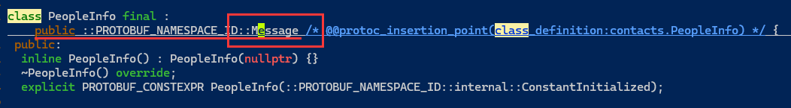
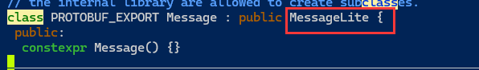

[toc]


# ProtoBuf


## ProtoBuf 安装

下载地址：https://github.com/protocolbuffers/protobuf/releases

如果要在 C++ 下使⽤ ProtoBuf，可以选择cpp.zip ；

如果要在 JAVA 下使⽤ ProtoBuf，可以选择 java.zip； 

其他语⾔选择对应的链接即可。

希望⽀持全部语⾔，选择 all.zip 。

```
⽀持全部语⾔，所以选择 protobuf-all-21.11.zip，右键将下载链接复制出来。
下载命令：
wget https://github.com/protocolbuffers/protobuf/releases/download/v21.11/protobuf-all-21.11.zip
```

可以不⽤下载最新版本，我当前使用v21.11


Win下需要把解压后⽂件中的bin⽬录配置到系统环境变量的Path中去


Linux下载 ProtoBuf 前需要安装依赖库：autoconf automake libtool curl make g++ unzip

```
# - CentOS
sudo yum install autoconf automake libtool curl make gcc-c++ unzip
```


进⼊解压好的⽂件，执⾏以下命令：

```
# 第⼀步执⾏autogen.sh，但如果下载的是具体的某⼀⻔语⾔，不需要执⾏这⼀步。
./autogen.sh 
 
# 第⼆步执⾏configure，有两种执⾏⽅式，任选其⼀即可，如下：
# 1、protobuf默认安装在 /usr/local ⽬录，lib、bin都是分散的
./configure 
# 2、修改安装⽬录，统⼀安装在/usr/local/protobuf下
./configure --prefix=/usr/local/protobuf

# 第三步
make // 执⾏15分钟左右
make check // 执⾏15分钟左右
# check没有问题后,才可以执行. (test例外,云服务器内存小)
sudo make install

```


如果当时选择了第⼀种执⾏⽅式，也就是 ./configure ，那么到这就可以正常使⽤protobuf了。如果选择了第⼆种执⾏⽅式，即修改了安装 ⽬录，那么还需要在/etc/profile 中添加⼀些内容：

```
sudo vim /etc/profile

# 添加内容如下：
#(动态库搜索路径) 程序加载运⾏期间查找动态链接库时指定除了系统默认路径之外的其他路径
export LD_LIBRARY_PATH=$LD_LIBRARY_PATH:/usr/local/protobuf/lib/
#(静态库搜索路径) 程序编译期间查找动态链接库时指定查找共享库的路径
export LIBRARY_PATH=$LIBRARY_PATH:/usr/local/protobuf/lib/
#执⾏程序搜索路径
export PATH=$PATH:/usr/local/protobuf/bin/
#c程序头⽂件搜索路径
export C_INCLUDE_PATH=$C_INCLUDE_PATH:/usr/local/protobuf/include/
#c++程序头⽂件搜索路径
export CPLUS_INCLUDE_PATH=$CPLUS_INCLUDE_PATH:/usr/local/protobuf/include/
#pkg-config 路径
export PKG_CONFIG_PATH=/usr/local/protobuf/lib/pkgconfig/
```


最后⼀步，重新执⾏ /etc/profile ⽂件:

```
source /etc/profile
```


检查是否配置成功

- Win打开cmd,输⼊: protoc --version 查看版本，有显⽰说明成功
- linux命令提示符输入protoc --version 查看版本，有显⽰说明成功


## 快速上⼿

在快速上⼿中，会编写第⼀版本的通讯录 1.0。在通讯录 1.0 版本中，将实现： 

- 对⼀个联系⼈的信息使⽤ PB 进⾏序列化，并将结果打印出来。 
- 对序列化后的内容使⽤ PB 进⾏反序列，解析出联系⼈信息并打印出来。 
- 联系⼈包含以下信息: 姓名、年龄。 
  通过通讯录 1.0，我们便能了解使⽤ ProtoBuf 初步要掌握的内容，以及体验到 ProtoBuf 的完整使⽤流
  程。


### 步骤1：创建 .proto ⽂件 

#### ⽂件规范 

- 创建 .proto ⽂件时，⽂件命名应该使⽤全⼩写字⺟命名，多个字⺟之间⽤ _ 连接。 例如：
  lower_snake_case.proto 。 

- 书写 .proto ⽂件代码时，应使⽤ 2 个空格的缩进。 


我们为通讯录 1.0 新建⽂件： contacts.proto


#### 添加注释

  向⽂件添加注释，可使⽤// 或者 /* ... */ 


#### 指定 proto3 语法 

Protocol Buffers 语⾔版本3，简称 proto3，是 .proto ⽂件最新的语法版本。proto3 简化了 Protocol Buffers 语⾔，既易于使⽤，⼜可以在更⼴泛的编程语⾔中使⽤。它允许你使⽤ Java，C++，Python 等多种语⾔⽣成 protocol buffer 代码。 

在 .proto ⽂件中，要使⽤ syntax = "proto3"; 来指定⽂件语法为 proto3，并且必须写在除去注释内容的第⼀⾏。 如果没有指定，编译器默认会使⽤proto2语法。 


在通讯录 1.0 的 contacts.proto ⽂件中，可以为⽂件指定 proto3 语法，内容如下： 

```
 syntax = "proto3";
```


#### package 声明符 

package 是⼀个可选的声明符，能表⽰ .proto ⽂件的命名空间，在项⽬中要有唯⼀性。它的作⽤是为了避免我们定义的消息出现冲突。


在通讯录 1.0 的 contacts.proto ⽂件中，可以声明其命名空间，内容如下： 

```
syntax = "proto3"; 
package contacts;
```


#### 定义消息（message） 

消息（message）: 要定义的结构化对象，我们可以给这个结构化对象中定义其对应的属性内容。

为什么要定义消息？
在⽹络传输中，我们需要为传输双⽅定制协议。定制协议说⽩了就是定义结构体或者结构化数据，⽐如，tcp，udp 报⽂就是结构化的。 

再⽐如将数据持久化存储到数据库时，会将⼀系列元数据统⼀⽤对象组织起来，再进⾏存储。

所以 ProtoBuf 就是以 message 的⽅式来⽀持我们定制协议字段，后期帮助我们形成类和⽅法来使⽤。在通讯录 1.0 中我们就需要为 联系⼈ 定义⼀个 message。 


.proto ⽂件中定义⼀个消息类型的格式为： 

```
message 消息类型名{

}

## 消息类型命名规范：使⽤驼峰命名法，⾸字⺟⼤写。
```


为 contacts.proto（通讯录 1.0）新增联系⼈message，内容如下： 

```
syntax = "proto3"; 
package contacts;

// 定义联系⼈消息 
message PeopleInfo {

}
```


#### 定义消息字段 

在 message 中我们可以定义其属性字段，字段定义格式为：字段类型 字段名 = 字段唯⼀编号； 

- 字段名称命名规范：全⼩写字⺟，多个字⺟之间⽤ _ 连接。 
- 字段类型分为：标量数据类型 和 特殊类型（包括枚举、其他消息类型等）。 
- 字段唯⼀编号：⽤来标识字段，⼀旦开始使⽤就不能够再改变。


##### 数据类型

该表格展⽰了定义于消息体中的标量数据类型，以及编译 .proto ⽂件之后⾃动⽣成的类中与之对应的 
字段类型。在这⾥展⽰了与 C++ 语⾔对应的类型。  

|proto Type | Notes | C++ Type |
|---|---|---|
|double| |double |
|float    |  |float |
|int32 |使⽤变⻓编码[1]。负数的编码效率较低⸺若字段可能为负值，应使⽤ sint32 代替。 |int32 |
|int64  |使⽤变⻓编码[1]。负数的编码效率较低⸺若字段可能为负值，应使⽤ sint64 代替。|int64 |
|uint32  |使⽤变⻓编码[1]。 |uint32 |
|uint64  |使⽤变⻓编码[1]。| uint64 |
|sint32  |使⽤变⻓编码[1]。符号整型。负值的编码效率⾼于常规 int32 类型。 |int32 |
|sint64 |使⽤变⻓编码[1]。符号整型。负值的编码效率⾼于常规的 int64 类型。 |int64 |
|fixed32 |定⻓ 4 字节。若值常⼤于2^28 则会⽐ uint32 更⾼效。 |uint32 |
|fixed64 |定⻓ 8 字节。若值常⼤于2^56 则会⽐ uint64 更⾼效。 |uint64 |
|sfixed32 |定⻓ 4 字节。 |int32 |
|sfixed64 |定⻓ 8 字节。| int64 |
|bool | |bool |
|string |包含 UTF-8 和 ASCII 编码的字符串，⻓度不能超过2^32 。 |string |
|bytes |可包含任意的字节序列但⻓度不能超过 2^32 。|string |

>  [1] 变⻓编码是指：经过protobuf 编码后，原本4字节或8字节的数可能会被变为其他字节数。


更新 contacts.proto (通讯录 1.0)，新增姓名、年龄字段： 

```
syntax = "proto3"; 
package contacts;

message PeopleInfo {
  string name = 1;            
  int32 age = 2;  
}
```


在这⾥还要特别讲解⼀下字段唯⼀编号的范围：

> 1 ~ 536,870,911 (2^29 - 1) ，其中 19000 ~ 19999  不可⽤。 

19000 ~ 19999 不可⽤是因为：在 Protobuf 协议的实现中，对这些数进⾏了预留。如果⾮要在.proto 
⽂件中使⽤这些预留标识号，例如将 name 字段的编号设置为19000，编译时就会报警： 

```
// 消息中定义了如下编号，代码会告警： 
// Field numbers 19,000 through 19,999 are reserved for the protobuf 
implementation
string name = 19000; 
```


### 步骤2：编译 contacts.proto ⽂件，⽣成 C++ ⽂件 

#### 编译命令 

编译命令⾏格式为：

```
protoc  [--proto_path=IMPORT_PATH]  --cpp_out=DST_DIR  path/to/file.proto

protoc               是 Protocol Buffer 提供的命令⾏编译⼯具。

--proto_path         指定 被编译的.proto⽂件所在⽬录，可多次指定。可简写成 -I IMPORT_PATH 。如不指定										 该参数，则在当前⽬录进⾏搜索。当某个.proto ⽂件 import 其他 .proto ⽂件时，或需										 要编译的 .proto ⽂件不在当前⽬录下，这时就要⽤-I来指定搜索⽬录。

--cpp_out=           指编译后的⽂件为 C++ ⽂件。 

OUT_DIR              编译后⽣成⽂件的⽬标路径。

path/to/file.proto   要编译的.proto⽂件。
```

编译 contacts.proto ⽂件命令如下： 

```
protoc --cpp_out=. contacts.proto		##生成C++的类
```

或

```
protoc -I fast_start --cpp_out=fast_start contacts.proto
```


#### 编译 contacts.proto ⽂件后会⽣成什么 

编译 contacts.proto ⽂件后，会⽣成所选择语⾔的代码，我们选择的是C++，所以编译后⽣成了两个 
⽂件：contacts.pb.h contacts.pb.cc 。 
对于编译⽣成的 C++ 代码，包含了以下内容 ： 
• 对于每个 message ，都会⽣成⼀个对应的消息类。 

• 在消息类中，编译器为每个字段提供了获取和设置⽅法，以及⼀下其他能够操作字段的⽅法。
• 编辑器会针对于每个 .proto ⽂件⽣成.h 和 .cc ⽂件，分别⽤来存放类的声明与类的实现。


contacts.pb.h 部分代码展⽰ 

```
class PeopleInfo final : public ::PROTOBUF_NAMESPACE_ID::Message {
 public:
  using ::PROTOBUF_NAMESPACE_ID::Message::CopyFrom;
  void CopyFrom(const PeopleInfo& from);
  using ::PROTOBUF_NAMESPACE_ID::Message::MergeFrom; 
  void MergeFrom( const PeopleInfo& from) {
    PeopleInfo::MergeImpl(*this, from); 
  }

  static ::PROTOBUF_NAMESPACE_ID::StringPiece FullMessageName() {
    return "PeopleInfo"; 
  }

  // string name = 1;
  void clear_name();
  const std::string& name() const;
  template <typename ArgT0 = const std::string&, typename... ArgT> 
  void set_name(ArgT0&& arg0, ArgT... args);
  std::string* mutable_name();
  PROTOBUF_NODISCARD std::string* release_name();
  void set_allocated_name(std::string* name);

  // int32 age = 2; 
  void clear_age(); 
  int32_t age() const;
  void set_age(int32_t value);
};
```

上述的例⼦中：
• 每个字段都有设置和获取的⽅法， getter 的名称与⼩写字段完全相同，setter ⽅法以 set_ 开头。 
• 每个字段都有⼀个 clear_ ⽅法，可以将字段重新设置回 empty 状态。 


那序列化与反序列化类呢?

根据下图可以发现,我们定义的类还继承了一个Message类



再看Message,还继承了一个类MessageLite



在消息类的⽗类 MessageLite 中，提供了读写消息实例的⽅法，包括序列化⽅法和反序列化⽅法。 

```
class MessageLite { 
public:
        //序列化： 
        bool SerializeToOstream(ostream* output) const;  // 将序列化后数据写⼊⽂件 
流 
        bool SerializeToArray(void *data, int size) const; 
        bool SerializeToString(string* output) const;
        
        //反序列化： 
        bool ParseFromIstream(istream* input);   // 从流中读取数据，再进⾏反序列化 
动作 
        bool ParseFromArray(const void* data, int size); 
        bool ParseFromString(const string& data);
};
```

注意：

- 序列化的结果为⼆进制字节序列，⽽⾮⽂本格式。
- 以上三种序列化的⽅法没有本质上的区别，只是序列化后输出的格式不同，可以供不同的应⽤场景使⽤。
- 序列化的 API 函数均为const成员函数，因为序列化不会改变类对象的内容， ⽽是将序列化的结果保存到函数⼊参指定的地址中。
- 详细 message API 可以参⻅ [message.h | Protocol Buffers Documentation (protobuf.dev)](https://protobuf.dev/reference/cpp/api-docs/google.protobuf.message/#Message)。 


### 步骤3：序列化与反序列化的使⽤ 

创建⼀个测试⽂件 main.cc，⽅法中我们实现： 

- 对⼀个联系⼈的信息使⽤ PB 进⾏序列化，并将结果打印出来。 
- 对序列化后的内容使⽤ PB 进⾏反序列，解析出联系⼈信息并打印出来。 
  main.cc 

```
#include<iostream>
#include"contacts.pb.h"
#include<string>


int main(){
  std::string str;

  {
    contacts::PeopleInfo pi;
    pi.set_age(18);
    pi.set_name("张三");
    if(pi.SerializeToString(&str)){
      std::cout<<"序列化成功,结果: "<<str<<std::endl;
    }
    else{
      std::cerr<<"序列化失败"<<std::endl;
      return -1;
    }
  }

  {
    contacts::PeopleInfo pi;
    if(pi.ParseFromString(str)){
      std::cout<<"反序列化成功 "<<std::endl;
      std::cout<<"姓名: "<<pi.name()<<std::endl;
      std::cout<<"年龄: "<<pi.age()<<std::endl;
    }
    else{
      std::cerr<<"反序列化失败"<<std::endl;
      return -1;
    }

  }

  return 0;
}
```

代码书写完成后，编译 main.cc，⽣成可执⾏程序 TestProtoBuf ： 

```
g++ main.cc contacts.pb.cc -o TestProtoBuf -std=c++11 -lprotobuf
```

 -lprotobuf：必加，不然会有链接错误。 
• -std=c++11：必加，使⽤C++11语法。 

执⾏TestProtoBuf ，可以看⻅ people 经过序列化和反序列化后的结果： 

```
[chj@gz fast_start 00:34:37]$ ./test
序列化成功,结果:																## 注意,序列化存放的都是二进制,此处还有一些数据,如换行
张三
反序列化成功
姓名: 张三
年龄: 18
```

由于 ProtoBuf 是把联系⼈对象序列化成了⼆进制序列，这⾥⽤ string 来作为接收⼆进制序列的容器。
所以在终端打印的时候会有换⾏等⼀些乱码显⽰。
所以相对于 xml 和 JSON 来说，因为被编码成⼆进制，破解成本增⼤，ProtoBuf 编码是相对安全的。


### ⼩结 ProtoBuf 使⽤流程 


## proto 3 语法详解 

### 小项目流程

- 将通讯录序列化后并写⼊⽂件中。
- 从⽂件中将通讯录解析出来，并进⾏打印。
- 新增联系⼈属性，共包括：姓名、年龄、电话信息、地址、其他联系⽅式、备注。


### 字段的修饰规则 

消息的字段可以⽤下⾯⼏种规则来修饰：

#### singular 

消息中可以包含该字段零次或⼀次（不超过⼀次）。 proto3 语法中，字段默认使⽤该
规则。

#### repeated 

消息中可以包含该字段任意多次（包括零次），其中重复值的顺序会被保留。可以理
解为定义了⼀个数组。


更新 contacts.proto ，PeopleInfo 消息中新增 phone_numbers 字段，表⽰⼀个联系⼈有多个 
号码，可将其设置为 repeated，写法如下： 

```
syntax = "proto3"; 
package contacts;

message PeopleInfo {
  string name = 1;            
  int32 age = 2;  
  repeated string phone_numbers = 3;	##一个类型为string的数组
}
```


<Br>

### 消息类型的定义与使⽤ 

#### 1. 定义 

在单个 .proto ⽂件中可以定义多个消息体，且⽀持定义嵌套类型的消息（任意多层）。每个消息体中的字段编号可以重复。


更新 contacts.proto，我们可以将 phone_number 提取出来，单独成为⼀个消息： 

##### 嵌套写法

```
// -------------------------- 嵌套写法 ------------------------- 
syntax = "proto3"; 
package contacts;

message PeopleInfo {
  string name = 1;            
  int32 age = 2;  
  message Phone {
    string number = 1;
  }
}
```

##### 非嵌套写法

```
// -------------------------- ⾮嵌套写法 ------------------------- 
syntax = "proto3"; 
package contacts;

message Phone { 
  string number = 1;
}

message PeopleInfo {
  string name = 1;            
  int32 age = 2;  
}
```


#### 2. 使⽤ 

##### 消息类型可作为字段类型使⽤

contacts.proto  

```
syntax = "proto3"; 
package contacts;

// 联系⼈ 
message PeopleInfo {
  string name = 1;                
  int32 age = 2;                

  message Phone {
    string number = 1;  
  }
  repeated Phone phone = 3; 
}
```


##### 导⼊其他 .proto ⽂件的message

例如 Phone 消息定义在 phone.proto ⽂件中： 

```
syntax = "proto3"; 
package phone;

message Phone {
  string number = 1;  
}
```

contacts.proto 中的 PeopleInfo 使⽤ Phone 消息：

```
syntax = "proto3"; 
package contacts;

import "phone.proto";    // 使⽤ import 将 phone.proto ⽂件导⼊进来 !!! 

message PeopleInfo {
  string name = 1;                
  int32 age = 2;      
  
  // 引⼊的⽂件声明了package，使⽤消息时，需要⽤ ‘命名空间.消息类型’ 格式          
    
  repeated phone.Phone phone = 3; 
}
```


##### 创建通讯录 2.0 版本 

通讯录 2.x 的需求是向⽂件中写⼊通讯录列表，以上我们只是定义了⼀个联系⼈的消息，并不能存放通 
讯录列表，所以还需要在完善⼀下 contacts.proto (终版通讯录 2.0)： 

```
syntax = "proto3"; 
package contacts;

// 联系⼈  
message PeopleInfo {
  string name = 1;                  // 姓名 
  int32 age = 2;                    // 年龄 

  message Phone {
    string number = 1;   // 电话号码 
  }
  repeated Phone phone = 3;         // 电话 
}

// 通讯录  
message Contacts {
  repeated PeopleInfo contacts = 1;
}
```

接着进⾏⼀次编译：

```
protoc --cpp_out=. contacts.proto
```

contacts.pb.h 更新的部分代码展⽰ 

```
// 新增了 PeopleInfo_Phone 类 
class PeopleInfo_Phone final : public ::PROTOBUF_NAMESPACE_ID::Message { 
public:
  using ::PROTOBUF_NAMESPACE_ID::Message::CopyFrom; 
  void CopyFrom(const PeopleInfo_Phone& from);
  using ::PROTOBUF_NAMESPACE_ID::Message::MergeFrom; 
  void MergeFrom( const PeopleInfo_Phone& from) {
    PeopleInfo_Phone::MergeImpl(*this, from);
  }
  static ::PROTOBUF_NAMESPACE_ID::StringPiece FullMessageName() {
    return "PeopleInfo.Phone"; 
  }

  // string number = 1;
  void clear_number();
  const std::string& number() const;
  template <typename ArgT0 = const std::string&, typename... ArgT> 
  void set_number(ArgT0&& arg0, ArgT... args);
  std::string* mutable_number();
  PROTOBUF_NODISCARD std::string* release_number();
  void set_allocated_number(std::string* number);
};

// 更新了 PeopleInfo 类 
class PeopleInfo final : public ::PROTOBUF_NAMESPACE_ID::Message {
 public:
  using ::PROTOBUF_NAMESPACE_ID::Message::CopyFrom;
  void CopyFrom(const PeopleInfo& from);
  using ::PROTOBUF_NAMESPACE_ID::Message::MergeFrom; 
  void MergeFrom( const PeopleInfo& from) {
    PeopleInfo::MergeImpl(*this, from); 
  }

  static ::PROTOBUF_NAMESPACE_ID::StringPiece FullMessageName() {
    return "PeopleInfo"; 
  }

  typedef PeopleInfo_Phone Phone;
  // repeated .PeopleInfo.Phone phone = 3;
  int phone_size() const;
  void clear_phone();
  ::PeopleInfo_Phone* mutable_phone(int index); 
  ::PROTOBUF_NAMESPACE_ID::RepeatedPtrField< ::PeopleInfo_Phone >*
      mutable_phone();
  const ::PeopleInfo_Phone& phone(int index) const;
  ::PeopleInfo_Phone* add_phone();
  const ::PROTOBUF_NAMESPACE_ID::RepeatedPtrField< ::PeopleInfo_Phone >&
      phone() const;
};

// 新增了 Contacts 类 
class Contacts final : public ::PROTOBUF_NAMESPACE_ID::Message {
 public:
  using ::PROTOBUF_NAMESPACE_ID::Message::CopyFrom;
  void CopyFrom(const Contacts& from);
  using ::PROTOBUF_NAMESPACE_ID::Message::MergeFrom; 
  void MergeFrom( const Contacts& from) {
    Contacts::MergeImpl(*this, from);
  }
  static ::PROTOBUF_NAMESPACE_ID::StringPiece FullMessageName() {
    return "Contacts"; 
  }

  // repeated .PeopleInfo contacts = 1;
  int contacts_size() const;
  void clear_contacts();
  ::PeopleInfo* mutable_contacts(int index); 
  ::PROTOBUF_NAMESPACE_ID::RepeatedPtrField< ::PeopleInfo >*
      mutable_contacts();
  const ::PeopleInfo& contacts(int index) const;
  ::PeopleInfo* add_contacts();
  const ::PROTOBUF_NAMESPACE_ID::RepeatedPtrField< ::PeopleInfo >&
      contacts() const;
  };
```

>上述的例⼦中：
>• 每个字段都有⼀个 clear_ ⽅法，可以将字段重新设置回 empty 状态。 
>• 每个字段都有设置和获取的⽅法， 获取⽅法的⽅法名称与⼩写字段名称完全相同。但如果是消息
>类型的字段，其设置⽅法为 mutable_ ⽅法，返回值为消息类型的指针，这类⽅法会为我们开辟
>好空间，可以直接对这块空间的内容进⾏修改。
>• 对于使⽤ repeated 修饰的字段，也就是数组类型，pb 为我们提供了 add_ ⽅法来新增⼀个值，
>并且提供了 _size ⽅法来判断数组存放元素的个数。 


##### 通讯录 2.0 的写⼊实现 

###### write.cc

```
#include<iostream>
#include<fstream>

#include"contacts.pb.h"

void Add_PeopleInfo(contacts::PeopleInfo* pi){
  std::cout << "-------------新增联系⼈-------------" << std::endl;
  std::cout << "请输⼊联系⼈姓名: ";
  std::string name;
  std::getline(std::cin,name);
  pi->set_name(name);

  std::cout << "请输⼊联系⼈年龄: ";
  int age = 0;
  std::cin>>age;
  pi->set_age(age);
  std::cin.ignore(256,'\n');  //cin读完后,缓冲区还会剩分隔符及后面的数据,如果下次读取是getline则会把这个分隔符一并读取, 可能导致得到不想要的结果;因此可以清理一下

  for(int i = 0; ;i++) {
    std::cout<<"请输入联系人电话"<<i+1<<"(只输入回车完成电话新增):";
    std::string number;
    getline(std::cin,number);
    if(number.empty())//getline会忽略分割符(换行),下次会跳过
    {
      break;
    }
    pi->add_phone()->set_number(number);
  }

  std::cout<<"添加联系人成功"<<std::endl;
}


int main(){
  // GOOGLE_PROTOBUF_VERIFY_VERSION 宏: 验证没有意外链接到与编译的头⽂件不兼容的库版 本。如果检测到版本不匹配，程序将中 ⽌。注意，每个 .pb.cc ⽂件在启动时都会⾃动调⽤此宏。在使 ⽤ C++ Protocol Buffer 库之前执⾏此宏是⼀种很好的做法，但不是绝对必要的。
  GOOGLE_PROTOBUF_VERIFY_VERSION;


  //1. 打开文件
  //2. 反序列化已有数据并读取至内存
  //3. 追加
  //4. 序列化并写入回文件

  //1
  std::fstream ifs("contacts.bin",std::ios::in|std::ios::binary);
  if(ifs.is_open()){
    std::cout<<"contacts.bin is open"<<std::endl;
  }
  else{
    std::cout<<"contacts.bin is not found"<<std::endl;
  }

  //2
  contacts::Contacts con;
  con.ParseFromIstream(&ifs);


  //3.追加
  Add_PeopleInfo(con.add_peopleinfo());


  //4.写回
  std::fstream ofs("contacts.bin",std::ios::out|std::ios::binary);
  if(ofs){
    std::cout<<"contacts.bin is open"<<std::endl;
  }
  else{
    std::cout<<"contacts.bin is not found"<<std::endl;
  }

  con.SerializeToOstream(&ofs);

  ifs.close();
  ofs.close();

    // 在程序结束时调⽤ ShutdownProtobufLibrary()，为了删除 Protocol Buffer 库分配的所 有全局对象。对于⼤多数程序来说这 是不必要的，因为该过程⽆论如何都要退出，并且操作系统将负责 回收其所有内存。但是，如果你使⽤了内存泄漏检查程序，该程序需 要释放每个最后对象，或者你正在 编写可以由单个进程多次加载和卸载的库，那么你可能希望强制使⽤ Protocol Buffers 来清理所有 内容。
  google::protobuf::ShutdownProtobufLibrary();

  return 0;
}
```


###### Makefile

```
all:write read


write:write.cc contacts.pb.cc
        g++ -o $@ $^ -std=c++11 -lprotobuf

read:read.cc  contacts.pb.cc
        g++ -o $@ $^ -std=c++11 -lprotobuf


protoc:*.proto
        protoc --cpp_out=. $^


.PHONY:clean
clean:
        ## rm *.pb.* -rf
        rm test -rf
        ##rm *.bin
```

make之后，运⾏ write 

```
-------------新增联系⼈-------------
请输⼊联系⼈姓名: 张三
请输⼊联系⼈年龄: 18
请输⼊联系⼈电话1(只输⼊回⻋完成电话新增): 123123123 
请输⼊联系⼈电话2(只输⼊回⻋完成电话新增): 333344441 
请输⼊联系⼈电话3(只输⼊回⻋完成电话新增): 
-----------添加联系⼈成功-----------
```


##### hexdump  查看⼆进制⽂件

```
[chj@gz protu3 12:27:25]$ hexdump -C contacts.bin
00000000  0a 31 0a 06 e5 bc a0 e4  b8 89 10 12 1a 0b 0a 09  |.1..............|
00000010  31 32 33 31 32 33 31 32  33 1a 0b 0a 09 33 33 33  |123123123....333|
00000020  33 34 34 34 34 31 1a 0b  0a 09 35 31 32 33 31 35  |344441....512315|
00000030  32 31 33 0a 31 0a 06 e6  9d 8e e5 9b 9b 10 2c 1a  |213.1.........,.|
00000040  0c 0a 0a 34 31 33 31 34  34 34 33 32 31 1a 0a 0a  |...4131444321...|
00000050  08 36 36 36 35 34 32 32  32 1a 0b 0a 09 33 31 32  |.66654222....312|
00000060  31 32 31 31 33 33                                 |121133|
00000066
```

解释： 
    hexdump：是Linux下的⼀个⼆进制⽂件查看⼯具，它可以将⼆进制⽂件转换为ASCII、⼋进制、
⼗进制、⼗六进制格式进⾏查看。
    -C: 表⽰每个字节显⽰为16进制和相应的ASCII字符


##### 通讯录 2.0 的读取实现 

###### read.cc 

```
#include<iostream>
#include<fstream>
#include<memory>

#include"contacts.pb.h"

void PrintContacts(const contacts::Contacts& con){
  for(int i = 0;i<con.peopleinfo_size() ;i++){
    contacts::PeopleInfo pi = con.peopleinfo(i);
    std::cout<<"联系人姓名: "<<pi.name()<<std::endl;
    std::cout<<"联系人年龄: "<<pi.age()<<std::endl;
    for(int j = 0 ; j<pi.phone_size();j++){
      //const contacts::PeopleInfo_Phone& phone = pi.phone(j);
      std::cout<<"联系人电话"<<j+1<<": "<<pi.phone(j).number()<<std::endl;
    }
    std::cout<<std::endl;
  }
}

int main(){
  std::fstream ifs("contacts.bin",std::ios::in|std::ios::binary);
  if(!ifs.is_open()){
    std::cerr<<"file open error"<<std::endl;
    return -1;
  }
  contacts::Contacts con;
  con.ParseFromIstream(&ifs);
  PrintContacts(con);

  ifs.close();
  return 0;
}
```

运行read

```
[chj@gz protu3 14:45:16]$ ./read
联系人姓名: 张三
联系人年龄: 18
联系人电话1: 123123123
联系人电话2: 333344441
联系人电话3: 512315213

联系人姓名: 李四
联系人年龄: 44
联系人电话1: 4131444321
联系人电话2: 66654222
联系人电话3: 312121133
```


##### 另⼀种验证⽅法 protpc --decode  

我们可以⽤ protoc -h 命令来查看 ProtoBuf 为我们提供的所有命令 option。其中 ProtoBuf 提供⼀个命令选项 --decode ，表⽰从标准输⼊中读取给定类型的⼆进制消息，并将其以⽂本格式写⼊标准输出。 消息类型必须在 .proto ⽂件或导⼊的⽂件中定义。 

```
[chj@gz protu3 14:34:41]$ protoc --decode=contacts.Contacts contacts.proto < contacts.bin
peopleinfo {
  name: "\345\274\240\344\270\211"
  age: 18
  phone {
    number: "123123123"
  }
  phone {
    number: "333344441"
  }
  phone {
    number: "512315213"
  }
}
peopleinfo {
  name: "\346\235\216\345\233\233"
  age: 44
  phone {
    number: "4131444321"
  }
  phone {
    number: "66654222"
  }
  phone {
    number: "312121133"
  }
}
```

