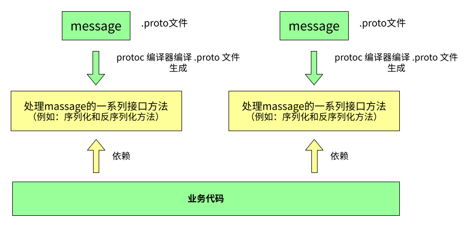
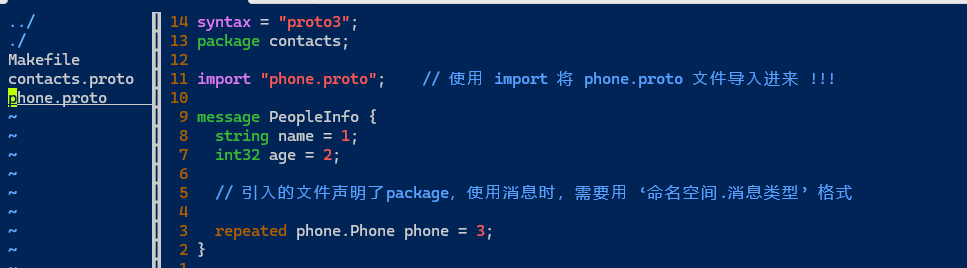

# ProtoBuf


## ProtoBuf 安装

下载地址：https://github.com/protocolbuffers/protobuf/releases

如果要在 C++ 下使⽤ ProtoBuf，可以选择cpp.zip ；

如果要在 JAVA 下使⽤ ProtoBuf，可以选择 java.zip； 

其他语⾔选择对应的链接即可。

希望⽀持全部语⾔，选择 all.zip 。

```
⽀持全部语⾔，所以选择 protobuf-all-21.11.zip，右键将下载链接复制出来。
下载命令：
wget https://github.com/protocolbuffers/protobuf/releases/download/v21.11/protobuf-all-21.11.zip
```

可以不⽤下载最新版本，我当前使用v21.11


Win下需要把解压后⽂件中的bin⽬录配置到系统环境变量的Path中去


Linux下载 ProtoBuf 前需要安装依赖库：autoconf automake libtool curl make g++ unzip

```
# - CentOS
sudo yum install autoconf automake libtool curl make gcc-c++ unzip
```


进⼊解压好的⽂件，执⾏以下命令：

```
# 第⼀步执⾏autogen.sh，但如果下载的是具体的某⼀⻔语⾔，不需要执⾏这⼀步。
./autogen.sh 
 
# 第⼆步执⾏configure，有两种执⾏⽅式，任选其⼀即可，如下：
# 1、protobuf默认安装在 /usr/local ⽬录，lib、bin都是分散的
./configure 
# 2、修改安装⽬录，统⼀安装在/usr/local/protobuf下
./configure --prefix=/usr/local/protobuf

# 第三步
make // 执⾏15分钟左右
make check // 执⾏15分钟左右
# check没有问题后,才可以执行. (test例外,云服务器内存小)
sudo make install

```


如果当时选择了第⼀种执⾏⽅式，也就是 ./configure ，那么到这就可以正常使⽤protobuf了。如果选择了第⼆种执⾏⽅式，即修改了安装 ⽬录，那么还需要在/etc/profile 中添加⼀些内容：

```
sudo vim /etc/profile

# 添加内容如下：
#(动态库搜索路径) 程序加载运⾏期间查找动态链接库时指定除了系统默认路径之外的其他路径
export LD_LIBRARY_PATH=$LD_LIBRARY_PATH:/usr/local/protobuf/lib/
#(静态库搜索路径) 程序编译期间查找动态链接库时指定查找共享库的路径
export LIBRARY_PATH=$LIBRARY_PATH:/usr/local/protobuf/lib/
#执⾏程序搜索路径
export PATH=$PATH:/usr/local/protobuf/bin/
#c程序头⽂件搜索路径
export C_INCLUDE_PATH=$C_INCLUDE_PATH:/usr/local/protobuf/include/
#c++程序头⽂件搜索路径
export CPLUS_INCLUDE_PATH=$CPLUS_INCLUDE_PATH:/usr/local/protobuf/include/
#pkg-config 路径
export PKG_CONFIG_PATH=/usr/local/protobuf/lib/pkgconfig/
```


最后⼀步，重新执⾏ /etc/profile ⽂件:

```
source /etc/profile
```


检查是否配置成功

- Win打开cmd,输⼊: protoc --version 查看版本，有显⽰说明成功
- linux命令提示符输入protoc --version 查看版本，有显⽰说明成功


## 快速上⼿

在快速上⼿中，会编写第⼀版本的通讯录 1.0。在通讯录 1.0 版本中，将实现： 

- 对⼀个联系⼈的信息使⽤ PB 进⾏序列化，并将结果打印出来。 
- 对序列化后的内容使⽤ PB 进⾏反序列，解析出联系⼈信息并打印出来。 
- 联系⼈包含以下信息: 姓名、年龄。 
  通过通讯录 1.0，我们便能了解使⽤ ProtoBuf 初步要掌握的内容，以及体验到 ProtoBuf 的完整使⽤流
  程。


### 步骤1：创建 .proto ⽂件 

#### ⽂件规范 

- 创建 .proto ⽂件时，⽂件命名应该使⽤全⼩写字⺟命名，多个字⺟之间⽤ _ 连接。 例如：
  lower_snake_case.proto 。 

- 书写 .proto ⽂件代码时，应使⽤ 2 个空格的缩进。 


我们为通讯录 1.0 新建⽂件： contacts.proto


#### 添加注释

  向⽂件添加注释，可使⽤// 或者 /* ... */ 


#### 指定 proto3 语法 

Protocol Buffers 语⾔版本3，简称 proto3，是 .proto ⽂件最新的语法版本。proto3 简化了 Protocol Buffers 语⾔，既易于使⽤，⼜可以在更⼴泛的编程语⾔中使⽤。它允许你使⽤ Java，C++，Python 等多种语⾔⽣成 protocol buffer 代码。 

在 .proto ⽂件中，要使⽤ syntax = "proto3"; 来指定⽂件语法为 proto3，并且必须写在除去注释内容的第⼀⾏。 如果没有指定，编译器默认会使⽤proto2语法。 


在通讯录 1.0 的 contacts.proto ⽂件中，可以为⽂件指定 proto3 语法，内容如下： 

```
 syntax = "proto3";
```


#### package 声明符 

package 是⼀个可选的声明符，能表⽰ .proto ⽂件的命名空间，在项⽬中要有唯⼀性。它的作⽤是为了避免我们定义的消息出现冲突。


在通讯录 1.0 的 contacts.proto ⽂件中，可以声明其命名空间，内容如下： 

```
syntax = "proto3"; 
package contacts;
```


#### 定义消息（message） 

消息（message）: 要定义的结构化对象，我们可以给这个结构化对象中定义其对应的属性内容。

为什么要定义消息？
在⽹络传输中，我们需要为传输双⽅定制协议。定制协议说⽩了就是定义结构体或者结构化数据，⽐如，tcp，udp 报⽂就是结构化的。 

再⽐如将数据持久化存储到数据库时，会将⼀系列元数据统⼀⽤对象组织起来，再进⾏存储。

所以 ProtoBuf 就是以 message 的⽅式来⽀持我们定制协议字段，后期帮助我们形成类和⽅法来使⽤。在通讯录 1.0 中我们就需要为 联系⼈ 定义⼀个 message。 


.proto ⽂件中定义⼀个消息类型的格式为： 

```
message 消息类型名{

}

## 消息类型命名规范：使⽤驼峰命名法，⾸字⺟⼤写。
```


为 contacts.proto（通讯录 1.0）新增联系⼈message，内容如下： 

```
syntax = "proto3"; 
package contacts;

// 定义联系⼈消息 
message PeopleInfo {

}
```


#### 定义消息字段 

在 message 中我们可以定义其属性字段，字段定义格式为：字段类型 字段名 = 字段唯⼀编号； 

- 字段名称命名规范：全⼩写字⺟，多个字⺟之间⽤ _ 连接。 
- 字段类型分为：标量数据类型 和 特殊类型（包括枚举、其他消息类型等）。 
- 字段唯⼀编号：⽤来标识字段，⼀旦开始使⽤就不能够再改变。


##### 数据类型

该表格展⽰了定义于消息体中的标量数据类型，以及编译 .proto ⽂件之后⾃动⽣成的类中与之对应的 
字段类型。在这⾥展⽰了与 C++ 语⾔对应的类型。  

|proto Type | Notes | C++ Type |
|---|---|---|
|double| |double |
|float    |  |float |
|int32 |使⽤变⻓编码[1]。负数的编码效率较低⸺若字段可能为负值，应使⽤ sint32 代替。 |int32 |
|int64  |使⽤变⻓编码[1]。负数的编码效率较低⸺若字段可能为负值，应使⽤ sint64 代替。|int64 |
|uint32  |使⽤变⻓编码[1]。 |uint32 |
|uint64  |使⽤变⻓编码[1]。| uint64 |
|sint32  |使⽤变⻓编码[1]。符号整型。负值的编码效率⾼于常规 int32 类型。 |int32 |
|sint64 |使⽤变⻓编码[1]。符号整型。负值的编码效率⾼于常规的 int64 类型。 |int64 |
|fixed32 |定⻓ 4 字节。若值常⼤于2^28 则会⽐ uint32 更⾼效。 |uint32 |
|fixed64 |定⻓ 8 字节。若值常⼤于2^56 则会⽐ uint64 更⾼效。 |uint64 |
|sfixed32 |定⻓ 4 字节。 |int32 |
|sfixed64 |定⻓ 8 字节。| int64 |
|bool | |bool |
|string |包含 UTF-8 和 ASCII 编码的字符串，⻓度不能超过2^32 。 |string |
|bytes |可包含任意的字节序列但⻓度不能超过 2^32 。|string |

>  [1] 变⻓编码是指：经过protobuf 编码后，原本4字节或8字节的数可能会被变为其他字节数。


更新 contacts.proto (通讯录 1.0)，新增姓名、年龄字段： 

```
syntax = "proto3"; 
package contacts;

message PeopleInfo {
  string name = 1;            
  int32 age = 2;  
}
```


在这⾥还要特别讲解⼀下字段唯⼀编号的范围：

> 1 ~ 536,870,911 (2^29 - 1) ，其中 19000 ~ 19999  不可⽤。 

19000 ~ 19999 不可⽤是因为：在 Protobuf 协议的实现中，对这些数进⾏了预留。如果⾮要在.proto 
⽂件中使⽤这些预留标识号，例如将 name 字段的编号设置为19000，编译时就会报警： 

```
// 消息中定义了如下编号，代码会告警： 
// Field numbers 19,000 through 19,999 are reserved for the protobuf 
implementation
string name = 19000; 
```


### 步骤2：编译 contacts.proto ⽂件，⽣成 C++ ⽂件 

#### 编译命令 

编译命令⾏格式为：

```
protoc  [--proto_path=IMPORT_PATH]  --cpp_out=DST_DIR  path/to/file.proto

protoc               是 Protocol Buffer 提供的命令⾏编译⼯具。

--proto_path         指定 被编译的.proto⽂件所在⽬录，可多次指定。可简写成 -I IMPORT_PATH 。如不指定										 该参数，则在当前⽬录进⾏搜索。当某个.proto ⽂件 import 其他 .proto ⽂件时，或需										 要编译的 .proto ⽂件不在当前⽬录下，这时就要⽤-I来指定搜索⽬录。

--cpp_out=           指编译后的⽂件为 C++ ⽂件。 

OUT_DIR              编译后⽣成⽂件的⽬标路径。

path/to/file.proto   要编译的.proto⽂件。
```

编译 contacts.proto ⽂件命令如下： 

```
protoc --cpp_out=. contacts.proto		##生成C++的类
```

或

```
protoc -I fast_start --cpp_out=fast_start contacts.proto
```


#### 编译 contacts.proto ⽂件后会⽣成什么 

编译 contacts.proto ⽂件后，会⽣成所选择语⾔的代码，我们选择的是C++，所以编译后⽣成了两个 
⽂件：contacts.pb.h contacts.pb.cc 。 
对于编译⽣成的 C++ 代码，包含了以下内容 ： 
• 对于每个 message ，都会⽣成⼀个对应的消息类。 

• 在消息类中，编译器为每个字段提供了获取和设置⽅法，以及⼀下其他能够操作字段的⽅法。
• 编辑器会针对于每个 .proto ⽂件⽣成.h 和 .cc ⽂件，分别⽤来存放类的声明与类的实现。


contacts.pb.h 部分代码展⽰ 

```
class PeopleInfo final : public ::PROTOBUF_NAMESPACE_ID::Message {
 public:
  using ::PROTOBUF_NAMESPACE_ID::Message::CopyFrom;
  void CopyFrom(const PeopleInfo& from);
  using ::PROTOBUF_NAMESPACE_ID::Message::MergeFrom; 
  void MergeFrom( const PeopleInfo& from) {
    PeopleInfo::MergeImpl(*this, from); 
  }

  static ::PROTOBUF_NAMESPACE_ID::StringPiece FullMessageName() {
    return "PeopleInfo"; 
  }

  // string name = 1;
  void clear_name();
  const std::string& name() const;
  template <typename ArgT0 = const std::string&, typename... ArgT> 
  void set_name(ArgT0&& arg0, ArgT... args);
  std::string* mutable_name();
  PROTOBUF_NODISCARD std::string* release_name();
  void set_allocated_name(std::string* name);

  // int32 age = 2; 
  void clear_age(); 
  int32_t age() const;
  void set_age(int32_t value);
};
```

上述的例⼦中：
• 每个字段都有设置和获取的⽅法， getter 的名称与⼩写字段完全相同，setter ⽅法以 set_ 开头。 
• 每个字段都有⼀个 clear_ ⽅法，可以将字段重新设置回 empty 状态。 


在消息类的⽗类 MessageLite 中，提供了读写消息实例的⽅法，包括序列化⽅法和反序列化⽅法。 

```
class MessageLite { 
public:
        //序列化： 
        bool SerializeToOstream(ostream* output) const;  // 将序列化后数据写⼊⽂件 
流 
        bool SerializeToArray(void *data, int size) const; 
        bool SerializeToString(string* output) const;
        
        //反序列化： 
        bool ParseFromIstream(istream* input);   // 从流中读取数据，再进⾏反序列化 
动作 
        bool ParseFromArray(const void* data, int size); 
        bool ParseFromString(const string& data);
};
```

注意：

- 序列化的结果为⼆进制字节序列，⽽⾮⽂本格式。
- 以上三种序列化的⽅法没有本质上的区别，只是序列化后输出的格式不同，可以供不同的应⽤场景使⽤。
- 序列化的 API 函数均为const成员函数，因为序列化不会改变类对象的内容， ⽽是将序列化的结果保存到函数⼊参指定的地址中。
- 详细 message API 可以参⻅ [message.h | Protocol Buffers Documentation (protobuf.dev)](https://protobuf.dev/reference/cpp/api-docs/google.protobuf.message/#Message)。 


### 步骤3：序列化与反序列化的使⽤ 

创建⼀个测试⽂件 main.cc，⽅法中我们实现： 

- 对⼀个联系⼈的信息使⽤ PB 进⾏序列化，并将结果打印出来。 
- 对序列化后的内容使⽤ PB 进⾏反序列，解析出联系⼈信息并打印出来。 
  main.cc 

```
#include <iostream>                          
#include "contacts.pb.h"     // 引⼊编译⽣成的头⽂件  
using namespace std;      
                                                             
int main() {       

    string people_str;      

    {

        // .proto⽂件声明的package，通过protoc编译后，会为编译⽣成的C++代码声明同名的 
命名空间 
        // 其范围是在.proto ⽂件中定义的内容 
        contacts::PeopleInfo people;      
        people.set_age(20);                                     
        people.set_name("张珊");      
        // 调⽤序列化⽅法，将序列化后的⼆进制序列存⼊string中 
        if (!people.SerializeToString(&people_str)) {      
          cout << "序列化联系⼈失败." << endl;      
        }
        // 打印序列化结果 
        cout << "序列化后的 people_str: " << people_str << endl;    
    }
                                                                    
    {
        contacts::PeopleInfo people;    
        // 调⽤反序列化⽅法，读取string中存放的⼆进制序列，并反序列化出对象 
        if (!people.ParseFromString(people_str)) {    
          cout << "反序列化出联系⼈失败." << endl;    
        }   
        // 打印结果 
        cout << "Parse age: " << people.age() << endl;    
        cout << "Parse name: " << people.name() << endl;    
    } 
}    
```

代码书写完成后，编译 main.cc，⽣成可执⾏程序 TestProtoBuf ： 

```
g++ main.cc contacts.pb.cc -o TestProtoBuf -std=c++11 -lprotobuf
```

 -lprotobuf：必加，不然会有链接错误。 
• -std=c++11：必加，使⽤C++11语法。 

执⾏TestProtoBuf ，可以看⻅ people 经过序列化和反序列化后的结果： 

```
hyb@139-159-150-152:~/protobuf$ ./TestProtoBuf 
序列化后的 people_str: 
张珊
Parse age: 20 
Parse name: 张珊
```

由于 ProtoBuf 是把联系⼈对象序列化成了⼆进制序列，这⾥⽤ string 来作为接收⼆进制序列的容器。
所以在终端打印的时候会有换⾏等⼀些乱码显⽰。
所以相对于 xml 和 JSON 来说，因为被编码成⼆进制，破解成本增⼤，ProtoBuf 编码是相对安全的。


### ⼩结 ProtoBuf 使⽤流程 




## proto 3 语法详解 

• 不再打印联系⼈的序列化结果，⽽是将通讯录序列化后并写⼊⽂件中。
• 从⽂件中将通讯录解析出来，并进⾏打印。
• 新增联系⼈属性，共包括：姓名、年龄、电话信息、地址、其他联系⽅式、备注。

1. 字段规则 
消息的字段可以⽤下⾯⼏种规则来修饰：
• singular ：消息中可以包含该字段零次或⼀次（不超过⼀次）。 proto3 语法中，字段默认使⽤该
规则。
• repeated ：消息中可以包含该字段任意多次（包括零次），其中重复值的顺序会被保留。可以理
解为定义了⼀个数组。

更新 contacts.proto ，PeopleInfo 消息中新增 phone_numbers 字段，表⽰⼀个联系⼈有多个 
号码，可将其设置为 repeated，写法如下： 

```
syntax = "proto3"; 
package contacts;

message PeopleInfo {
  string name = 1;            
  int32 age = 2;  
  repeated string phone_numbers = 3;

```

2. 消息类型的定义与使⽤ 
2.1 定义 
在单个 .proto ⽂件中可以定义多个消息体，且⽀持定义嵌套类型的消息（任意多层）。每个消息体中
的字段编号可以重复。
更新 contacts.proto，我们可以将 phone_number 提取出来，单独成为⼀个消息： 


嵌套写法

```
// -------------------------- 嵌套写法 ------------------------- 
syntax = "proto3"; 
package contacts;

message PeopleInfo {
  string name = 1;            
  int32 age = 2;  
  message Phone {
    string number = 1;
  }
}
```

非嵌套写法

```
// -------------------------- ⾮嵌套写法 ------------------------- 
syntax = "proto3"; 
package contacts;

message Phone { 
  string number = 1;
}

message PeopleInfo {
  string name = 1;            
  int32 age = 2;  
}
```

2.2 使⽤ 
• 消息类型可作为字段类型使⽤
contacts.proto  

```
syntax = "proto3"; 
package contacts;

// 联系⼈ 
message PeopleInfo {
  string name = 1;                
  int32 age = 2;                

  message Phone {
    string number = 1;  
  }
  repeated Phone phone = 3; 
}
```


可导⼊其他 .proto ⽂件的消息并使⽤ 
例如 Phone 消息定义在 phone.proto ⽂件中： 

```
syntax = "proto3"; 
package phone;

message Phone {
  string number = 1;  
}
```

contacts.proto 中的 PeopleInfo 使⽤ Phone 消息：

```
syntax = "proto3"; 
package contacts;

import "phone.proto";    // 使⽤ import 将 phone.proto ⽂件导⼊进来 !!! 

message PeopleInfo {
  string name = 1;                
  int32 age = 2;      
  
  // 引⼊的⽂件声明了package，使⽤消息时，需要⽤ ‘命名空间.消息类型’ 格式          
    
  repeated phone.Phone phone = 3; 
}
```


